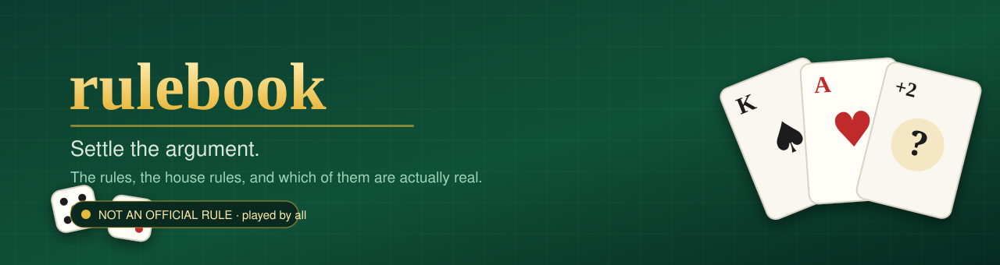

<p align="center">
  
</p>

<p align="center">
  <a href="https://mohitagw15856.github.io/rulebook/"><b>🎲 Open the site</b></a> ·
  <a href="#try-it-in-ten-seconds"><b>⌨️ Use the CLI</b></a> ·
  <a href="#the-wall-of-shame"><b>🔥 The wall of shame</b></a> ·
  <a href="#add-an-argument"><b>✍️ Add a ruling</b></a>
</p>

<p align="center">
  
  
  
  
  <a href="https://www.npmjs.com/package/@mohitagw15856/rulebook"></a>
  <a href="https://github.com/mohitagw15856/rulebook/actions/workflows/ci.yml"></a>
</p>

---

## You are wrong about at least one of these

| You probably think | Actually |
|---|---|
| 🃏 You can stack a +2 on a +2 in Uno | **No.** Never could. Mattel said so out loud in 2019 and the internet refused to accept it |
| 🎩 Free Parking pays out the tax pile | **No.** It has never done anything, in any edition, ever |
| 🃏 You draw until you get a playable card | **No.** You draw exactly one and move on |
| 🌾 You can trade whenever you like in Catan | **No.** Only on the active player's turn, and only with them |
| 🎩 Landing exactly on Go pays double | **No.** It never has |

Everybody plays these. Nobody checked.

**That gap is the whole project.** Rules are easy to find — every box has them.
*Rulings* are not: what to do at 9pm when your uncle is certain, you are
certain, and the box is in the loft.

---

## Try it in ten seconds

```console
$ npx @mohitagw15856/rulebook uno "can I stack a draw 2"
```

```
Can you stack a Draw Two on a Draw Two, or a Draw Four on a Draw Four?
● NOT AN OFFICIAL RULE   played by almost everyone, almost everywhere

  No. Under the published rules there is no stacking. A player hit with a Draw
  Two draws two cards and loses their turn — they cannot pass the penalty
  along. Mattel stated this publicly in May 2019 and a large part of the
  internet refused to believe it.

  The house version

  The near-universal house version lets you answer a Draw Two with your own
  Draw Two, passing an accumulating penalty around the table until someone
  cannot respond and draws the entire pile.
```

Nothing to install, nothing to sign up for, no network calls.

---

## 🎉&nbsp; It runs your game night now

<table>
<tr><td width="50%">

**Before anyone arrives**

```console
$ rulebook night --people 6 --hours 3
```

Builds a real evening — an opener while people
turn up, the heaviest game that actually fits,
and something light for when nobody can think.
Counts the teach time, which everyone forgets.

</td><td width="50%">

**Mid-argument**

```console
$ rulebook ref uno "stacking"
```

Settles it **and logs who called it.**
Then `rulebook record` shows the standings:

```
Siyu    ████████░░   80%  8-2
Mohit   ██░░░░░░░░   22%  2-7

Mohit has been wrong 7 times. Someone should tell them.
```

</td></tr>
<tr><td>

**When the table goes quiet**

```console
$ rulebook quiz
```

Ten rulings. Official, or made up? You guess.
Ends with a title you have earned, such as
*Has Been Playing It Wrong For Years*.

</td><td>

**For the slow player**

```console
$ rulebook timer --minutes 2
```

```
01:12  ████████████░░░░░░  
```

No further comment.

</td></tr>
</table>

| | |
|---|---|
| 🔥 `hottest` | The rules most likely to stop a game, ranked |
| 🎲 `odds` | Catan's dice, blackjack's dealer, poker's outs — computed, not remembered |
| 📋 `about <game>` | The honest facts: real playtime, **downtime between your turns**, the age it actually works at, and when it's fair to give up |
| 🧮 `score` | Poker hands, gin deadwood, Scrabble premiums, Uno and Pablo totals |
| 🗣️ `teach <game> --live` | Walks the teach script one beat at a time, against the clock |
| 🔍 `find --players 5 --kids 7` | What fits tonight — filtered on **real** playtime, not the box |
| 🕵️ `cheats <game>` | How people cheat at it, and how to catch them |
| 🗳️ `vote <game> "<rule>"` | Report how *your* table plays it |
| ✅ `verify` | Which facts have been checked against a source, and when |
| 🌍 `--lang fr` | Any translation, falling back to English per ruling |

---

## 🤖&nbsp; Give it to your AI

Ask any assistant whether you can stack a +2 in Uno and it will usually say yes,
confidently, because that is what most of the internet says. This hands it the
sourced answer instead.

```json
{ "mcpServers": {
    "rulebook": { "command": "npx", "args": ["-y", "@mohitagw15856/rulebook", "mcp"] }
} }
```

Four tools, no dependencies, ~200 lines of MCP over stdio:
`settle_rules_dispute` · `get_game_facts` · `plan_game_night` · `list_contested_rules`

The dispute tool is explicitly told **not to invent an answer** when the
registry has nothing — it returns a "file it" link instead. That is the whole
point of pointing a model at a registry rather than at its own memory.

## 🌐&nbsp; The JSON API

Static files on a CDN. No key, no rate limit, nothing to go down on its own.

```console
$ curl https://mohitagw15856.github.io/rulebook/api/games/uno.json
$ curl https://mohitagw15856.github.io/rulebook/api/hottest.json
```

| | |
|---|---|
| `/api/index.json` | Counts, endpoints, the game list |
| `/api/games.json` | Everything, one array |
| `/api/games/{slug}.json` | One game, rulings included |
| `/api/rulings.json` | All 196 rulings, flat |
| `/api/hottest.json` | The 40 most contested |

There is also a [Slack and Discord bot](bots/server.mjs) — one file, no
dependencies, signature verification via `node:crypto` — and an
[iOS Shortcut recipe](shortcuts/README.md) that reads the same API.

## 🖨️&nbsp; Print it and put it in the box

Three things print straight from a browser. No PDF library, no dependency —
just HTML and SVG with `@page` rules.

| | |
|---|---|
| **[The booklet](https://mohitagw15856.github.io/rulebook/print/)** | The entire registry as a printable book. Every game, every ruling, every tiebreak. |
| **[The card deck](https://mohitagw15856.github.io/rulebook/print/deck.html)** | 196 poker-sized ruling cards. Print double-sided — the backs are laid out mirrored so each answer lands behind its own question. Hold one up, everyone guesses official or made up, turn it over. |
| `rulebook card catan` | One A4 sheet per game. Fold twice, leave it in the lid. |

The per-game card carries setup by player count, the turn, the four rules your
table gets wrong, and a QR code to every ruling.

<details>
<summary>The QR encoder is written from scratch, and it didn't work at first</summary>

<br>

No dependencies means no QR library, so it's ~250 lines implementing byte mode,
error correction level M, Reed–Solomon over GF(256), and mask selection.

The first version produced something that looked *exactly* like a QR code and
was completely unscannable — the format-information bits were in the wrong
cells. I found out by decoding it with a real barcode scanner rather than
trusting my eyes. `rulebook qr <game>` prints one straight to your terminal.

</details>

---

## 📋&nbsp; The facts no box prints

`rulebook about <game>` is where the unglamorous, genuinely useful stuff lives.

| | |
|---|---|
| **Setup and pack-away time** | A 20-minute setup quietly ruins a 30-minute game, and no box mentions it |
| **Downtime between *your* turns** | The honest measure of whether a game is bearable to sit through. It is why Monopoly is hated and Codenames is not |
| **The tiebreak** | Every game has one — including *"it cannot happen"* — and almost nobody knows it. All 36 recorded |
| **Handicaps** | How to make it fair between an expert and a beginner, or an adult and a seven-year-old |
| **[How people cheat](https://github.com/mohitagw15856/rulebook/blob/main/games/scrabble/game.yml)** | And how to spot it. Recorded so it can be caught, not so it can be done |
| **When to give up** | Every game has a fair moment to stop. None of them print it |
| **How it changed** | Edition timelines, so you know which rule arrived in 2015 |

Rulings can also link to rulings they **compound with**. Play both Uno house
rules — stacking *and* draw-until-playable — and hands reach sizes neither rule
alone predicts. Those links are cross-checked at build time.

## 🏠&nbsp; Your table's constitution

Every group plays differently. Say so **once**, in a `.rulebookrc`, and every
ruling answers with *your* version first and the published rule second:

```yaml
table: The Thursday Lot
house_rules:
  uno/stacking-draw-cards: yes        # we stack, and we know it isn't real
  monopoly/free-parking-jackpot: no   # we play it properly
  ludo/blocking-two-tokens: yes
```

Commit it. Send it to anyone joining game night. It settles more arguments
before they start than any amount of looking things up afterwards.

---

## 💻&nbsp; The website

**[mohitagw15856.github.io/rulebook](https://mohitagw15856.github.io/rulebook/)**

Same data, same code — the scoring engines and the search are the *same
modules*, imported as plain ESM. No bundler, no second implementation that can
quietly disagree with the terminal.

It also does things the terminal can't:

- 🔎 Search **every game's rulings at once**
- 🌍 See which rules are played differently in **different countries**
- 📊 A bar chart of how much every box lies about playtime *(Monopoly: +120 min)*
- 🧾 A round-by-round **scorepad** that saves to your device
- 📴 Installs as an app and **works with no signal**

Every ruling has its own link that unfurls with the verdict — paste one into
the group chat and let it do the arguing:

```
https://mohitagw15856.github.io/rulebook/r/uno/stacking-draw-cards/
```

---

## ✍️&nbsp; Add an argument

**This is the valuable bit, and it takes two minutes.** One entry in one YAML
file. No code, no build step, and
[a form](https://github.com/mohitagw15856/rulebook/issues/new?template=good-first-ruling.yml)
if you'd rather not touch YAML at all.

```yaml
- id: free-parking-jackpot
  question: Does landing on Free Parking pay you the money in the middle?
  asked_as:
    - free parking money           # ← how people actually type it
    - do you get the tax money on free parking
  kind: house-rule
  official: false
  prevalence: near-universal       # ← how many people play it anyway
  verdict: >
    No, and it never has been — not in any edition of the rules...
```

`asked_as` matters most. It's how search finds your ruling when somebody types
what they'd genuinely shout across a table.

Run `npm run ci` before opening a PR — it validates, checks your prose is your
own, runs 97 tests, verifies nothing changed shape, and rebuilds this file.

**[CONTRIBUTING.md](CONTRIBUTING.md)** has the rest, and
**[MAINTAINERS.md](MAINTAINERS.md)** explains adopting a game — about an hour a
year, and the single most useful thing anybody can do here. **4 of 36** games
are currently verified.

Not sure where to start? `node scripts/starter-issues.mjs` lists twenty games
worth adding, each with an argument it is already known for.

<details>
<summary>Adding a whole game, or a scorer</summary>

<br>

One game is one folder: `game.yml`, `rules.md`, `rulings.yml`, `teach.md`, and
optionally `score.mjs` and `odds.mjs`. Copy the closest existing game —
`npm run validate` names every missing field, so there's no schema to memorise.

The fields people skip and shouldn't: **`downtime`** (how long between *your*
turns — the honest measure of whether a game is bearable, and nobody publishes
it), **`min_age`** (the age it genuinely works at, not the age on the box), and
**`concession`** (when it's fair to stop).

</details>

---

## 🔍&nbsp; How much of this should you believe?

A registry that says "everyone plays it this way" had better be able to show
its working. Three mechanisms, all visible:

**Verification.** Every game records who checked its facts, when, and against
what. `rulebook verify` lists them. Right now **4 of 36 are verified** and the
other 32 say so plainly — unverified is not the same as wrong, and inventing 36
dates would be exactly the dishonesty this project argues against.

**Sources that disagree.** A ruling can carry several sources, each recording
what it claims and whether it *supports* the verdict. The Ludo blockade is the
first real case: Wikipedia presents it as standard, British sets omit it, and
the entry now says so rather than quietly picking a winner.

**Votes.** `prevalence` is currently somebody's judgement. `rulebook vote` lets
you report how your table actually plays, and every ruling shows `n=` beside its
claim. With no votes it says *"a judgement, not a survey"* rather than showing a
confident zero. It records **where you learned a rule** — family, friends, club,
online — because rules travel through families far more than through countries,
and [`data/votes.yml`](https://github.com/mohitagw15856/rulebook/blob/main/data/votes.yml)
ships deliberately empty.

**Tests that do not rely on my imagination.** The scorers carry property tests
over ~1,400 generated deals, checking rules rather than examples: poker
comparison is a total order, seven cards never score below the best five inside
them, and melding can only ever *reduce* deadwood.

```console
$ npm run coverage     # what is missing, and how old the facts are
$ rulebook verify      # which games have been checked, and when
$ npm test             # every test, including the property tests
```

## ⚖️&nbsp; About the rules themselves

**How a game is played isn't copyrightable.** That's the idea/expression split —
settled since *Baker v. Selden* (1879) and stated flatly in 37 CFR 202.1(b),
which excludes "the idea for a game" from copyright.

**A publisher's wording is.** So every word of rules here was written from
scratch by someone who understood the game, and `npm run check` enforces it: no
copyright notices, no ® or ™, no long quotations, no sentence appearing in two
games.

It has caught me twice. That's the point of having it.

> Game names and trademarks belong to their owners. Nothing here is affiliated
> with or endorsed by any publisher.

Code is MIT. The game data is CC BY 4.0 — take it, build something.

---

<!-- Everything below this line is generated by scripts/build.mjs. Edit games/, not this. -->

## Every game on file

<details>
<summary><b>All 36 games</b> — who they suit, what they really take, and how many arguments each one starts</summary>

### Card games

| Game | Players | Box says | Actually | Teach | Weight | Luck | Rulings |
|---|---|---|---|---|---|---|---|
| **[Blackjack](docs/games/blackjack.md)** | 1–7 (best 4) | 20 min | **30 min** | 4 min | ●●○○○ | 70% | 5 🎲 |
| **[Coup](docs/games/coup.md)** | 2–6 (best 5) | 15 min | **25 min** | 6 min | ●●○○○ | 35% | 6 |
| **[Crazy Eights](docs/games/crazy-eights.md)** | 2–7 (best 4) | 20 min | **25 min** | 90 sec | ●○○○○ | 88% | 3 |
| **[Cribbage](docs/games/cribbage.md)** | 2–4 (best 2) | 30 min | **30 min** | 12 min | ●●○○○ | 40% | 5 |
| **[Dominion](docs/games/dominion.md)** | 2–4 (best 3) | 30 min | **45 min** | 10 min | ●●○○○ | 35% | 6 |
| **[Go Fish](docs/games/go-fish.md)** | 2–6 (best 4) | 15 min | **20 min** | 60 sec | ●○○○○ | 80% | 4 |
| **[Hearts](docs/games/hearts.md)** | 3–6 (best 4) | 45 min | **60 min** | 5 min | ●●○○○ | 45% | 5 |
| **[Jaipur](docs/games/jaipur.md)** | 2–2 (best 2) | 30 min | **30 min** | 5 min | ●●○○○ | 45% | 6 |
| **[Love Letter](docs/games/love-letter.md)** | 2–4 (best 4) | 20 min | **20 min** | 3 min | ●○○○○ | 60% | 6 |
| **[Pablo](docs/games/pablo.md)** | 2–6 (best 4) | 20 min | **35 min** | 4 min | ●●○○○ | 65% | 4 🧮 |
| **[Texas Hold'em](docs/games/poker-texas-holdem.md)** | 2–10 (best 6) | 60 min | **2 hr** | 8 min | ●●●○○ | 45% | 6 🧮 🎲 |
| **[Gin Rummy](docs/games/rummy-gin.md)** | 2–2 (best 2) | 30 min | **40 min** | 5 min | ●●○○○ | 55% | 5 🧮 |
| **[Indian Rummy](docs/games/rummy-indian.md)** | 2–6 (best 4) | 30 min | **45 min** | 6 min | ●●○○○ | 60% | 5 |
| **[Spades](docs/games/spades.md)** | 2–6 (best 4) | 30 min | **50 min** | 6 min | ●●○○○ | 40% | 5 |
| **[The Mind](docs/games/the-mind.md)** | 2–4 (best 3) | 20 min | **25 min** | 90 sec | ●○○○○ | 45% | 5 |
| **[Uno](docs/games/uno.md)** | 2–10 (best 4) | 30 min | **45 min** | 3 min | ●○○○○ | 85% | 7 🧮 |

### Board games

| Game | Players | Box says | Actually | Teach | Weight | Luck | Rulings |
|---|---|---|---|---|---|---|---|
| **[Catan](docs/games/catan.md)** | 3–4 (best 4) | 60 min | **90 min** | 15 min | ●●○○○ | 50% | 6 🎲 |
| **[Cluedo](docs/games/cluedo.md)** | 3–6 (best 4) | 45 min | **50 min** | 7 min | ●●○○○ | 55% | 6 |
| **[Ludo](docs/games/ludo.md)** | 2–4 (best 4) | 30 min | **45 min** | 3 min | ●○○○○ | 92% | 5 |
| **[Monopoly](docs/games/monopoly.md)** | 2–8 (best 4) | 60 min | **3 hr** | 10 min | ●●○○○ | 70% | 6 |
| **[Patchwork](docs/games/patchwork.md)** | 2–2 (best 2) | 30 min | **30 min** | 5 min | ●●○○○ | 20% | 6 |
| **[7 Wonders Duel](docs/games/seven-wonders-duel.md)** | 2–2 (best 2) | 30 min | **40 min** | 12 min | ●●●○○ | 30% | 6 |
| **[Ticket to Ride](docs/games/ticket-to-ride.md)** | 2–5 (best 4) | 60 min | **70 min** | 8 min | ●●○○○ | 45% | 6 |

### Word games

| Game | Players | Box says | Actually | Teach | Weight | Luck | Rulings |
|---|---|---|---|---|---|---|---|
| **[Codenames Duet](docs/games/codenames-duet.md)** | 2–4 (best 2) | 15 min | **25 min** | 5 min | ●●○○○ | 30% | 6 |
| **[Scrabble](docs/games/scrabble.md)** | 2–4 (best 2) | 60 min | **75 min** | 6 min | ●●○○○ | 40% | 6 🧮 |

### Party games

| Game | Players | Box says | Actually | Teach | Weight | Luck | Rulings |
|---|---|---|---|---|---|---|---|
| **[Charades](docs/games/charades.md)** | 4–20 (best 8) | 30 min | **45 min** | 2 min | ●○○○○ | 35% | 5 |
| **[Codenames](docs/games/codenames.md)** | 2–8 (best 6) | 15 min | **25 min** | 4 min | ●○○○○ | 25% | 5 |
| **[Fishbowl](docs/games/fishbowl.md)** | 6–20 (best 10) | 40 min | **55 min** | 4 min | ●○○○○ | 30% | 5 |
| **[Skull](docs/games/skull.md)** | 3–6 (best 5) | 30 min | **30 min** | 3 min | ●○○○○ | 25% | 5 |

### Social deduction

| Game | Players | Box says | Actually | Teach | Weight | Luck | Rulings |
|---|---|---|---|---|---|---|---|
| **[Werewolf](docs/games/werewolf.md)** | 7–20 (best 12) | 30 min | **40 min** | 5 min | ●●○○○ | 30% | 6 |

### Dice games

| Game | Players | Box says | Actually | Teach | Weight | Luck | Rulings |
|---|---|---|---|---|---|---|---|
| **[Yahtzee](docs/games/yahtzee.md)** | 1–10 (best 4) | 30 min | **30 min** | 4 min | ●○○○○ | 75% | 5 🎲 |

### Abstract strategy

| Game | Players | Box says | Actually | Teach | Weight | Luck | Rulings |
|---|---|---|---|---|---|---|---|
| **[Azul](docs/games/azul.md)** | 2–4 (best 2) | 45 min | **40 min** | 6 min | ●●○○○ | 30% | 6 |
| **[Backgammon](docs/games/backgammon.md)** | 2–2 (best 2) | 30 min | **25 min** | 10 min | ●●●○○ | 45% | 6 🎲 |
| **[Battleship](docs/games/battleship.md)** | 2–2 (best 2) | 20 min | **20 min** | 90 sec | ●○○○○ | 65% | 5 |
| **[Chess](docs/games/chess.md)** | 2–2 (best 2) | 30 min | **45 min** | 10 min | ●●●●○ | 0% | 6 |
| **[Hive](docs/games/hive.md)** | 2–2 (best 2) | 20 min | **25 min** | 4 min | ●●●○○ | 0% | 6 |

🧮 scorer · 🎲 odds table · **bold** playtime is the real one

</details>

## The wall of shame

Every one of these is a house rule. **None of them is official.** Most people
have played them their whole lives without ever knowing that.

| Game | "Rule" | The actual rule |
|---|---|---|
| Crazy Eights | Do Twos make the next player draw, and do Queens skip? | Not part of the base game. |
| Monopoly | Do you collect money from Free Parking? | No. Free Parking does nothing at all in the published rules. It is a resting space and pays nothing. This is probably the most widely played rule that… |
| Pablo | Which cards have powers? | There is no single authority, so no set is official. The most widely used set is below, and it is worth stating out loud before dealing. |
| Pablo | What happens if you call Pablo and are not lowest? | Universally penalised, but the size varies. |
| Uno | Can you stack a Draw Two on a Draw Two, or a Draw Four on a Draw Four? | No. Under the published rules there is no stacking. A player hit with a Draw Two draws two cards and loses their turn — they cannot pass the penalty a… |
| Uno | Do you keep drawing until you get a card you can play? | No. Officially you draw exactly one card. If it can be played you may play it immediately; if not, your turn ends. |

## Every ruling on file

<details>
<summary><b>All 196 rulings</b> — every argument in the registry, official or not</summary>

| Game | Question | Official? | How widely played |
|---|---|---|---|
| [Azul](docs/games/azul.md) | Can you take just some of the tiles of a colour? | ✅ yes | near universal |
| [Azul](docs/games/azul.md) | What happens to tiles that do not fit in your pattern line? | ✅ yes | near universal |
| [Azul](docs/games/azul.md) | Can you fill a pattern line with a colour already on your wall in that row? | ✅ yes | common |
| [Azul](docs/games/azul.md) | Does taking from the centre first cost you? | ✅ yes | common |
| [Azul](docs/games/azul.md) | Do unfinished pattern lines stay for the next round? | ✅ yes | near universal |
| [Azul](docs/games/azul.md) | Does the game stop the instant someone completes a row? | ✅ yes | common |
| [Backgammon](docs/games/backgammon.md) | Do you have to play both dice if the move is bad for you? | ✅ yes | near universal |
| [Backgammon](docs/games/backgammon.md) | Who can double after a double has been accepted? | ✅ yes | common |
| [Backgammon](docs/games/backgammon.md) | Can you move other checkers while one is on the bar? | ✅ yes | near universal |
| [Backgammon](docs/games/backgammon.md) | Can you immediately redouble when offered a double? | ❌ no | common |
| [Backgammon](docs/games/backgammon.md) | What happens if you roll higher than any checker you have left? | ✅ yes | common |
| [Backgammon](docs/games/backgammon.md) | When does a win count double or triple? | ✅ yes | common |
| [Battleship](docs/games/battleship.md) | Can two ships be placed next to each other? | ✅ yes | common |
| [Battleship](docs/games/battleship.md) | Do you have to say which ship has been sunk? | ✅ yes | near universal |
| [Battleship](docs/games/battleship.md) | Is going first an advantage? | ✅ yes | common |
| [Battleship](docs/games/battleship.md) | Do you get another shot when you score a hit? | ❌ no | common |
| [Battleship](docs/games/battleship.md) | Can ships be placed diagonally? | ✅ yes | near universal |
| [Blackjack](docs/games/blackjack.md) | Is an Ace worth 1 or 11? | ✅ yes | near universal |
| [Blackjack](docs/games/blackjack.md) | If both you and the dealer bust, is it a push? | ✅ yes | near universal |
| [Blackjack](docs/games/blackjack.md) | Does the dealer have a choice about hitting? | ✅ yes | near universal |
| [Blackjack](docs/games/blackjack.md) | Should you take insurance? | ✅ yes | common |
| [Blackjack](docs/games/blackjack.md) | Do five cards under 21 win automatically? | ❌ no | regional |
| [Catan](docs/games/catan.md) | Who discards when a 7 is rolled? | ✅ yes | near universal |
| [Catan](docs/games/catan.md) | Can players trade when it is not their turn? | ✅ yes | near universal |
| [Catan](docs/games/catan.md) | What happens to Longest Road when someone ties it? | ✅ yes | common |
| [Catan](docs/games/catan.md) | Can you build on someone else's turn? | ✅ yes | common |
| [Catan](docs/games/catan.md) | Do you collect resources on the first roll of the game for everyone? | ✅ yes | common |
| [Catan](docs/games/catan.md) | Is the robber allowed to sit on the desert forever? | ❌ no | common |
| [Charades](docs/games/charades.md) | Can you point at something in the room to indicate a word? | ✅ yes | near universal |
| [Charades](docs/games/charades.md) | Is "sounds like" allowed? | ✅ yes | near universal |
| [Charades](docs/games/charades.md) | Can you mouth the word silently? | ✅ yes | near universal |
| [Charades](docs/games/charades.md) | Does a guess count if they say the right words in the wrong order? | ❌ no | common |
| [Charades](docs/games/charades.md) | Do you have to signal the number of words before acting? | ✅ yes | common |
| [Chess](docs/games/chess.md) | What is en passant and when can you do it? | ✅ yes | near universal |
| [Chess](docs/games/chess.md) | When exactly are you allowed to castle? | ✅ yes | near universal |
| [Chess](docs/games/chess.md) | If a player cannot move, do they lose? | ✅ yes | near universal |
| [Chess](docs/games/chess.md) | Must a promoted pawn become a queen? | ✅ yes | common |
| [Chess](docs/games/chess.md) | If you touch a piece, must you move it? | ✅ yes | common |
| [Chess](docs/games/chess.md) | How does a game end in a draw when neither side can win? | ✅ yes | common |
| [Cluedo](docs/games/cluedo.md) | Does everyone show you a card, or only the first player who can? | ✅ yes | near universal |
| [Cluedo](docs/games/cluedo.md) | What happens if your accusation is wrong? | ✅ yes | near universal |
| [Cluedo](docs/games/cluedo.md) | Can you name a card that is in your own hand? | ✅ yes | common |
| [Cluedo](docs/games/cluedo.md) | Do you have to be in a room to make a suggestion? | ✅ yes | near universal |
| [Cluedo](docs/games/cluedo.md) | If your character is moved into a room by someone else, can you suggest from there? | ✅ yes | common |
| [Cluedo](docs/games/cluedo.md) | Can you use a secret passage and still make a suggestion? | ✅ yes | common |
| [Codenames](docs/games/codenames.md) | What exactly is a legal clue? | ✅ yes | near universal |
| [Codenames](docs/games/codenames.md) | Can your clue be a word visible on the grid? | ✅ yes | near universal |
| [Codenames](docs/games/codenames.md) | Do you always get one extra guess? | ✅ yes | near universal |
| [Codenames](docs/games/codenames.md) | Can you give a clue for zero words? | ✅ yes | common |
| [Codenames](docs/games/codenames.md) | Are homophones and near-spellings allowed? | ❌ no | common |
| [Codenames Duet](docs/games/codenames-duet.md) | How many agents are there in total? | ✅ yes | common |
| [Codenames Duet](docs/games/codenames-duet.md) | Can a word be an assassin for one player and an agent for the other? | ✅ yes | near universal |
| [Codenames Duet](docs/games/codenames-duet.md) | Can your clue be a word visible on the table? | ✅ yes | near universal |
| [Codenames Duet](docs/games/codenames-duet.md) | Are compound words and proper nouns allowed as clues? | ❌ no | common |
| [Codenames Duet](docs/games/codenames-duet.md) | How many guesses does your partner get? | ✅ yes | common |
| [Codenames Duet](docs/games/codenames-duet.md) | Can you give a clue for zero? | ✅ yes | rare |
| [Coup](docs/games/coup.md) | Do you have to coup when you have ten coins? | ✅ yes | near universal |
| [Coup](docs/games/coup.md) | What happens when you are challenged and you really had the card? | ✅ yes | near universal |
| [Coup](docs/games/coup.md) | Can you challenge someone who blocks you? | ✅ yes | near universal |
| [Coup](docs/games/coup.md) | If your assassination is challenged and fails, do you get the coins back? | ✅ yes | common |
| [Coup](docs/games/coup.md) | If an assassination succeeds against a player with one card, and they challenge and lose, do they lose two? | ✅ yes | rare |
| [Coup](docs/games/coup.md) | When you lose a card, do you choose which one and does everyone see it? | ✅ yes | near universal |
| [Crazy Eights](docs/games/crazy-eights.md) | Which cards have special powers in Crazy Eights? | ✅ yes | near universal |
| [Crazy Eights](docs/games/crazy-eights.md) | Do Twos make the next player draw, and do Queens skip? | ❌ no | near universal |
| [Crazy Eights](docs/games/crazy-eights.md) | Do you draw until you can play, or just one card? | ✅ yes | common |
| [Cribbage](docs/games/cribbage.md) | Can you claim points your opponent missed? | ❌ no | common |
| [Cribbage](docs/games/cribbage.md) | Does a run have to be played in order during the pegging? | ✅ yes | near universal |
| [Cribbage](docs/games/cribbage.md) | Does a four-card flush score in the crib? | ✅ yes | common |
| [Cribbage](docs/games/cribbage.md) | What happens when the starter card is a jack? | ✅ yes | common |
| [Cribbage](docs/games/cribbage.md) | If your opponent reaches 121 first, do you still count your hand? | ✅ yes | near universal |
| [Dominion](docs/games/dominion.md) | Where does a card you buy go? | ✅ yes | near universal |
| [Dominion](docs/games/dominion.md) | How many actions and buys do you get? | ✅ yes | near universal |
| [Dominion](docs/games/dominion.md) | Which empty piles end the game? | ✅ yes | common |
| [Dominion](docs/games/dominion.md) | Do you have to reveal a Moat to be protected from an attack? | ✅ yes | common |
| [Dominion](docs/games/dominion.md) | When exactly do you shuffle your discard pile? | ✅ yes | common |
| [Dominion](docs/games/dominion.md) | Who wins if two players tie on victory points? | ✅ yes | common |
| [Fishbowl](docs/games/fishbowl.md) | Do you use the same slips in all three rounds? | ✅ yes | near universal |
| [Fishbowl](docs/games/fishbowl.md) | Can you gesture while giving your one word in round two? | ✅ yes | common |
| [Fishbowl](docs/games/fishbowl.md) | Can you skip a slip you cannot get? | ❌ no | common |
| [Fishbowl](docs/games/fishbowl.md) | What happens if the timer goes while a slip is being guessed? | ✅ yes | common |
| [Fishbowl](docs/games/fishbowl.md) | Can you use part of the phrase on the slip? | ✅ yes | near universal |
| [Go Fish](docs/games/go-fish.md) | Can you ask for a card you do not already have? | ✅ yes | near universal |
| [Go Fish](docs/games/go-fish.md) | Do you get another turn if the other player hands cards over? | ✅ yes | common |
| [Go Fish](docs/games/go-fish.md) | What if you draw the exact card you asked for? | ❌ no | common |
| [Go Fish](docs/games/go-fish.md) | What happens when you run out of cards but the pond is not empty? | ✅ yes | common |
| [Hearts](docs/games/hearts.md) | When can you lead a heart? | ✅ yes | near universal |
| [Hearts](docs/games/hearts.md) | Can the queen of spades be played on the first trick? | ✅ yes | common |
| [Hearts](docs/games/hearts.md) | What happens when someone shoots the moon? | ✅ yes | near universal |
| [Hearts](docs/games/hearts.md) | Do you look at the cards passed to you before choosing what to pass? | ✅ yes | near universal |
| [Hearts](docs/games/hearts.md) | Is the jack of diamonds worth minus ten? | ❌ no | common |
| [Hive](docs/games/hive.md) | What happens if moving a tile would split the hive? | ✅ yes | near universal |
| [Hive](docs/games/hive.md) | When must the queen bee be placed? | ✅ yes | near universal |
| [Hive](docs/games/hive.md) | Can you open the game by placing your queen? | ✅ yes | common |
| [Hive](docs/games/hive.md) | Can a tile move through a narrow gap between two others? | ✅ yes | common |
| [Hive](docs/games/hive.md) | Do your own tiles count towards surrounding your queen? | ✅ yes | common |
| [Hive](docs/games/hive.md) | What if both queens are surrounded at the same time? | ✅ yes | rare |
| [Jaipur](docs/games/jaipur.md) | Do camels count towards your hand limit? | ✅ yes | near universal |
| [Jaipur](docs/games/jaipur.md) | Can you take just some of the camels? | ✅ yes | near universal |
| [Jaipur](docs/games/jaipur.md) | Can you sell a single diamond? | ✅ yes | near universal |
| [Jaipur](docs/games/jaipur.md) | Can you use camels in a swap? | ✅ yes | common |
| [Jaipur](docs/games/jaipur.md) | What ends a round? | ✅ yes | common |
| [Jaipur](docs/games/jaipur.md) | Who gets the camel bonus if both players have the same number? | ✅ yes | rare |
| [Love Letter](docs/games/love-letter.md) | Do you have to play the Countess? | ✅ yes | near universal |
| [Love Letter](docs/games/love-letter.md) | What happens if a Prince forces you to discard the Princess? | ✅ yes | near universal |
| [Love Letter](docs/games/love-letter.md) | Can a Guard name another Guard? | ✅ yes | near universal |
| [Love Letter](docs/games/love-letter.md) | What if everyone left is protected by a Handmaid? | ✅ yes | common |
| [Love Letter](docs/games/love-letter.md) | Who wins if two players tie on card value at the end? | ✅ yes | common |
| [Love Letter](docs/games/love-letter.md) | Can you look back through the discarded cards? | ✅ yes | near universal |
| [Ludo](docs/games/ludo.md) | What happens if you roll three sixes in a row? | ✅ yes | near universal |
| [Ludo](docs/games/ludo.md) | Do you need an exact roll to get home? | ✅ yes | near universal |
| [Ludo](docs/games/ludo.md) | Can two of your tokens block opponents from passing? | ❌ no | regional |
| [Ludo](docs/games/ludo.md) | Are the starting squares safe from capture? | ✅ yes | common |
| [Ludo](docs/games/ludo.md) | Can you decline to move if every option is bad? | ✅ yes | common |
| [Monopoly](docs/games/monopoly.md) | Do you collect money from Free Parking? | ❌ no | near universal |
| [Monopoly](docs/games/monopoly.md) | What happens if you land on a property and do not buy it? | ✅ yes | near universal |
| [Monopoly](docs/games/monopoly.md) | Do you charge double rent on a full colour group? | ✅ yes | common |
| [Monopoly](docs/games/monopoly.md) | Can you run out of houses? | ✅ yes | rare |
| [Monopoly](docs/games/monopoly.md) | Can you collect rent while in jail? | ✅ yes | common |
| [Monopoly](docs/games/monopoly.md) | Do you get double for landing exactly on Go? | ❌ no | common |
| [Pablo](docs/games/pablo.md) | Is Pablo the same game as Cabo? | ✅ yes | near universal |
| [Pablo](docs/games/pablo.md) | Which cards have powers? | ❌ no | near universal |
| [Pablo](docs/games/pablo.md) | What happens if you call Pablo and are not lowest? | ❌ no | near universal |
| [Pablo](docs/games/pablo.md) | Can you get rid of a card by matching the discard? | ❌ no | common |
| [Patchwork](docs/games/patchwork.md) | Who takes the next turn? | ✅ yes | near universal |
| [Patchwork](docs/games/patchwork.md) | Can you buy any patch from the circle? | ✅ yes | near universal |
| [Patchwork](docs/games/patchwork.md) | Can patches be rotated or flipped over? | ✅ yes | common |
| [Patchwork](docs/games/patchwork.md) | How much does an empty square cost? | ✅ yes | near universal |
| [Patchwork](docs/games/patchwork.md) | Can both players get the seven-by-seven bonus? | ✅ yes | common |
| [Patchwork](docs/games/patchwork.md) | How far do you move when you take buttons instead of a patch? | ✅ yes | common |
| [Texas Hold'em](docs/games/poker-texas-holdem.md) | What if the best hand is the five community cards themselves? | ✅ yes | common |
| [Texas Hold'em](docs/games/poker-texas-holdem.md) | Can you say "I call, and raise"? | ✅ yes | common |
| [Texas Hold'em](docs/games/poker-texas-holdem.md) | We both have a pair of kings — who wins? | ✅ yes | near universal |
| [Texas Hold'em](docs/games/poker-texas-holdem.md) | Does one suit beat another? | ✅ yes | common |
| [Texas Hold'em](docs/games/poker-texas-holdem.md) | Is Ace-2-3-4-5 a straight? | ✅ yes | common |
| [Texas Hold'em](docs/games/poker-texas-holdem.md) | How small can a raise be? | ✅ yes | common |
| [Gin Rummy](docs/games/rummy-gin.md) | What counts as deadwood? | ✅ yes | near universal |
| [Gin Rummy](docs/games/rummy-gin.md) | When are you allowed to knock? | ✅ yes | near universal |
| [Gin Rummy](docs/games/rummy-gin.md) | What happens if the opponent has less deadwood than the knocker? | ✅ yes | common |
| [Gin Rummy](docs/games/rummy-gin.md) | Can you add your cards to the knocker's melds? | ✅ yes | common |
| [Gin Rummy](docs/games/rummy-gin.md) | How much is going gin worth? | ❌ no | common |
| [Indian Rummy](docs/games/rummy-indian.md) | Can you declare without a pure sequence? | ✅ yes | near universal |
| [Indian Rummy](docs/games/rummy-indian.md) | Can a joker be used inside a run? | ✅ yes | near universal |
| [Indian Rummy](docs/games/rummy-indian.md) | How is the wild joker chosen? | ✅ yes | near universal |
| [Indian Rummy](docs/games/rummy-indian.md) | How many points do you lose when someone else declares? | ✅ yes | near universal |
| [Indian Rummy](docs/games/rummy-indian.md) | Can you quit a hand early? | ✅ yes | common |
| [Scrabble](docs/games/scrabble.md) | What happens when you challenge a word? | ✅ yes | near universal |
| [Scrabble](docs/games/scrabble.md) | What is a blank worth, and can you take it back? | ✅ yes | near universal |
| [Scrabble](docs/games/scrabble.md) | When do you get the fifty-point bonus? | ✅ yes | near universal |
| [Scrabble](docs/games/scrabble.md) | Do premium squares keep working on later turns? | ✅ yes | common |
| [Scrabble](docs/games/scrabble.md) | Are proper nouns allowed? | ✅ yes | near universal |
| [Scrabble](docs/games/scrabble.md) | Are obscure two-letter words really allowed? | ✅ yes | common |
| [7 Wonders Duel](docs/games/seven-wonders-duel.md) | Do military and science wins end the game immediately? | ✅ yes | near universal |
| [7 Wonders Duel](docs/games/seven-wonders-duel.md) | Can you buy resources from your opponent? | ✅ yes | common |
| [7 Wonders Duel](docs/games/seven-wonders-duel.md) | How many coins do you get for discarding a card? | ✅ yes | common |
| [7 Wonders Duel](docs/games/seven-wonders-duel.md) | Can both players build all four of their wonders? | ✅ yes | common |
| [7 Wonders Duel](docs/games/seven-wonders-duel.md) | Can you take a card that is partly covered? | ✅ yes | near universal |
| [7 Wonders Duel](docs/games/seven-wonders-duel.md) | When do you get a progress token? | ✅ yes | common |
| [Skull](docs/games/skull.md) | Which discs do you flip first when you win the bid? | ✅ yes | near universal |
| [Skull](docs/games/skull.md) | Who chooses which disc you lose? | ✅ yes | common |
| [Skull](docs/games/skull.md) | Can you bid more discs than are on the table? | ✅ yes | near universal |
| [Skull](docs/games/skull.md) | Can you rejoin the bidding after passing? | ✅ yes | near universal |
| [Skull](docs/games/skull.md) | Can a player with one disc still win? | ✅ yes | common |
| [Spades](docs/games/spades.md) | What happens to tricks you win beyond your bid? | ✅ yes | near universal |
| [Spades](docs/games/spades.md) | Can you signal to your partner? | ✅ yes | near universal |
| [Spades](docs/games/spades.md) | Is blind nil a real bid? | ❌ no | common |
| [Spades](docs/games/spades.md) | When can spades be led? | ✅ yes | near universal |
| [Spades](docs/games/spades.md) | If your partner bids nil, do their tricks count against you? | ✅ yes | common |
| [The Mind](docs/games/the-mind.md) | What exactly counts as communicating? | ✅ yes | near universal |
| [The Mind](docs/games/the-mind.md) | What happens to lower cards when someone plays out of order? | ✅ yes | common |
| [The Mind](docs/games/the-mind.md) | Can one player use a throwing star alone? | ✅ yes | common |
| [The Mind](docs/games/the-mind.md) | What if two players play at exactly the same moment? | ✅ yes | common |
| [The Mind](docs/games/the-mind.md) | Can you rearrange or hold your cards where others might see? | ✅ yes | common |
| [Ticket to Ride](docs/games/ticket-to-ride.md) | Does taking a face-up locomotive cost your whole turn? | ✅ yes | near universal |
| [Ticket to Ride](docs/games/ticket-to-ride.md) | Do unfinished tickets cost you points? | ✅ yes | near universal |
| [Ticket to Ride](docs/games/ticket-to-ride.md) | Can one player claim both tracks of a double route? | ✅ yes | common |
| [Ticket to Ride](docs/games/ticket-to-ride.md) | What happens if two players tie for the longest route? | ✅ yes | common |
| [Ticket to Ride](docs/games/ticket-to-ride.md) | Does the longest route count branches? | ✅ yes | common |
| [Ticket to Ride](docs/games/ticket-to-ride.md) | Can other players see how many tickets you are holding? | ✅ yes | common |
| [Uno](docs/games/uno.md) | Can you stack a Draw Two on a Draw Two, or a Draw Four on a Draw Four? | ❌ no | near universal |
| [Uno](docs/games/uno.md) | Can you play a Wild Draw Four whenever you like? | ✅ yes | near universal |
| [Uno](docs/games/uno.md) | What actually happens if you forget to say "Uno"? | ✅ yes | common |
| [Uno](docs/games/uno.md) | Do you keep drawing until you get a card you can play? | ❌ no | near universal |
| [Uno](docs/games/uno.md) | Can you win by playing an action card as your last card? | ✅ yes | common |
| [Uno](docs/games/uno.md) | Can you play out of turn if you hold the identical card? | ❌ no | common |
| [Uno](docs/games/uno.md) | Do Sevens and Zeros swap hands? | ❌ no | common |
| [Werewolf](docs/games/werewolf.md) | Can eliminated players talk? | ✅ yes | near universal |
| [Werewolf](docs/games/werewolf.md) | Can the moderator also have a role? | ✅ yes | common |
| [Werewolf](docs/games/werewolf.md) | Do werewolves have to kill everyone to win? | ✅ yes | near universal |
| [Werewolf](docs/games/werewolf.md) | Should the seer announce what they know? | ✅ yes | common |
| [Werewolf](docs/games/werewolf.md) | Can the village choose not to eliminate anyone? | ❌ no | common |
| [Werewolf](docs/games/werewolf.md) | Can werewolves eliminate one of their own? | ✅ yes | common |
| [Yahtzee](docs/games/yahtzee.md) | What happens if you roll a second Yahtzee? | ✅ yes | common |
| [Yahtzee](docs/games/yahtzee.md) | Can you pick up dice you already set aside? | ✅ yes | common |
| [Yahtzee](docs/games/yahtzee.md) | Does a large straight also count as a small straight? | ✅ yes | near universal |
| [Yahtzee](docs/games/yahtzee.md) | Can you skip a turn if nothing fits? | ✅ yes | near universal |
| [Yahtzee](docs/games/yahtzee.md) | Does three of a kind score just the three matching dice? | ✅ yes | common |

</details>

## Who has settled an argument here

**Mohit**

196 rulings on file. [Add the one your table argues about](https://github.com/mohitagw15856/rulebook/issues/new?template=good-first-ruling.yml) — it is one entry, no code, and no build step.

## By the numbers

| | |
|---|---|
| Games | 36 |
| Rulings | 196 |
| Of those, not official rules | 25 |
| Not official, yet played nearly everywhere | 6 |
| Games with a runnable scorer | 5 |
| Games with an odds table | 5 |
| Documented variants | 28 |
| Rulings that are region-specific | 10 |
| Games playable with a six-year-old | 7 |
| Games needing nothing but people | 3 |
| Minutes the boxes are collectively lying by | 475 |
| Worst offender | Monopoly, over by 120 min |
