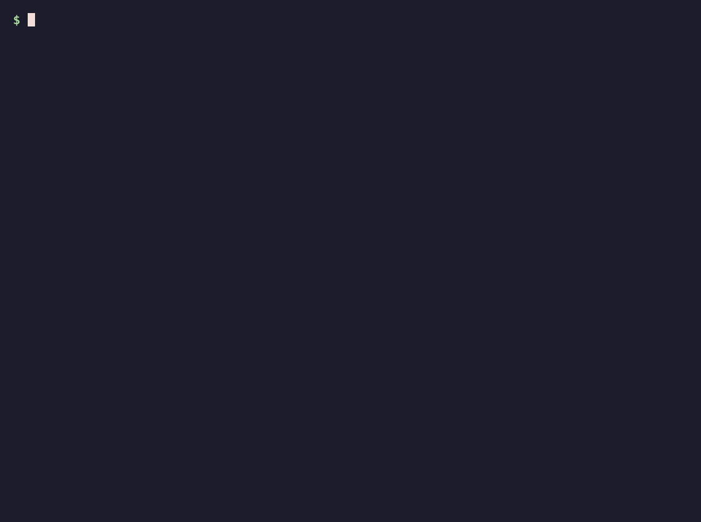

<p align="center">
  
</p>

<p align="center">
  <b>Somebody just played a Draw Four and the table has stopped.</b><br>
  Someone says you cannot stack. Someone says you always could.<br>
  <b>One of them is right, and it is not who you think.</b>
</p>

<p align="center">
  <a href="#the-games"></a>
  <a href="#every-ruling-on-file"></a>
  <a href="#things-everyone-plays-that-are-not-in-the-rulebook"></a>
  
  
  <a href="https://www.npmjs.com/package/@mohitagw15856/rulebook"></a>
  <a href="https://github.com/mohitagw15856/rulebook/actions/workflows/ci.yml"></a>
  <a href="https://mohitagw15856.github.io/rulebook/"></a>
</p>

<p align="center">
  <b><a href="https://mohitagw15856.github.io/rulebook/">→ Settle an argument right now, in your browser ←</a></b><br>
  <sub>No install. Works on your phone at the table.</sub>
</p>

<p align="center">
  
</p>

```console
$ npx @mohitagw15856/rulebook ruling uno "can I stack a draw 2"

Can you stack a Draw Two on a Draw Two, or a Draw Four on a Draw Four?
● NOT AN OFFICIAL RULE   played by almost everyone, almost everywhere

  No. Under the published rules there is no stacking. A player hit with a Draw
  Two draws two cards and loses their turn — they cannot pass the penalty
  along. Mattel stated this publicly in May 2019 and a large part of the
  internet refused to believe it. Note that the official UNO mobile game does
  offer stacking as a setting, which is not the same as it being in the card
  game's rules.

  The house version

  The near-universal house version lets you answer a Draw Two with your own
  Draw Two, passing an accumulating penalty around the table until someone
  cannot respond and draws the entire pile.
```

---

## What this is

Rules are easy to find. **Rulings are not.**

Every published rulebook tells you how the game starts. None of them tells you
what to do when your uncle insists that landing on Free Parking pays out the
tax pile, that you can stack a +2, or that you can trade on someone else’s turn
in Catan.

None of those three is a real rule. All three are played constantly.

rulebook records both: what the rulebook says, and what the world actually
plays — clearly labelled, so the table can pick one and get on with it.

| | |
|---|---|
| **The rules** | Written plainly. Setup, turn, and how it ends. |
| **The rulings** | The arguments, each marked official or not, with how widely the house version is played. |
| **The honest clock** | What the box claims, and what it really takes. |
| **The teach script** | How to explain it to someone who has never played, in order. |
| **The scorer** | `rulebook score poker "As Ks Qs Js Ts"` — no arithmetic arguments. |
| **The finder** | `rulebook find --players 5 --minutes 30` — what fits tonight. |

## Use it without installing anything

**[mohitagw15856.github.io/rulebook](https://mohitagw15856.github.io/rulebook/)**

The whole registry, in the browser. Search every ruling at once, filter the
games by what fits tonight, and run the scorers — those are the *same* modules
the CLI uses, imported directly and running on your machine. Nothing is sent
anywhere, and there is no backend to go down.

## Use it in the terminal

```console
$ npx @mohitagw15856/rulebook ruling monopoly "free parking"
$ npx @mohitagw15856/rulebook score gin "4c 5c 6c 7c 9h 9d 9s Kh Kd Ks"
$ npx @mohitagw15856/rulebook teach catan
$ npx @mohitagw15856/rulebook find --players 6 --minutes 30 --max-weight 2
$ npx @mohitagw15856/rulebook list
```

Or install it, because game night has no wifi:

```console
$ npm install -g @mohitagw15856/rulebook
$ rulebook uno "wild draw four"
```

Zero dependencies. Zero network calls. The entire registry ships in the package,
because the moment you need a ruling is the moment somebody has already picked
up the cards and is waiting.

### The five commands

| | |
|---|---|
| `rulebook ruling <game> "<question>"` | Settle it. Searches the phrasings people actually use, not just the formal question. |
| `rulebook score <game> "<cards>"` | Poker hands, gin deadwood, Scrabble premiums, Uno and Pablo totals. |
| `rulebook teach <game>` | A script for explaining the game, in the order that works. |
| `rulebook find [filters]` | `--players` `--minutes` `--max-weight` `--type`. Filters on real playtime, not box time. |
| `rulebook list` | Everything on file. |

## Add a game, or settle one more argument

One game is one folder. One argument is one entry in a YAML file.

```yaml
- id: free-parking-jackpot
  question: Does landing on Free Parking pay you the money in the middle?
  asked_as:
    - free parking money
    - do you get the tax money on free parking
  kind: house-rule
  official: false
  prevalence: near-universal
  verdict: >
    No, and it never has been — not in any edition of the rules...
  house_rule: >
    Fines and taxes go into a pot in the middle...
  effect: >
    It puts money back into the game and stretches it by hours...
```

`asked_as` is the field that matters most: it is how the search finds your
ruling when somebody types what they would actually shout across the table.

Run `npm run ci` before you open a PR. It validates the schema, checks that the
prose is your own, runs the scoring tests, and rebuilds this file.

**[CONTRIBUTING.md](CONTRIBUTING.md)** has the whole thing.

## About the rules themselves

How a game is played is not copyrightable — that is the idea/expression split,
and the US Copyright Office says so directly in 37 CFR 202.1(b). A publisher’s
*wording* is another matter entirely.

So every word of rules in this repo is written from scratch by someone who
understood the game, and `npm run check` enforces it: no copyright notices, no
® or ™, no long quotations of anyone else’s text, no sentence appearing in two
games. Game names and trademarks belong to their owners; nothing here is
affiliated with or endorsed by any publisher.

Code is MIT. The game data is CC BY 4.0 — take it, build something.

<!-- Everything below this line is generated by scripts/build.mjs. Edit games/, not this. -->

## The games

### Card games

| Game | Players | Box says | Actually | Teach | Weight | Luck | Rulings |
|---|---|---|---|---|---|---|---|
| **[Blackjack](docs/games/blackjack.md)** | 1–7 (best 4) | 20 min | **30 min** | 4 min | ●●○○○ | 70% | 5 |
| **[Crazy Eights](docs/games/crazy-eights.md)** | 2–7 (best 4) | 20 min | **25 min** | 90 sec | ●○○○○ | 88% | 3 |
| **[Go Fish](docs/games/go-fish.md)** | 2–6 (best 4) | 15 min | **20 min** | 60 sec | ●○○○○ | 80% | 4 |
| **[Pablo](docs/games/pablo.md)** | 2–6 (best 4) | 20 min | **35 min** | 4 min | ●●○○○ | 65% | 4 · 🧮 |
| **[Texas Hold'em](docs/games/poker-texas-holdem.md)** | 2–10 (best 6) | 60 min | **2 hr** | 8 min | ●●●○○ | 45% | 6 · 🧮 |
| **[Gin Rummy](docs/games/rummy-gin.md)** | 2–2 (best 2) | 30 min | **40 min** | 5 min | ●●○○○ | 55% | 5 · 🧮 |
| **[Indian Rummy](docs/games/rummy-indian.md)** | 2–6 (best 4) | 30 min | **45 min** | 6 min | ●●○○○ | 60% | 5 |
| **[Uno](docs/games/uno.md)** | 2–10 (best 4) | 30 min | **45 min** | 3 min | ●○○○○ | 85% | 7 · 🧮 |

### Board games

| Game | Players | Box says | Actually | Teach | Weight | Luck | Rulings |
|---|---|---|---|---|---|---|---|
| **[Catan](docs/games/catan.md)** | 3–4 (best 4) | 60 min | **90 min** | 15 min | ●●○○○ | 50% | 6 |
| **[Monopoly](docs/games/monopoly.md)** | 2–8 (best 4) | 60 min | **3 hr** | 10 min | ●●○○○ | 70% | 6 |

### Word games

| Game | Players | Box says | Actually | Teach | Weight | Luck | Rulings |
|---|---|---|---|---|---|---|---|
| **[Scrabble](docs/games/scrabble.md)** | 2–4 (best 2) | 60 min | **75 min** | 6 min | ●●○○○ | 40% | 6 · 🧮 |

### Party games

| Game | Players | Box says | Actually | Teach | Weight | Luck | Rulings |
|---|---|---|---|---|---|---|---|
| **[Codenames](docs/games/codenames.md)** | 2–8 (best 6) | 15 min | **25 min** | 4 min | ●○○○○ | 25% | 5 |

### Abstract strategy

| Game | Players | Box says | Actually | Teach | Weight | Luck | Rulings |
|---|---|---|---|---|---|---|---|
| **[Chess](docs/games/chess.md)** | 2–2 (best 2) | 30 min | **45 min** | 10 min | ●●●●○ | 0% | 6 |

🧮 = has a scorer you can run.

## Things everyone plays that are not in the rulebook

Every one of these is a house rule. None of them is official. Most people
have played them their whole lives without knowing that.

| Game | "Rule" | The actual rule |
|---|---|---|
| Crazy Eights | Do Twos make the next player draw, and do Queens skip? | Not part of the base game. |
| Monopoly | Do you collect money from Free Parking? | No. Free Parking does nothing at all in the published rules. It is a resting space and pays nothing. This is probably the most widely played rule that… |
| Pablo | Which cards have powers? | There is no single authority, so no set is official. The most widely used set is below, and it is worth stating out loud before dealing. |
| Pablo | What happens if you call Pablo and are not lowest? | Universally penalised, but the size varies. |
| Uno | Can you stack a Draw Two on a Draw Two, or a Draw Four on a Draw Four? | No. Under the published rules there is no stacking. A player hit with a Draw Two draws two cards and loses their turn — they cannot pass the penalty a… |
| Uno | Do you keep drawing until you get a card you can play? | No. Officially you draw exactly one card. If it can be played you may play it immediately; if not, your turn ends. |

## Every ruling on file

| Game | Question | Official? | How widely played |
|---|---|---|---|
| [Blackjack](docs/games/blackjack.md) | Is an Ace worth 1 or 11? | ✅ yes | near universal |
| [Blackjack](docs/games/blackjack.md) | If both you and the dealer bust, is it a push? | ✅ yes | near universal |
| [Blackjack](docs/games/blackjack.md) | Does the dealer have a choice about hitting? | ✅ yes | near universal |
| [Blackjack](docs/games/blackjack.md) | Should you take insurance? | ✅ yes | common |
| [Blackjack](docs/games/blackjack.md) | Do five cards under 21 win automatically? | ❌ no | regional |
| [Catan](docs/games/catan.md) | Who discards when a 7 is rolled? | ✅ yes | near universal |
| [Catan](docs/games/catan.md) | Can players trade when it is not their turn? | ✅ yes | near universal |
| [Catan](docs/games/catan.md) | What happens to Longest Road when someone ties it? | ✅ yes | common |
| [Catan](docs/games/catan.md) | Can you build on someone else's turn? | ✅ yes | common |
| [Catan](docs/games/catan.md) | Do you collect resources on the first roll of the game for everyone? | ✅ yes | common |
| [Catan](docs/games/catan.md) | Is the robber allowed to sit on the desert forever? | ❌ no | common |
| [Chess](docs/games/chess.md) | What is en passant and when can you do it? | ✅ yes | near universal |
| [Chess](docs/games/chess.md) | When exactly are you allowed to castle? | ✅ yes | near universal |
| [Chess](docs/games/chess.md) | If a player cannot move, do they lose? | ✅ yes | near universal |
| [Chess](docs/games/chess.md) | Must a promoted pawn become a queen? | ✅ yes | common |
| [Chess](docs/games/chess.md) | If you touch a piece, must you move it? | ✅ yes | common |
| [Chess](docs/games/chess.md) | How does a game end in a draw when neither side can win? | ✅ yes | common |
| [Codenames](docs/games/codenames.md) | What exactly is a legal clue? | ✅ yes | near universal |
| [Codenames](docs/games/codenames.md) | Can your clue be a word visible on the grid? | ✅ yes | near universal |
| [Codenames](docs/games/codenames.md) | Do you always get one extra guess? | ✅ yes | near universal |
| [Codenames](docs/games/codenames.md) | Can you give a clue for zero words? | ✅ yes | common |
| [Codenames](docs/games/codenames.md) | Are homophones and near-spellings allowed? | ❌ no | common |
| [Crazy Eights](docs/games/crazy-eights.md) | Which cards have special powers in Crazy Eights? | ✅ yes | near universal |
| [Crazy Eights](docs/games/crazy-eights.md) | Do Twos make the next player draw, and do Queens skip? | ❌ no | near universal |
| [Crazy Eights](docs/games/crazy-eights.md) | Do you draw until you can play, or just one card? | ✅ yes | common |
| [Go Fish](docs/games/go-fish.md) | Can you ask for a card you do not already have? | ✅ yes | near universal |
| [Go Fish](docs/games/go-fish.md) | Do you get another turn if the other player hands cards over? | ✅ yes | common |
| [Go Fish](docs/games/go-fish.md) | What if you draw the exact card you asked for? | ❌ no | common |
| [Go Fish](docs/games/go-fish.md) | What happens when you run out of cards but the pond is not empty? | ✅ yes | common |
| [Monopoly](docs/games/monopoly.md) | Do you collect money from Free Parking? | ❌ no | near universal |
| [Monopoly](docs/games/monopoly.md) | What happens if you land on a property and do not buy it? | ✅ yes | near universal |
| [Monopoly](docs/games/monopoly.md) | Do you charge double rent on a full colour group? | ✅ yes | common |
| [Monopoly](docs/games/monopoly.md) | Can you run out of houses? | ✅ yes | rare |
| [Monopoly](docs/games/monopoly.md) | Can you collect rent while in jail? | ✅ yes | common |
| [Monopoly](docs/games/monopoly.md) | Do you get double for landing exactly on Go? | ❌ no | common |
| [Pablo](docs/games/pablo.md) | Is Pablo the same game as Cabo? | ✅ yes | near universal |
| [Pablo](docs/games/pablo.md) | Which cards have powers? | ❌ no | near universal |
| [Pablo](docs/games/pablo.md) | What happens if you call Pablo and are not lowest? | ❌ no | near universal |
| [Pablo](docs/games/pablo.md) | Can you get rid of a card by matching the discard? | ❌ no | common |
| [Texas Hold'em](docs/games/poker-texas-holdem.md) | What if the best hand is the five community cards themselves? | ✅ yes | common |
| [Texas Hold'em](docs/games/poker-texas-holdem.md) | Can you say "I call, and raise"? | ✅ yes | common |
| [Texas Hold'em](docs/games/poker-texas-holdem.md) | We both have a pair of kings — who wins? | ✅ yes | near universal |
| [Texas Hold'em](docs/games/poker-texas-holdem.md) | Does one suit beat another? | ✅ yes | common |
| [Texas Hold'em](docs/games/poker-texas-holdem.md) | Is Ace-2-3-4-5 a straight? | ✅ yes | common |
| [Texas Hold'em](docs/games/poker-texas-holdem.md) | How small can a raise be? | ✅ yes | common |
| [Gin Rummy](docs/games/rummy-gin.md) | What counts as deadwood? | ✅ yes | near universal |
| [Gin Rummy](docs/games/rummy-gin.md) | When are you allowed to knock? | ✅ yes | near universal |
| [Gin Rummy](docs/games/rummy-gin.md) | What happens if the opponent has less deadwood than the knocker? | ✅ yes | common |
| [Gin Rummy](docs/games/rummy-gin.md) | Can you add your cards to the knocker's melds? | ✅ yes | common |
| [Gin Rummy](docs/games/rummy-gin.md) | How much is going gin worth? | ❌ no | common |
| [Indian Rummy](docs/games/rummy-indian.md) | Can you declare without a pure sequence? | ✅ yes | near universal |
| [Indian Rummy](docs/games/rummy-indian.md) | Can a joker be used inside a run? | ✅ yes | near universal |
| [Indian Rummy](docs/games/rummy-indian.md) | How is the wild joker chosen? | ✅ yes | near universal |
| [Indian Rummy](docs/games/rummy-indian.md) | How many points do you lose when someone else declares? | ✅ yes | near universal |
| [Indian Rummy](docs/games/rummy-indian.md) | Can you quit a hand early? | ✅ yes | common |
| [Scrabble](docs/games/scrabble.md) | What happens when you challenge a word? | ✅ yes | near universal |
| [Scrabble](docs/games/scrabble.md) | What is a blank worth, and can you take it back? | ✅ yes | near universal |
| [Scrabble](docs/games/scrabble.md) | When do you get the fifty-point bonus? | ✅ yes | near universal |
| [Scrabble](docs/games/scrabble.md) | Do premium squares keep working on later turns? | ✅ yes | common |
| [Scrabble](docs/games/scrabble.md) | Are proper nouns allowed? | ✅ yes | near universal |
| [Scrabble](docs/games/scrabble.md) | Are obscure two-letter words really allowed? | ✅ yes | common |
| [Uno](docs/games/uno.md) | Can you stack a Draw Two on a Draw Two, or a Draw Four on a Draw Four? | ❌ no | near universal |
| [Uno](docs/games/uno.md) | Can you play a Wild Draw Four whenever you like? | ✅ yes | near universal |
| [Uno](docs/games/uno.md) | What actually happens if you forget to say "Uno"? | ✅ yes | common |
| [Uno](docs/games/uno.md) | Do you keep drawing until you get a card you can play? | ❌ no | near universal |
| [Uno](docs/games/uno.md) | Can you win by playing an action card as your last card? | ✅ yes | common |
| [Uno](docs/games/uno.md) | Can you play out of turn if you hold the identical card? | ❌ no | common |
| [Uno](docs/games/uno.md) | Do Sevens and Zeros swap hands? | ❌ no | common |

## By the numbers

| | |
|---|---|
| Games | 13 |
| Rulings | 68 |
| Of those, not official rules | 15 |
| Not official, yet played nearly everywhere | 6 |
| Games with a runnable scorer | 5 |
| Minutes the boxes are collectively lying by | 325 |
| Worst offender | Monopoly, over by 120 min |
