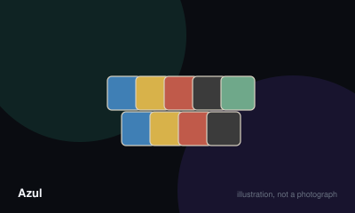

# Azul



> Draft tiles and place them on your wall in patterns, scoring for adjacency and for completed rows, columns and colours.

|  |  |
|---|---|
| **Players** | 2–4, best at 2 |
| **Box says** | 45 min |
| **Actually takes** | 40 min |
| **Teach time** | 6 min |
| **Between your turns** | 25 sec |
| **Works at age** | 8+ |
| **Weight** | ●●○○○ 1.8 / 5 |
| **Luck** | 30% chance, 70% skill |
| **Family** | tile-drafting |

## How many players changes what

| Players | Setup | Notes |
|---|---|---|
| **2** | Five factory displays. | Widely considered the best count. The drafting becomes a precise duel where every tile you leave is a tile they take. |
| **3** | Seven factory displays. | Good, though the tile you were counting on is more likely to vanish before your turn. |
| **4** | Nine factory displays. | Playable and pretty, but planning ahead becomes considerably less reliable. |

## Rules

Take tiles, place them in rows, move them to your wall, score for what they
touch. The whole game is about what you are forced to take, not what you want.

## Setup

Fill each factory display with four tiles drawn blind from the bag. Every player
gets a board with five pattern lines on the left, a five-by-five wall on the
right, and a floor line underneath.

## Drafting

On your turn you must do exactly one of two things:

- Take **every tile of one colour** from a single factory display, and push all
  remaining tiles from that display into the centre of the table.
- Take **every tile of one colour** from the centre. The first player to take
  from the centre in a round also takes the starting player marker and places it
  on their floor line, which costs a point.

You must take all of that colour. You do not get to choose how many.

## Placing

Put the tiles you took into a single pattern line on your board. The lines hold
one, two, three, four and five tiles respectively.

Three restrictions:

- A pattern line may only hold one colour.
- You may not place a colour in a line if that colour is already on your wall in
  the corresponding row.
- Any tiles that will not fit drop onto your floor line and cost you points.

## Scoring the wall

When no tiles remain anywhere, every completed pattern line sends one tile onto
the matching row of your wall. The rest of that line is discarded.

Score each tile as you place it by counting the unbroken horizontal and vertical
chains it becomes part of. A tile touching nothing scores one. A tile completing
a run of three horizontally and two vertically scores five.

Then subtract your floor penalties, refill the factories, and play another round.

## Ending

The game ends after the round in which somebody completes a full horizontal row
on their wall. Then add the bonuses: two points per completed row, seven per
completed column, ten for each colour placed all five times.

## The trap

Taking tiles you cannot use is not optional. Late in a round the centre often
holds nothing but tiles that will land straight on your floor, and choosing
which damage to take is the real decision the game is built around.

## Settle the argument

### Can you take just some of the tiles of a colour?

**Official rule.** Played by almost everyone, almost everywhere.

No. You take every tile of the chosen colour from that display or from the centre, however many there are. Being forced to take four when you can only use two is the central tension of the game.

```console
$ rulebook ruling azul "do I take all the tiles"
```

### What happens to tiles that do not fit in your pattern line?

**Official rule.** Played by almost everyone, almost everywhere.

They go straight to your floor line and subtract points at the end of the round, on an increasing scale. You may also choose to send tiles to the floor deliberately, which is occasionally the correct play.

```console
$ rulebook ruling azul "overflow tiles azul"
```

### Can you fill a pattern line with a colour already on your wall in that row?

**Official rule.** Widespread but far from universal.

No. If that colour already sits in the corresponding row of your wall, that pattern line is closed to it permanently. Any tiles of that colour you take must go somewhere else or onto the floor.

*What it changes:* This restriction tightens dramatically in the last two rounds and is what turns the endgame into a series of forced bad choices.

```console
$ rulebook ruling azul "repeat colour azul"
```

### Does taking from the centre first cost you?

**Official rule.** Widespread but far from universal.

Yes. The first player to draft from the centre each round takes the starting player marker onto their floor line, costing one point, and leads the next round. It is a small price and often worth paying deliberately.

```console
$ rulebook ruling azul "first player marker azul"
```

### Do unfinished pattern lines stay for the next round?

**Official rule.** Played by almost everyone, almost everywhere.

Yes. Pattern lines that are not full remain exactly as they are into the next round, keeping their colour and their tiles. Only completed lines send a tile to the wall and clear.

```console
$ rulebook ruling azul "incomplete rows azul"
```

### Does the game stop the instant someone completes a row?

**Official rule.** Widespread but far from universal.

The current round is played to its end, including all wall placement and scoring, and the game finishes after that. It does not stop mid-round, so a player can still complete a row of their own in the same round.

```console
$ rulebook ruling azul "when does azul end"
```

## Teaching it

Six minutes. The components do a lot of the work — it is a beautiful game and
people want to touch it, which buys you attention.

**Start with the physical loop, not the scoring:** "Take tiles from a plate, put
them in a row on the left, and at the end of the round they move across to the
wall on the right." Trace it with your finger on their board.

**Then the drafting rule, which is the game:** "You take *all* the tiles of one
colour from one plate, and everything else on that plate goes into the middle."
Demonstrate it. The push-to-centre is what makes every choice matter and it is
invisible until you see it happen.

**Then the punishment, immediately:** "Anything that doesn't fit in your row
goes down here and costs you points." Point at the floor line. New players who
learn this after their first overflow feel cheated.

**Show one scoring example on the wall and only one.** Place a tile next to two
others in a row and count aloud: "One, two, three — that's three points." Then
say: "Touching more tiles is worth more. That's all the scoring is." Do not
explain columns and colour bonuses yet.

**Mention the fixed colour positions once:** "Each colour has a set place in
each row — it's printed on the board." Then let them look it up as they go
rather than memorising it.

**Introduce the end-game bonuses at the end of round one,** not before. By then
they have placed real tiles and the words "complete a column for seven points"
mean something. Explained at the start, they are noise.

**Say the strategic truth out loud, because it is not obvious:** "You'll often
have to take tiles you don't want. Picking the least bad option is most of the
game." That single sentence turns a frustrating first game into an interesting
one.

**Warn about the ending:** "The game stops when someone finishes a whole
horizontal row." Beginners routinely fail to notice they are one tile from
ending it while behind.

## Variants worth knowing

**Grey board** — The reverse of the player board removes the fixed colour positions, letting you choose where each colour goes on your wall. Substantially harder.

## Play it online, free

- **[Board Game Arena](https://boardgamearena.com/gamepanel?game=azul)** — Free with an account. It scores the wall for you, which removes the most common source of error.

## When it is fair to stop

A player who has taken heavy floor penalties two rounds running is unlikely to recover, but rounds are short and the endgame bonuses are large enough that conceding early is usually premature. Finish the round at minimum.

## When a piece goes missing

The tiles are the game and cannot sensibly be improvised. Player boards are printable. The bag can be any opaque container.

## Accessibility

The five tile colours are distinguished partly by pattern, which helps, but the blue and turquoise are close under warm light. The tiles are chunky and pleasant to handle, which makes this one of the more dexterity-friendly modern games. Scoring involves counting adjacency chains, which is the main arithmetic demand.

## Sources

- <https://en.wikipedia.org/wiki/Azul_(board_game)>

---

*Generated from [`games/azul/`](../../games/azul/). Fix it there, not here.*
