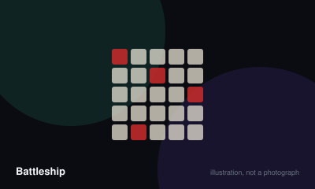

# Battleship



> Find and sink all five of your opponent's hidden ships before they sink yours.

|  |  |
|---|---|
| **Players** | 2–2, best at 2 |
| **Box says** | 20 min |
| **Actually takes** | 20 min |
| **Teach time** | 90 sec |
| **Between your turns** | 10 sec |
| **Works at age** | 6+ |
| **Weight** | ●○○○○ 1.1 / 5 |
| **Luck** | 65% chance, 35% skill |
| **Family** | hidden-information-grid |

## How many players changes what

| Players | Setup | Notes |
|---|---|---|
| **2** | Each player secretly places five ships on their own ten by ten grid, horizontally or vertically, never diagonally and never overlapping. | The only count the game supports. Team play works informally with two people per side conferring. |

## Rules

Two grids, ten by ten. Yours holds your fleet; the other tracks where you have
shot. Neither player can see the other's board, and that is the whole game.

## Placing your fleet

Each player secretly arranges five ships on their own grid:

- Carrier, five squares
- Battleship, four squares
- Cruiser, three squares
- Submarine, three squares
- Destroyer, two squares

Ships sit horizontally or vertically along the grid lines. They may not be
placed diagonally, may not overlap, and may not run off the edge. Whether ships
may touch each other is the one setup question worth agreeing before you start.

## Firing

Players alternate. On your turn, name a single coordinate — a letter and a
number. Your opponent must tell you truthfully whether it is a hit or a miss.

Mark it on your tracking grid: one symbol for hits, another for misses. Losing
track of what you have already fired at is the most common way to lose.

## Sinking

When every square of a ship has been hit, its owner must say so and name the
ship. You are not required to volunteer anything before that point, and you must
not lie about it afterwards.

Knowing *which* ship you have sunk is real information, because it tells you how
many squares of each length remain to be found.

## Winning

Sink all five enemy ships. Since players alternate and the game is otherwise
symmetrical, the player who fires first genuinely has the advantage — flip for
it, or play two games and swap.

## Settle the argument

### Can two ships be placed next to each other?

**Official rule.** Widespread but far from universal.

In the standard published rules, yes. Ships may sit side by side as long as they do not overlap. Only diagonal placement and overlapping are forbidden.

*The house version:* A widespread house version requires at least one empty square between any two ships, which makes deduction far more powerful because a confirmed miss rules out a large area.

*What it changes:* Requiring gaps makes the game noticeably shorter and rewards systematic searching. Allowing contact makes it more of a guessing game and protects clustered fleets.

```console
$ rulebook ruling battleship "can ships touch"
```

### Do you have to say which ship has been sunk?

**Official rule.** Played by almost everyone, almost everywhere.

Yes. When the last square of a ship is hit you must announce both that it has sunk and which ship it was. Concealing it is cheating, though you are never obliged to hint at anything before the final hit.

```console
$ rulebook ruling battleship "do I say what ship sank"
```

### Is going first an advantage?

**Official rule.** Widespread but far from universal.

Yes, unavoidably. Both players need the same number of successful shots, so whoever starts reaches the total first in any tied race. Flip a coin, or play an even number of games and alternate who opens.

```console
$ rulebook ruling battleship "who shoots first"
```

### Do you get another shot when you score a hit?

**Not an official rule.** Widespread but far from universal.

Not in the standard rules, where every turn is exactly one shot regardless of the result.

*The house version:* Many tables let a hit earn another shot immediately, continuing until you miss.

*What it changes:* It shortens the game a great deal and hugely magnifies the first-player advantage, since a lucky opening run can end things before the second player has properly begun.

```console
$ rulebook ruling battleship "extra turn on hit"
```

### Can ships be placed diagonally?

**Official rule.** Played by almost everyone, almost everywhere.

No. Every ship lies along a row or a column. Diagonal placement is not permitted in any published version, and allowing it breaks the search logic the whole game rests on.

```console
$ rulebook ruling battleship "diagonal placement"
```

## Teaching it

Ninety seconds. This is the easiest teach in the registry and it works with a
six-year-old.

**Show both grids and name their jobs.** "This one is your ships. This one is
where you remember what you've already tried." That distinction is the only
thing anybody ever gets confused about.

**Then the loop, in one sentence:** "You say a square, I tell you hit or miss,
then it's my turn."

**Place your fleet in front of them the first time** rather than explaining the
rules about diagonals and overlapping. Doing it visibly answers every question
before it is asked.

**Agree one thing before the first shot:** whether ships are allowed to touch.
Both versions are perfectly good, but discovering mid-game that you assumed
different things is genuinely annoying. Say: "Can ships be next to each other?
Let's say yes." Then it is settled.

**With children, teach the search pattern after the first game, not during it.**
Let them shoot at random once and enjoy it. Afterwards, mention that shooting
every other square finds a two-square ship just as reliably and takes half as
long. That is a real strategic insight and it lands much better as a discovery
than as an instruction.

**Say this once:** "When you sink something, you have to say what it was." It is
an official rule, it is easy to forget, and it matters more than it looks.

## Variants worth knowing

**Salvo** — You fire one shot per surviving ship each turn instead of a single shot, which shortens the game dramatically and rewards early hits.

**Moving fleet** — Ships may move one square per turn instead of firing. Turns a search puzzle into something closer to a chase.

## When it is fair to stop

Once four of your five ships are sunk, conceding costs nothing and saves five minutes of being shot at. Nobody has ever come back from that position.

## When a piece goes missing

This game does not need its box at all. Two sheets of squared paper per player and a pen reproduce it exactly, which is how most people first played it.

## Accessibility

The plastic pegs are very small and a real dexterity barrier; the paper version avoids this completely and is in no way inferior. Calling and hearing coordinates accurately matters, so agree on a phonetic convention if the room is loud — B and D cause most of the disputes.

## Sources

- <https://www.hasbro.com/common/instruct/battleship.pdf>

---

*Generated from [`games/battleship/`](../../games/battleship/). Fix it there, not here.*
