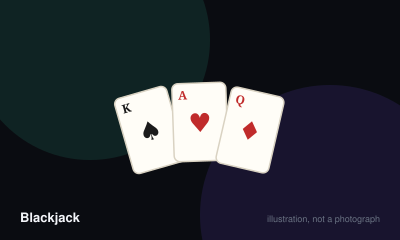

# Blackjack



> Beat the dealer's hand without going over 21.

|  |  |
|---|---|
| **Players** | 1–7, best at 4 |
| **Box says** | 20 min |
| **Actually takes** | 30 min |
| **Teach time** | 4 min |
| **Between your turns** | 45 sec |
| **Works at age** | 8+ |
| **Weight** | ●●○○○ 1.8 / 5 |
| **Luck** | 70% chance, 30% skill |
| **Family** | banking |

## How many players changes what

| Players | Setup | Notes |
|---|---|---|
| **1** | One player against the dealer. Fine for learning basic strategy, dull as a social game. | — |
| **2-7** | Each player plays their own hand against the dealer, not against each other. | Casinos seat seven; at home, more than five makes each player wait too long. |

## Rules

You are not playing the other players. Every hand is you against the dealer, and
the dealer has no choices to make.

## Card values

| Card | Value |
| --- | --- |
| 2–10 | Face value |
| Jack, Queen, King | 10 |
| Ace | 11, or 1 if 11 would bust you |

A hand holding an Ace still counted as 11 is **soft**. Soft hands cannot bust on
the next card.

## Setup

Everyone places a bet. Each player receives two cards face up. The dealer takes
one face up and one face down.

If your first two cards total 21 — an Ace with any ten-valued card — that is a
**blackjack**, and it normally pays three to two.

## Your options

- **Hit** — take another card. You may keep hitting until you stand or bust.
- **Stand** — take no more cards.
- **Double down** — double your bet and take exactly one more card.
- **Split** — if your two cards are the same rank, separate them into two hands
  with a second bet equal to the first.

Going over 21 is a **bust** and loses immediately, before the dealer plays.

## The dealer's turn

The dealer reveals the face-down card and then follows a fixed rule with no
discretion: draw while the total is 16 or less, stand on 17 or more. Whether the
dealer hits a *soft* 17 varies and is printed on the table.

## Settling

- Dealer busts and you did not — you win.
- Your total is higher than the dealer's — you win.
- Equal totals — a push; your bet is returned.
- Dealer's total is higher — you lose.

## Playing at home

Rotate the dealer every round. The dealer has a mathematical edge, so leaving
one person as the house for a whole evening is not a game, it is a slow
transfer of matchsticks.

## Settle the argument

### Is an Ace worth 1 or 11?

**Official rule.** Played by almost everyone, almost everywhere.

Both, whichever helps. An Ace counts as 11 unless that would bust you, in which case it counts as 1. A hand containing an Ace still counted as 11 is called "soft" — a soft 17 (Ace plus six) can never bust on one more card, which is why the dealer rule for soft 17 matters so much.

```console
$ rulebook ruling blackjack "ace value blackjack"
```

### If both you and the dealer bust, is it a push?

**Official rule.** Played by almost everyone, almost everywhere.

No. You lose. The moment you go over 21 your bet is collected, before the dealer plays at all. This ordering is the single largest source of the house edge, and most casual players do not realise it exists.

```console
$ rulebook ruling blackjack "both bust blackjack"
```

### Does the dealer have a choice about hitting?

**Official rule.** Played by almost everyone, almost everywhere.

None at all. The dealer follows a fixed rule: draw to 16, stand on 17. Whether they hit a *soft* 17 varies by house and is printed on the table. Hitting soft 17 is worse for the player.

```console
$ rulebook ruling blackjack "does the dealer have to hit"
```

### Should you take insurance?

**Official rule.** Widespread but far from universal.

It is a legal side bet, and for a player not counting cards it is a bad one. It pays 2:1 on a proposition that comes in slightly less than one time in three, so it loses money over time regardless of what you hold.

```console
$ rulebook ruling blackjack "is insurance worth it"
```

### Do five cards under 21 win automatically?

**Not an official rule.** Standard in some places, unheard of in others.

Not a standard casino rule and absent from most tables.

*The house version:* A hand of five cards totalling 21 or less wins immediately, regardless of the dealer's hand.

*What it changes:* Shifts the odds noticeably toward the player and rewards hitting on totals you would normally stand on.

*Played mostly in:* United Kingdom, Australia

```console
$ rulebook ruling blackjack "five card charlie"
```

## Teaching it

## Say this first

"Get closer to 21 than the dealer without going over. Face cards are ten, an
Ace is eleven or one, whichever helps you."

Deal a hand immediately and talk through it. Blackjack is learned by playing one
hand, not by listening.

## The two rules people get wrong

Say both of these out loud early, because they decide most hands:

1. **If you bust, you lose straight away** — even if the dealer busts
   afterwards. Your money is already gone.
2. **The dealer has no choices.** They draw to 16 and stand on 17, always. There
   is no point trying to read them.

## Introduce later

Doubling and splitting on the third or fourth hand. Insurance last, if at all —
and when you do, say plainly that it is a bad bet for anyone who is not counting
cards.

## For a home game

Rotate the dealer each round and use matchsticks. The dealer wins slightly more
than they lose, so a fixed dealer turns a game into an arithmetic demonstration.

## Editions

| Edition | Year | What changed |
|---|---|---|
| Six-to-five payouts | — | Many modern casino tables pay 6:5 on blackjack rather than the traditional 3:2, which roughly triples the house edge. It is the single most important number on the table. |

## When it is fair to stop

Anyone may leave between hands. That is the whole appeal — the game has no arc to interrupt, so walking away after a round costs nobody anything.

## When a piece goes missing

Any deck and any counters work — coins, matches, dried beans. The dealer role can rotate each round so that nobody is stuck as the house all evening.

## Accessibility

Card values are numeric and colour is irrelevant, so colour vision is not needed. Betting and payout arithmetic is the real barrier; a printed payout card helps enormously.

## Sources

- <https://www.pagat.com/banking/blackjack.html>

---

*Generated from [`games/blackjack/`](../../games/blackjack/). Fix it there, not here.*
