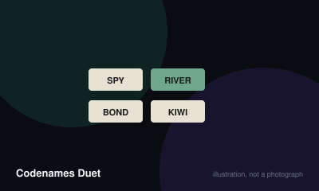

# Codenames Duet



> Find all fifteen agents between you, giving each other one-word clues, before you run out of turns or hit the assassin.

|  |  |
|---|---|
| **Players** | 2–4, best at 2 |
| **Box says** | 15 min |
| **Actually takes** | 25 min |
| **Teach time** | 5 min |
| **Between your turns** | 40 sec |
| **Works at age** | 11+ |
| **Weight** | ●●○○○ 1.5 / 5 |
| **Luck** | 30% chance, 70% skill |
| **Family** | cooperative-word-association |

## How many players changes what

| Players | Setup | Notes |
|---|---|---|
| **2** | Five by five grid of words, key card in the holder so each player sees only their own side. | The count it was designed for, and one of the best cooperative games for exactly two people. |
| **3-4** | Play in two teams sharing each side of the key card, conferring on clues. | Works well and is more forgiving, though the intimacy that makes the two-player game special is diluted. |

## Rules

The cooperative version of Codenames. You are both clue-givers and both
guessers, and neither of you can see the whole picture.

## Setup

Deal twenty-five words into a square, five along each edge. Slide a key card into the
holder and place it between you so that each player sees only their own side.

The two sides are different. Each shows nine of your agents, three assassins,
and the rest bystanders. Crucially, some words are agents on both sides — and
there are fifteen agents to find in total, not eighteen.

Take nine turn tokens.

## Playing

Give your partner a one-word clue and a number, exactly as in standard
Codenames. The clue must relate to the meaning of the words, and it must not be
any word visible on the table.

Your partner guesses. For each guess:

- **Agent on your key** — place a green agent card. They may guess again.
- **Bystander** — the turn ends.
- **Assassin on your key** — the mission ends immediately in failure.

Your partner may make one more guess than the number you said, and may stop
early at any point.

Then you swap roles and they give you a clue.

## The critical difference from Codenames

A word that is an assassin on your key may be a perfectly good agent on your
partner's. You cannot see their assassins and they cannot see yours. Steering
your partner away from something you cannot warn them about is the entire
emotional experience of the game.

## Turn tokens

Each round costs a token. Run out and the mission fails. Finding an agent that
was already found from the other side returns a token, which is how a good pair
buys itself time.

## Winning

Find all fifteen agents before the tokens are gone. Because both players
contribute, some agents count for both of you and the total is fifteen rather
than eighteen.

## The campaign

The box includes a map of missions with varying numbers of tokens and allowed
mistakes. It is worth using — the escalating difficulty is genuinely well
designed and gives a pair something to work through over weeks.

## Settle the argument

### How many agents are there in total?

**Official rule.** Widespread but far from universal.

Fifteen. Each key shows nine agents, but three of them overlap between the two sides, so the combined total is fifteen rather than eighteen. Finding an overlapping word from the second side returns a turn token rather than counting again.

```console
$ rulebook ruling codenames-duet "how many agents duet"
```

### Can a word be an assassin for one player and an agent for the other?

**Official rule.** Played by almost everyone, almost everywhere.

Yes, and this is the central design of the game. A word can be a perfectly safe agent on your key and an instant loss on your partner's. You are never permitted to warn them, and being unable to is the point.

```console
$ rulebook ruling codenames-duet "assassin on one side"
```

### Can your clue be a word visible on the table?

**Official rule.** Played by almost everyone, almost everywhere.

No. No clue may be any word currently visible in the grid, including as part of a compound. Once a word has been covered by an agent or bystander card it becomes legal to use.

```console
$ rulebook ruling codenames-duet "clue word on board"
```

### Are compound words and proper nouns allowed as clues?

**Not an official rule.** Widespread but far from universal.

The published rules require a single word, with proper nouns permitted at the group's discretion. Hyphenated and compound words sit in a genuine grey area that the rulebook acknowledges rather than settles.

*The house version:* Most pairs allow established compounds such as seatbelt, and allow well-known proper nouns. Stricter play allows neither.

*What it changes:* Agreeing before the first clue matters far more than which way you decide, because a mid-mission dispute costs a turn and the mood.

```console
$ rulebook ruling codenames-duet "two word clues"
```

### How many guesses does your partner get?

**Official rule.** Widespread but far from universal.

The number you said, plus one. They may also stop at any point before that. The extra guess is intended for picking up an agent from a previous clue that was left behind.

```console
$ rulebook ruling codenames-duet "number of guesses duet"
```

### Can you give a clue for zero?

**Official rule.** Occasional, or specific to one group.

Yes. A clue of zero tells your partner that none of the words relating to it are yours, which is a way of steering them away from danger without naming it. They may then guess as many times as they like, which makes it a genuine gamble rather than a free warning.

```console
$ rulebook ruling codenames-duet "zero clue duet"
```

## Teaching it

Five minutes, and if either player has played standard Codenames, three.

**If they know Codenames, start with the difference:** "Same clue-giving, but
we're on the same side, and we each see a different key. I know some agents you
don't, and you know some I don't." That single sentence is the whole game.

**If they don't know Codenames, teach the clue first:** "I say one word and a
number. The word is a hint that connects some of these words on the table. The
number is how many." Give a live example using the actual grid in front of you —
it lands infinitely better than an abstract one.

**Then the guessing:** "You point at words. I'll tell you if you're right. Get it
right and you can keep going."

**Then the thing that makes Duet frightening, and say it plainly:** "There are
assassins on my card that you can't see, and assassins on yours that I can't. If
either of us touches one, the mission's over." Watch them realise they are about
to send their partner into something invisible. That is the moment the game
sells itself.

**Explain the clue restriction properly,** because it causes every argument:
"Your clue can't be a word that's on the table, and it has to be about what the
words mean — not how they're spelled or how they sound."

**Mention the token economy briefly:** "We've got nine turns between us. Finding
something the other person already found gives one back."

**For a first game, ignore the campaign map** and just play a standard mission
with nine tokens. The campaign is excellent and it is also a second layer of
rules that nobody needs on their first night.

**One piece of advice worth giving:** "Clue for two rather than four. Getting two
right and stopping is much better than getting three right and then hitting my
assassin." Ambitious clues are how new pairs lose.

## When it is fair to stop

A failed mission takes fifteen minutes and the campaign map lets you retry the same node, so there is no reason to abandon one. If you hit the assassin, the mission is simply over and you start another.

## When a piece goes missing

The key card holder is essential and cannot be improvised easily, since it must show each player a different pattern. The word cards can be replaced with any twenty-five nouns written on paper.

## Accessibility

The green and beige agent cards are close in value under low light. The game is entirely language-based and assumes fluent shared vocabulary and cultural reference, which makes it hard across a language gap in a way that Codenames Duet's cooperative framing does at least make gentler.

## Sources

- <https://en.wikipedia.org/wiki/Codenames_(board_game)>

---

*Generated from [`games/codenames-duet/`](../../games/codenames-duet/). Fix it there, not here.*
