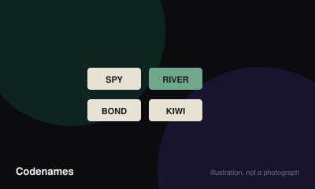

# Codenames



> Guide your team to identify all of your agents from a grid of words, using one-word clues, without hitting the assassin.

|  |  |
|---|---|
| **Players** | 2–8, best at 6 |
| **Box says** | 15 min |
| **Actually takes** | 25 min |
| **Teach time** | 4 min |
| **Between your turns** | 90 sec |
| **Works at age** | 10+ |
| **Weight** | ●○○○○ 1.3 / 5 |
| **Luck** | 25% chance, 75% skill |
| **Family** | word-association |

## How many players changes what

| Players | Setup | Notes |
|---|---|---|
| **2** | Play the cooperative Duet-style variant, or one clue-giver against the clock. The competitive game does not work with two. | The base box supports two only as a co-op puzzle, not as the designed game. |
| **4-6** | Two teams, one clue-giver each. Lay out a 5x5 grid of words and give both clue-givers the same key card. | Six is the sweet spot — enough guessers for discussion without gridlock. |
| **7-8** | Same structure, larger teams. Expect longer discussion and more table talk. | Above eight the guessing team cannot converge and the game slows badly. |

## Rules

Two teams, one grid of words, and two people who know which words belong to whom
and are allowed to say almost nothing.

## Setup

Lay out twenty-five word cards in a five-by-five grid.

Each team picks a **clue-giver**. Both clue-givers — and only they — look at the
same key card, which shows:

- 9 words belonging to the starting team
- 8 words belonging to the other team
- 7 innocent bystanders
- 1 **assassin**

The starting team is shown on the key card and has one extra word to find.

## Giving a clue

On your team's turn, the clue-giver says **one word and one number**.

The word relates to the words on the grid you want your team to guess. The
number says how many.

You may not use any word currently visible in the grid, and you may not use a
form of one. Tone, emphasis and gestures are all forbidden — the clue is the
whole communication.

## Guessing

The team discusses and then guesses one word at a time by touching it. The
clue-giver covers the word with a card revealing who it belonged to:

- **Your agent** — correct. Guess again if you want.
- **A bystander** — turn ends.
- **The other team's agent** — turn ends, and you have helped them.
- **The assassin** — you lose immediately.

You may make **one more guess than the number given**, as long as every guess so
far has been correct. This lets you pick up words you missed from earlier clues.

## Ending

The first team to reveal all of their agents wins. Revealing the assassin loses
instantly, whatever the score.

## Clue numbers you can give

Zero is legal, and means none of the grid words relate to your clue; the team
may then guess as many as they like. "Unlimited" is also legal and is used when
several known words are outstanding.

## Settle the argument

### What exactly is a legal clue?

**Official rule.** Played by almost everyone, almost everywhere.

Exactly one word and one number, and nothing else — no tone, no gestures, no "this one's a stretch". Proper nouns are allowed if your group agrees; compound words are only legal if they are genuinely written as one word. The number is how many grid words the clue relates to.

```console
$ rulebook ruling codenames "can you give a two word clue"
```

### Can your clue be a word visible on the grid?

**Official rule.** Played by almost everyone, almost everywhere.

No. The clue may not be any word currently visible in the grid, and you may not use a form of it either. Once a word is covered by an agent card, it becomes usable again.

```console
$ rulebook ruling codenames "can the clue be on the table"
```

### Do you always get one extra guess?

**Official rule.** Played by almost everyone, almost everywhere.

Yes. A team may make one more guess than the number given, provided every guess so far has been correct. This exists so a team can pick up a word they missed from an earlier clue, and it is the mechanism most new players forget they have.

```console
$ rulebook ruling codenames "extra guess codenames"
```

### Can you give a clue for zero words?

**Official rule.** Widespread but far from universal.

Yes to both. A clue of zero means "none of these relate to my words" and lets the team guess as many as they like, using the bonus-guess rule to chase earlier clues. "Unlimited" is used when the team already has several known words outstanding. Both are legal and both are rare enough to surprise people.

```console
$ rulebook ruling codenames "clue for zero"
```

### Are homophones and near-spellings allowed?

**Not an official rule.** Widespread but far from universal.

The published rules leave this to the group, which is a polite way of saying it is the most argued-about point in the game.

*The house version:* Common positions are: homophones always allowed, homophones never allowed, or allowed only if the spelling differs and the meaning is unrelated.

*What it changes:* Decide before the first clue. Mid-game is the worst possible time to discover the two teams disagree.

```console
$ rulebook ruling codenames "can you use a homophone"
```

## Teaching it

## Put the grid down first

Lay the twenty-five words out before explaining anything. People start making
connections immediately, which is the game teaching itself.

## Say this

"Two teams. One person on each team knows which words are yours. They give a
one-word clue and a number — the number is how many words it points at. Your
team guesses. Get one wrong and your turn ends."

Then, pointing at the assassin card: **"Touch this one and you lose instantly."**
Say it last so it lands.

## For the clue-givers specifically

Pull them aside for fifteen seconds:

- "One word, one number, nothing else. No hints, no faces, no sighing."
- "Your word can't be on the board."
- "It is fine to give a clue for one. New clue-givers try for four and lose the
  game."

That last point is the single most useful thing you can tell a first-time
clue-giver.

## Mention after the first turn

The bonus guess. "You always get one more than the number, if you've been right
so far." It is easier to understand once they have seen a turn end.

## Settle before the first clue

"Are homophones allowed?" The rules deliberately leave this to the group, and
it is the only thing this game reliably produces an argument about.

## Editions

| Edition | Year | What changed |
|---|---|---|
| Codenames Duet | — | A fully cooperative two-player version with a different key card and a shared turn limit, rather than an adaptation of the competitive rules. |

## Play it online, free

- **[codenames.game](https://codenames.game)** — Free, no account, and you can play with people in the room by sharing one link. Made by the publisher.

## When it is fair to stop

Rounds are short enough that finishing is easier than quitting. If the room has lost interest, play the current round out and stop there.

## When a piece goes missing

Missing word cards barely matter — the grid only needs twenty-five words, and any twenty-five from the set work. A lost key card can be replaced by dealing agent cards face down into a grid and peeking.

## Accessibility

Agent cards are red and blue, the classic problematic pair; the key card is also colour-coded. Mark team cards with shapes, or say the team aloud each turn. The game is entirely verbal otherwise and works well for players with limited mobility.

## Sources

- <https://czechgames.com/en/codenames/>

---

*Generated from [`games/codenames/`](../../games/codenames/). Fix it there, not here.*
