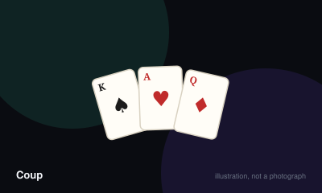

# Coup



> Be the last player with any influence remaining, by bluffing about which characters you hold and calling other players' bluffs.

|  |  |
|---|---|
| **Players** | 2–6, best at 5 |
| **Box says** | 15 min |
| **Actually takes** | 25 min |
| **Teach time** | 6 min |
| **Between your turns** | 30 sec |
| **Works at age** | 12+ |
| **Weight** | ●●○○○ 1.7 / 5 |
| **Luck** | 35% chance, 65% skill |
| **Family** | bluffing-and-elimination |

## How many players changes what

| Players | Setup | Notes |
|---|---|---|
| **2** | Standard deal of two cards each. The official variant gives the starting player one coin instead of two. | Sharp and fast, but with only one opponent the bluffing becomes a duel of nerve rather than a table read. |
| **3-4** | Two cards and two coins each. | Good. Games run about fifteen minutes and elimination stings less. |
| **5-6** | Two cards and two coins each. Consider adding the Inquisitor variant deck if you own it. | The best range. More players means more possible bluffs and a genuinely uncertain table. |

## Rules

You hold two character cards face down. You may claim to be any character at any
time, whether or not you hold them. Everything else follows from that.

## Setup

Shuffle the fifteen character cards and deal two to each player, face down.
These are your influence. Take two coins each from the treasury.

## The general actions

Available to everybody, always, and never challengeable:

- **Income** — take one coin.
- **Foreign aid** — take two coins. Can be blocked by a claimed Duke.
- **Coup** — pay seven coins and force a player to lose a card. Cannot be
  blocked or challenged. **If you begin your turn with ten or more coins you
  must coup.**

## The characters

- **Duke** — take three coins. Blocks foreign aid.
- **Assassin** — pay three coins to make a player lose a card. Blocked by the
  Contessa.
- **Contessa** — blocks assassination. Has no action of its own.
- **Captain** — steal two coins from another player. Blocked by another Captain
  or by the Ambassador.
- **Ambassador** — draw two cards from the deck, keep two of the total, return
  two. Blocks stealing.

## Claiming and challenging

To take a character action, simply claim that character. You do not show
anything.

Any other player may challenge. If they do, you reveal the card:

- If you had it, the challenger loses a card. You shuffle your revealed card
  back into the deck and draw a replacement, so your bluffing position is
  restored.
- If you did not have it, you lose a card and the action does not happen.

Blocks work identically. Claiming a block can itself be challenged, and a false
block costs you a card.

## Losing influence

When you lose a card you choose which one and turn it face up permanently.
Everybody can now see it, and everybody knows what you no longer hold.

Lose both and you are out of the game.

## Winning

Be the last player with a face-down card.

## Settle the argument

### Do you have to coup when you have ten coins?

**Official rule.** Played by almost everyone, almost everywhere.

Yes. Beginning your turn with ten or more coins forces you to launch a coup as your action. You may not take income, use a character, or hold the coins back. It is the rule that guarantees the game ends.

```console
$ rulebook ruling coup "ten coins rule"
```

### What happens when you are challenged and you really had the card?

**Official rule.** Played by almost everyone, almost everywhere.

You reveal it, the challenger loses a card, and then you shuffle your revealed card back into the deck and draw a replacement. You do not keep the revealed card, which means the table's new information about you is immediately worthless.

*What it changes:* Being challenged correctly is a strong outcome, and beginners routinely avoid honest claims because they do not realise the card is replaced.

```console
$ rulebook ruling coup "challenged and I had it"
```

### Can you challenge someone who blocks you?

**Official rule.** Played by almost everyone, almost everywhere.

Yes. A block is itself a character claim and is challengeable on exactly the same terms. Claiming a Contessa you do not hold to survive an assassination is one of the most common bluffs in the game, and calling it is often correct.

```console
$ rulebook ruling coup "challenging a block"
```

### If your assassination is challenged and fails, do you get the coins back?

**Official rule.** Widespread but far from universal.

No. The three coins are spent when you declare the assassination and are not refunded, whether you are challenged successfully, blocked, or anything else. A failed assassin bluff therefore costs you a card and three coins together.

```console
$ rulebook ruling coup "failed assassination coins"
```

### If an assassination succeeds against a player with one card, and they challenge and lose, do they lose two?

**Official rule.** Occasional, or specific to one group.

A player with a single card who challenges and loses is eliminated by that alone, and the assassination becomes irrelevant. You cannot lose more influence than you hold, so there is no double penalty — only a faster exit.

```console
$ rulebook ruling coup "double loss coup"
```

### When you lose a card, do you choose which one and does everyone see it?

**Official rule.** Played by almost everyone, almost everywhere.

You choose which of your cards to reveal, and it stays face up for the rest of the game where everyone can see it. That public information is significant — the table now knows one character you definitely cannot claim honestly, and one more copy of it that is out of the deck.

```console
$ rulebook ruling coup "which card do I lose"
```

## Teaching it

Six minutes, and it is the hardest teach among the small-box games because five
characters and their counters must land before turn one.

**Start with the licence to lie, because it reframes everything:** "You have two
cards. You can claim to be any character you want, whether or not you actually
have them. That's not cheating — that's the game."

**Then the consequence, immediately:** "But anyone can call you out. If they
catch you, you lose a card. If they're wrong, they lose one."

**Give everybody a reference card and do not proceed until they have one.** This
is not optional. Five characters, five actions and four counters cannot be
memorised from speech, and a table without references plays a slow, confused
first game and concludes Coup is fiddly.

**Teach the three general actions first,** because they are the safe ground:
income, foreign aid, coup. Say: "You can always do these three. Nobody can
challenge income or a coup."

**Then walk the reference card top to bottom once,** naming the action and its
counter together: "Duke takes three, and blocks foreign aid. Assassin pays three
to kill, and the Contessa stops it." Pairing them is what makes them stick.

**Say the ten-coin rule clearly and early:** "If you start your turn with ten
coins, you *must* coup. No choice." Players who discover this late feel ambushed,
and it is the rule that stops the game stalling.

**Emphasise the free replacement on a successful challenge:** "If someone
challenges you and you really had it, you swap that card for a fresh one — so
they've given you a brand new secret." New players consistently under-rate how
good it is to be challenged correctly.

**Warn about elimination up front:** "Losing both cards puts you out for the
whole game, not the round. So we'll probably play a couple." Setting that
expectation early prevents somebody sitting bored for ten minutes.

## Variants worth knowing

**Inquisitor** — Replaces the Ambassador with the Inquisitor, who exchanges one card instead of two and can force a player to reveal a card privately. From the Reformation expansion.

**Two-player opening** — The official two-player rule starts the first player with one coin rather than two, offsetting the first-move advantage.

## When it is fair to stop

Eliminated players are out for the whole game rather than the round, so a short game is a real risk. Playing best of three is the usual fix, and anyone knocked out in the first two minutes should be offered the next deal quickly.

## When a piece goes missing

Coins are trivially replaced by anything countable. The character cards are the game. Reference cards are the component people lose first and miss most — writing the five characters and their actions on paper solves it.

## Accessibility

Coup demands holding five characters, their actions and their counters in mind simultaneously, which is a real barrier without the reference card in front of every player. It is also a game about lying to friends, which some players find genuinely uncomfortable rather than fun.

## Sources

- <https://en.wikipedia.org/wiki/Coup_(card_game)>

---

*Generated from [`games/coup/`](../../games/coup/). Fix it there, not here.*
