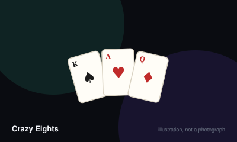

# Crazy Eights



> Empty your hand before anyone else by matching the top discard by rank or suit.

|  |  |
|---|---|
| **Players** | 2–7, best at 4 |
| **Box says** | 20 min |
| **Actually takes** | 25 min |
| **Teach time** | 90 sec |
| **Between your turns** | 30 sec |
| **Works at age** | 5+ |
| **Weight** | ●○○○○ 1 / 5 |
| **Luck** | 88% chance, 12% skill |
| **Family** | shedding |

## How many players changes what

| Players | Setup | Notes |
|---|---|---|
| **2** | Deal 7 each. | — |
| **3-4** | Deal 5 each. | — |
| **5-7** | Deal 5 each from two shuffled decks. | One deck runs out too quickly above four players. |

## Rules

The public-domain ancestor of Uno, playable with any deck of cards. If you know
Uno you already know this; the differences are that suits replace colours and
that only the Eight is special.

## Setup

Deal five cards each, or seven for a two-player game. Place the remainder face
down as the stock and turn the top card face up to begin the discard pile.

## Playing a turn

Play one card that matches the top discard by **suit** or by **rank**. A seven
of hearts can be followed by any heart, or by any seven.

An **Eight** is wild. Play it on anything, and name the suit that the next
player must match. You are not obliged to name the suit of the Eight itself.

If you cannot play, draw from the stock until you find a playable card, then
play it. If the stock runs out and you still cannot play, your turn passes.

## Ending the round

The first player to empty their hand wins the round.

If the stock is exhausted and nobody can play, the round is blocked. The player
with the lowest total in hand wins it.

## Scoring

The winner scores the value of the cards remaining in every other hand:

| Card | Points |
| --- | --- |
| Eight | 50 |
| King, Queen, Jack, Ten | 10 |
| Ace | 1 |
| All others | Face value |

Play to 100 points, or to whatever total suits the length of evening you want.

## Settle the argument

### Which cards have special powers in Crazy Eights?

**Official rule.** Played by almost everyone, almost everywhere.

In the base game, only the Eight does anything: it is wild, and you name the suit that follows. Every other card is an ordinary matching card. Almost every group adds powers to other ranks, and almost every group believes theirs are standard.

```console
$ rulebook ruling crazy-eights "what do jacks do in crazy eights"
```

### Do Twos make the next player draw, and do Queens skip?

**Not an official rule.** Played by almost everyone, almost everywhere.

Not part of the base game.

*The house version:* The common additions are: Two forces the next player to draw two, Queen skips the next player, Ace reverses direction, and Jack is another wild. Which subset a group uses varies wildly from household to household.

*What it changes:* Pushes the game toward Uno. Agree the set before dealing, because there is no canonical version to appeal to.

```console
$ rulebook ruling crazy-eights "do twos make you pick up"
```

### Do you draw until you can play, or just one card?

**Official rule.** Widespread but far from universal.

In the traditional game you draw until you can play, or until the stock runs out — the opposite of Uno, where you draw exactly one. Many groups import the Uno rule without realising they have swapped games.

```console
$ rulebook ruling crazy-eights "how many cards do you draw crazy eights"
```

## Teaching it

## Say this

"Match the top card by suit or by number. Eights are wild — play one and say
what suit comes next. First to run out wins."

That is the entire game. Deal and start.

## Say before dealing

"Are we playing that Twos make you pick up and Queens skip?"

This is the whole argument, and it is worth thirty seconds up front. The base
game gives powers to **only** the Eight. Every added power is a house rule, and
every family is certain their version is the standard one.

## Good first game for

Children, and anyone who says they do not like card games. The rule set is one
sentence long and the game teaches itself from the second turn onward.

## Editions

| Edition | Year | What changed |
|---|---|---|
| Commercial descendants | 1971 | Uno is a commercial reworking of this public-domain game, replacing suits with colours and adding dedicated action cards. |

## Play it online, free

- **[cardgames.io](https://cardgames.io/crazyeights/)** — Free in the browser. Note that it makes its own choices about which action cards exist, which is exactly the ambiguity this game is known for.

## When it is fair to stop

End it whenever. There is no accumulated position to waste, and a hand can be abandoned mid-trick without anyone losing anything they built.

## When a piece goes missing

Needs nothing but a standard deck, which makes it the game to fall back on when a boxed game is missing pieces. If you are short of cards, deal fewer.

## Accessibility

Standard playing cards have small corner indices; a large-index or jumbo deck helps considerably. The wild card is defined by rank rather than colour, so colour vision is not required.

## Sources

- <https://www.pagat.com/eights/crazy8s.html>

---

*Generated from [`games/crazy-eights/`](../../games/crazy-eights/). Fix it there, not here.*
