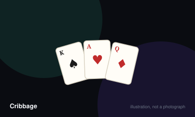

# Cribbage



> Be first to peg 121 points, scored from card combinations during play and from the hands counted afterwards.

|  |  |
|---|---|
| **Players** | 2–4, best at 2 |
| **Box says** | 30 min |
| **Actually takes** | 30 min |
| **Teach time** | 12 min |
| **Between your turns** | 15 sec |
| **Works at age** | 9+ |
| **Weight** | ●●○○○ 2.2 / 5 |
| **Luck** | 40% chance, 60% skill |
| **Family** | adding-and-melding |

## How many players changes what

| Players | Setup | Notes |
|---|---|---|
| **2** | Six cards each, two discarded by each player into the crib. The crib belongs to the dealer. | The count the game was designed around, and the only one where the maths of the crib works cleanly. |
| **3** | Five cards each plus one dealt straight to the crib; each player discards one. | Works well and turns the crib into a shared prize rather than a duel. |
| **4** | Five cards each in two partnerships, one discard apiece into the dealer's crib. | Partnership cribbage is a real tradition, though the pegging becomes noticeably more chaotic. |

## Rules

Two people, one deck and a wooden board with a hundred and twenty-one holes.
The game is arithmetic dressed as a pub tradition, and it is very old.

## The deal

Each player is dealt six cards. Both players choose two to throw face down into
a separate four-card hand called the crib, which belongs to the dealer and is
counted last. Throwing well into your own crib and badly into your opponent's
is half the skill.

The non-dealer then cuts the deck and the dealer turns the top card of the
lower half face up. This is the starter, and it belongs to everybody. If it is
a jack, the dealer immediately pegs two.

## Card values

Aces are one, face cards are ten, everything else is its number. Suits only
matter for flushes.

## The play

Players alternate laying cards face up in front of themselves, announcing the
running total as they go. The total may never exceed thirty-one. Score as you
go:

- Making the total exactly fifteen scores two.
- Making it exactly thirty-one scores two.
- Playing a card of the same rank as the previous one scores two, a third in a
  row scores six, a fourth scores twelve.
- Completing a run of three or more, in any order, scores one per card.

If you cannot play without exceeding thirty-one, say "go" and your opponent
continues alone. Whoever plays the last card before a reset scores one. The
total then resets to zero and play continues with the remaining cards.

## The count

Now everybody counts their four cards *plus* the starter as a five-card hand.
The non-dealer counts first, which matters when the game is nearly over.

- Every distinct combination totalling fifteen scores two.
- Every pair scores two, counted for each pairing.
- Every run of three or more scores one per card, counted for each distinct run.
- Four cards of one suit score four; if the starter matches too, five.
- The jack of the starter's suit scores one.

The dealer then counts their hand, and finally the crib on the same terms —
except that a crib flush requires all five cards to match.

The first player to 121 wins immediately.

## Settle the argument

### Can you claim points your opponent missed?

**Not an official rule.** Widespread but far from universal.

Not in the ordinary friendly game, where a player who undercounts simply loses those points and nobody profits.

*The house version:* Under muggins, an opponent who spots the omission may call it and peg the missed points themselves. It must be agreed before the game starts, and tournament play generally uses it.

*What it changes:* It sharpens the game enormously and makes it considerably less friendly. Teaching a beginner with muggins switched on is close to cruelty.

```console
$ rulebook ruling cribbage "muggins rule"
```

### Does a run have to be played in order during the pegging?

**Official rule.** Played by almost everyone, almost everywhere.

No. The cards must form a run when taken together, but the order they were laid in is irrelevant. Five, seven, six scores a run of three. A card that breaks the sequence ends the opportunity.

```console
$ rulebook ruling cribbage "runs in order cribbage"
```

### Does a four-card flush score in the crib?

**Official rule.** Widespread but far from universal.

No. A hand scores four for a four-card flush, but the crib requires all five cards including the starter to share a suit before it scores anything.

*What it changes:* It is the single most commonly misplayed scoring rule in the game, and it quietly changes what you should throw away.

```console
$ rulebook ruling cribbage "crib flush rules"
```

### What happens when the starter card is a jack?

**Official rule.** Widespread but far from universal.

The dealer immediately pegs two, before any cards are played. This is separate from the point scored for holding the jack matching the starter's suit, which is counted later and belongs to whoever holds that jack.

```console
$ rulebook ruling cribbage "jack turned up cribbage"
```

### If your opponent reaches 121 first, do you still count your hand?

**Official rule.** Played by almost everyone, almost everywhere.

No. The game ends the instant a player pegs the final hole, even in the middle of a count. This is exactly why the non-dealer counts first, and it is the reason a close endgame is decided before the cards are.

```console
$ rulebook ruling cribbage "game ends mid count"
```

## Teaching it

Twelve minutes, and it is the longest teach in this registry for a reason:
cribbage has two entirely separate scoring phases and beginners conflate them
constantly.

**Name the two phases before you explain either.** Write them down if you must:
"There's the play, where we take turns adding up to thirty-one. Then there's the
count, where we score our hands. They're different. Same cards, different
scoring." Every question you are about to be asked comes from someone who
missed this.

**Teach fifteens first and nothing else.** Deal five cards face up and find the
fifteens together. It is the core of the whole game, and people enjoy the hunt.
Once they can see fifteens without help, everything else is an addition.

**Then pairs, then runs.** In that order, because pairs are unambiguous and runs
have an edge case.

**Do not explain the crib properly on the first hand.** Say only: "Throw two
cards in there. It's my extra hand this time, so throw me rubbish." The strategy
of crib-throwing is genuinely the deepest part of the game and completely
opaque until they have counted a few hands.

**Let them peg for you the first game.** Counting your own hand aloud while they
move the pegs teaches the board without a separate lesson, and it means the
first thing they learn is the shape of the track rather than a rule.

**Say this before the first count, and say it slowly:** "Non-dealer counts
first. That matters at the end, because if you get to a hundred and
twenty-one first, the game stops there and my hand never gets counted at all."
That is the sentence that explains why cribbage is tense.

**The most common beginner error to pre-empt:** a run of three in the play does
not have to be laid in order. Five, seven, six is a run. Say it once, in
advance.

## Play it online, free

- **[PlayOK](https://www.playok.com/en/cribbage/)** — Free browser play, and it counts the hands for you — useful while you are still learning to spot fifteens.

## When it is fair to stop

The board makes the gap visible, so a player twenty holes from home against an opponent still in the first street can simply be conceded to. Skunk lines exist precisely so that a hopeless position has a name.

## When a piece goes missing

The board is only a counter. A pen and paper replaces it entirely, and a missing peg can be a coin or a match. Losing the board is inconvenient, never fatal.

## Accessibility

Standard boards have small holes and small pegs, which is a real dexterity barrier; large-format boards and continuous-track boards exist. The counting is genuinely arithmetic-heavy and happens under mild time pressure, which is the main cognitive load of the game.

## Sources

- <https://www.pagat.com/adders/crib6.html>

---

*Generated from [`games/cribbage/`](../../games/cribbage/). Fix it there, not here.*
