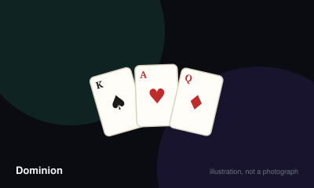

# Dominion



> Build a deck that buys victory points faster than anyone else, then have the most points when the game ends.

|  |  |
|---|---|
| **Players** | 2–4, best at 3 |
| **Box says** | 30 min |
| **Actually takes** | 45 min |
| **Teach time** | 10 min |
| **Between your turns** | 45 sec |
| **Works at age** | 10+ |
| **Weight** | ●●○○○ 2.4 / 5 |
| **Luck** | 35% chance, 65% skill |
| **Family** | deck-building |

## How many players changes what

| Players | Setup | Notes |
|---|---|---|
| **2** | Eight of each victory card, eight curses. Three empty supply piles ends the game. | Fast and sharp. Attack cards are far more punishing with only one opponent. |
| **3** | Twelve of each victory card, twenty curses. | The most balanced count — attacks are spread across two targets rather than aimed at one. |
| **4** | Twelve of each victory card, thirty curses. Four empty piles ends the game. | Long turns and heavy downtime unless everyone shuffles while others play. |

## Rules

Everybody starts with the same terrible deck of ten cards. You buy better ones,
they shuffle into your deck, and you draw them again later. That loop is the
whole game and it was the first of its kind.

## Setup

Every player begins with seven Coppers and three Estates. Shuffle and draw five.

Lay out the basic supply — Copper, Silver, Gold, Estate, Duchy, Province, and
Curse — plus ten kingdom card stacks chosen from the box. The ten you choose
change the game completely, which is why the same box plays differently every
time.

## A turn — three phases, always in this order

**Action.** Play one action card from your hand and do what it says. Many action
cards grant extra actions, and chaining them is where the game gets interesting.
If you have no actions to play, or do not want to, skip straight on.

**Buy.** Play as many treasure cards as you like from your hand, adding up their
coin values, then buy one card from the supply costing no more than that total.
The card you buy goes to your discard pile, not your hand.

**Clean-up.** Discard everything you played and everything left in your hand.
Draw five new cards.

## The deck

When your draw pile runs out, shuffle your discard pile and it becomes the new
draw pile. This is why every card you buy matters — everything you own comes
back around eventually, including the Estates that clog your hand and do nothing.

## Ending

The game ends immediately at the end of any turn where the Province pile is
empty, or where three supply piles are empty — four in a four-player game.

Then count the victory points in your entire deck: Estates are one, Duchies
three, Provinces six, Curses minus one. Most points wins. If tied, the player
who took fewer turns wins.

## The thing that catches everyone

Victory cards do nothing during play. They are dead weight in your hand all
game, and they are the only way to win. Buying them too early strangles your
deck; buying them too late loses the race. That tension is Dominion.

## Settle the argument

### Where does a card you buy go?

**Official rule.** Played by almost everyone, almost everywhere.

Onto your discard pile, never into your hand or your draw pile. You will not see it again until your discards are shuffled back, which is exactly why deck size matters so much.

```console
$ rulebook ruling dominion "do bought cards go to my hand"
```

### How many actions and buys do you get?

**Official rule.** Played by almost everyone, almost everywhere.

Exactly one action and one buy per turn, unless a card you play grants more. Treasures are not actions and you may play as many as you like during your buy phase without spending anything.

```console
$ rulebook ruling dominion "how many actions per turn"
```

### Which empty piles end the game?

**Official rule.** Widespread but far from universal.

Any three supply piles at two or three players, or any four at four players — including kingdom piles, Curses, and even Coppers. The Province pile emptying ends it on its own regardless of player count.

*What it changes:* Deliberately emptying three cheap piles while ahead is a legitimate and frequently decisive strategy that beginners never see coming.

```console
$ rulebook ruling dominion "three piles empty"
```

### Do you have to reveal a Moat to be protected from an attack?

**Official rule.** Widespread but far from universal.

Yes. A Moat only protects you if you reveal it from your hand when the attack is played. Holding it silently does nothing, and there is no retrospective protection once the attack has resolved.

```console
$ rulebook ruling dominion "moat protection"
```

### When exactly do you shuffle your discard pile?

**Official rule.** Widespread but far from universal.

Only when you need to draw a card and the draw pile is empty. Draw what remains first, then shuffle the discards and continue drawing. Shuffling early, before you need to, changes what you draw and is a genuine error rather than a shortcut.

```console
$ rulebook ruling dominion "when do I reshuffle"
```

### Who wins if two players tie on victory points?

**Official rule.** Widespread but far from universal.

The player who has taken fewer turns. If they have taken the same number, the game is a genuine tie and both players share the win. This makes the turn order at the end of a close province race quietly important.

```console
$ rulebook ruling dominion "dominion tie"
```

## Teaching it

Ten minutes, and the biggest mistake is explaining the ten kingdom cards first.
Do not. Teach the engine, then the cards.

**Start with the deck, physically.** Have them fan their opening ten cards: "Seven
coppers, three estates. Everyone has exactly this. It's rubbish, and that's the
point — you're going to improve it."

**Then the loop, which is the whole idea:** "Anything you buy goes into your
discard pile. When your draw pile runs out you shuffle the discards and that
becomes your new deck. So everything you buy, you'll draw again later." Say this
slowly. It is the concept the entire genre rests on and it is genuinely novel to
someone who has never played a deck-builder.

**Then the three phases, in order, and write them down if you have paper:**
action, buy, clean-up. Emphasise: "One action, one buy, unless a card says
otherwise."

**Now go through the ten kingdom cards** — but only after the engine makes
sense. Read each aloud once. Then say: "You don't need to remember these. They're
sitting right there, go and read them on your turn."

**Point out the three archetypes** so the ten cards stop being a wall of text:
"Some of these draw you more cards. Some give you more actions so you can chain
them. Some let you get rid of your rubbish. That's most of what they do."

**Say the counter-intuitive thing explicitly:** "Estates and Provinces do
absolutely nothing while you're playing. They just sit in your hand. But they're
the only way to win." Beginners either buy them constantly and choke, or never
buy them at all and lose to somebody who did.

**Give one piece of concrete advice,** because a first game with no anchor is
miserable: "Buying a Silver or a Gold is almost never wrong early on."

**Use the recommended First Game set.** It exists precisely so the first teach is
survivable, and picking ten cards at random for beginners produces a game where
nothing works.

## Variants worth knowing

**First Game set** — The recommended ten cards for a first play — Cellar, Market, Militia, Mine, Moat, Remodel, Smithy, Village, Woodcutter and Workshop. Use it.

**Colony games** — Prosperity adds Platinum and Colony, extending the game and raising the ceiling on a big deck.

## When it is fair to stop

A player whose deck has failed to come together by the midpoint is unlikely to win, but the province race can end abruptly and second place is genuinely contested. Playing on costs five minutes, so finish it.

## When a piece goes missing

The cards are the entire game. Nothing here can be improvised, and a missing kingdom pile simply means playing without that card, which is fine since only ten of twenty-five are used anyway.

## Accessibility

The card text is dense and every game uses a different ten cards, so the setup requires reading and understanding ten new abilities before the first turn. Laying the ten kingdom cards where everyone can read them, rather than in a tight row, makes a substantial difference. Constant shuffling is a real dexterity demand across a whole game.

## Sources

- <https://en.wikipedia.org/wiki/Dominion_(card_game)>

---

*Generated from [`games/dominion/`](../../games/dominion/). Fix it there, not here.*
