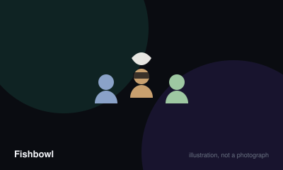

# Fishbowl



> Get your team to guess as many names from the bowl as possible, across three rounds that use the same slips with progressively harsher restrictions.

|  |  |
|---|---|
| **Players** | 6–20, best at 10 |
| **Box says** | 40 min |
| **Actually takes** | 55 min |
| **Teach time** | 4 min |
| **Between your turns** | 45 sec |
| **Works at age** | 10+ |
| **Weight** | ●○○○○ 1 / 5 |
| **Luck** | 30% chance, 70% skill |
| **Family** | escalating-guessing |

## How many players changes what

| Players | Setup | Notes |
|---|---|---|
| **6-8** | Two teams. Three or four slips each, so roughly twenty-five in the bowl. | Below six the rounds finish too fast for the escalation to build. |
| **9-14** | Two teams, three slips each. Aim for thirty to forty slips total. | The ideal range, with enough slips that nobody remembers all of them by round three. |
| **15-20** | Three teams and two slips each, otherwise a single round takes twenty minutes. | Cap the bowl at about fifty slips regardless of headcount. |

## Rules

Three games in one, played with the same slips of paper. The reason it works is
that by the third round everybody already half-remembers what is in the bowl,
so an impossible restriction becomes achievable.

## Filling the bowl

Everybody writes the same number of slips — three is standard — each with one
name or phrase. Famous people, characters, places, objects, anything the room
can reasonably be expected to recognise.

Fold them and put them all in one bowl. Do not sort them and do not look.

## Round one — describe

Teams alternate. One player takes the bowl and has a minute.

They may say anything at all except the words on the slip. No rhymes with it, no
spelling it, no using any part of the phrase itself.

Every slip guessed correctly goes into that team's pile. Keep going until the
timer stops, then pass the bowl to the other team. The round ends when the bowl
is empty.

## Round two — one word

Put every slip back in the bowl. Same teams, same order.

Now the clue-giver may say exactly one word. Not one sentence, not one word plus
a gesture. One word, then silence while their team guesses.

This is only possible because everyone heard the slips in round one. That is the
design.

## Round three — mime

Refill the bowl again. No words, no sounds at all. Acting only.

By this point the room has heard every slip twice and round three moves
alarmingly fast, which is the intended payoff.

## Scoring

Count each team's slips across the three rounds and add them together. If your
group has stopped keeping score by round three, the game is working correctly.

## Passing

Most groups allow you to skip a slip you cannot convey, putting it back in the
bowl. Agree before round one whether skipping is unlimited or costs you
something, because it materially changes how hard the later rounds are.

## Settle the argument

### Do you use the same slips in all three rounds?

**Official rule.** Played by almost everyone, almost everywhere.

Yes, and this is the entire design. Every slip goes back in the bowl at the end of each round. Rounds two and three are only achievable because the room has already heard the whole bowl described once.

*What it changes:* Groups that write fresh slips each round find round two nearly impossible and conclude the game is badly designed, when they have simply removed the mechanism that makes it work.

```console
$ rulebook ruling fishbowl "same papers each round"
```

### Can you gesture while giving your one word in round two?

**Official rule.** Widespread but far from universal.

No. Round two is the word alone. Adding gestures collapses the distinction between round two and round three and removes the escalation the game is built on.

*The house version:* Some groups permit gestures in round two and compensate by banning them from round three in favour of statue-like poses.

```console
$ rulebook ruling fishbowl "gestures round two"
```

### Can you skip a slip you cannot get?

**Not an official rule.** Widespread but far from universal.

There is no single authority on this and both versions are widely played.

*The house version:* The common version allows unlimited passes, with the slip returning to the bowl. Stricter groups allow one pass per turn, or none at all.

*What it changes:* Unlimited passing makes the game gentler and slower, since hard slips circulate until somebody cracks them. Banning it entirely makes a single obscure entry capable of consuming a whole turn.

```console
$ rulebook ruling fishbowl "can I pass fishbowl"
```

### What happens if the timer goes while a slip is being guessed?

**Official rule.** Widespread but far from universal.

The slip is unclaimed and goes back into the bowl. There is no grace period, which is why experienced players glance at the timer before starting a slip they suspect is difficult.

```console
$ rulebook ruling fishbowl "timer runs out mid clue"
```

### Can you use part of the phrase on the slip?

**Official rule.** Played by almost everyone, almost everywhere.

No. No word appearing on the slip may be spoken, in any round where speech is allowed at all. That includes rhymes, spellings and translations of those words. The restriction applies to the whole phrase, not only the main noun.

```console
$ rulebook ruling fishbowl "can I say one of the words"
```

## Teaching it

Four minutes, and the crucial thing is to explain all three rounds *before* the
first one starts.

**Explain the structure first, then the rounds.** Say: "Same slips, three times,
each round harder. Round one you can say anything. Round two you get one word.
Round three you can't talk at all." People need to know round two is coming,
because that is what makes them pay attention during round one.

**Say that out loud, in fact.** "Listen carefully in round one — you'll need to
remember these." It transforms the first round from a warm-up into the setup for
the whole game.

**Be specific about what "one word" means,** because somebody will try to cheat
it: "One word. Not a short sentence. Not a word and a gesture. You say a word,
then you stand there."

**Give clear guidance on writing slips,** which is where the game is won or
lost: "Something you'd expect most people in this room to know." A bowl full of
obscure entries produces three rounds of failure rather than one.

**Settle the passing rule before you start.** "Can you put one back if you're
stuck?" Decide once. Groups that leave it ambiguous end up arguing during round
three, when the timer is running and everyone is shouting.

**Warn them about the pace shift.** "Round three is much faster than you'd
think." Otherwise the mimer panics at a clue they would have got instantly.

**For a first game, use one minute per turn and three slips per person.** Longer
turns make round one drag, and more slips make round two genuinely impossible
rather than pleasingly hard.

## Variants worth knowing

**Fourth round, one sound** — Add a round where you may make exactly one noise and no movement. Very funny with a group that already knows the slips well.

**Celebrity** — Restrict every slip to a famous person, real or fictional. Narrower and easier for large mixed groups than open-ended phrases.

## When it is fair to stop

Stop after a completed round rather than mid-round, because the same slips carry across all three rounds and abandoning one wastes the writing everybody did. Finishing round two and stopping is a perfectly respectable end.

## When a piece goes missing

Nothing to lose beyond paper and a bowl, both of which are improvised anyway. A hat, a mug or an upturned hood all work.

## Accessibility

Round three is mimed and excludes anyone who cannot perform physically unless the group agrees to seated play. The first round is purely verbal and the second is a single word, so a player who prefers not to mime can be swapped out of round three without disrupting anything.

## Sources

- <https://en.wikipedia.org/wiki/Celebrity_(game)>

---

*Generated from [`games/fishbowl/`](../../games/fishbowl/). Fix it there, not here.*
