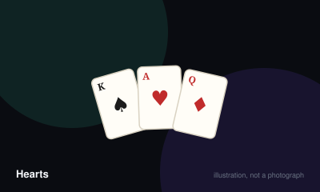

# Hearts



> Avoid taking tricks containing hearts or the queen of spades — unless you decide to take every single one of them, which flips the whole game.

|  |  |
|---|---|
| **Players** | 3–6, best at 4 |
| **Box says** | 45 min |
| **Actually takes** | 60 min |
| **Teach time** | 5 min |
| **Between your turns** | 20 sec |
| **Works at age** | 8+ |
| **Weight** | ●●○○○ 2 / 5 |
| **Luck** | 45% chance, 55% skill |
| **Family** | trick-taking |

## How many players changes what

| Players | Setup | Notes |
|---|---|---|
| **3** | Remove the two of diamonds so 51 cards deal evenly, seventeen each. | Three-handed hearts is loose and shooting the moon becomes noticeably easier. |
| **4** | Deal the whole deck, thirteen cards each. Pass three cards left, then right, then across, then not at all, repeating on that cycle. | The designed count. The passing cycle is what makes the game a game rather than a lottery. |
| **5** | Remove the two of diamonds and the two of clubs, ten cards each. | With five, the queen of spades moves around far less predictably. |
| **6** | Remove both black twos and both red twos, eight cards each. | Hands are short enough that a single mistake decides the round. |

## Rules

Every heart you take is worth a point. The queen of spades is worth thirteen.
Points are bad. That is the entire game, and it takes about thirty seconds to
explain and several hours to stop thinking about.

## Dealing and passing

Deal the deck out evenly. Before anyone plays a card, each player chooses three
cards from their hand and passes them face down to another player — left on the
first hand, right on the second, straight across on the third, and on the fourth
hand nobody passes at all. The cycle then repeats.

Choose your three before you look at what arrives. Everybody passes at once.

## Playing

Whoever holds the two of clubs must lead it. Play proceeds clockwise. You must
follow the suit that was led if you hold anything in it. If you do not, you may
play any card you like, and this is where the game lives — a void in a suit is
permission to hand somebody the queen.

The highest card of the led suit wins the trick. Suits other than the led suit
cannot win it, no matter how high. The winner leads the next trick.

## Two restrictions worth stating plainly

On the very first trick you may not play a heart or the queen of spades, even
if you have nothing else. Hearts may not be *led* until a heart has already
been discarded on some earlier trick — commonly described as hearts being
broken. You may play a heart onto a suit you cannot follow at any time; that is
usually how they get broken in the first place.

## Scoring

Count what you took. Each heart is one point, the queen of spades is thirteen.
A whole hand is therefore worth twenty-six points to somebody.

## Shooting the moon

If one player takes all thirteen hearts *and* the queen of spades, the scoring
inverts: they score nothing and every other player takes twenty-six. Attempting
this and falling one heart short is catastrophic, which is what makes it worth
attempting.

The game ends when a player crosses the agreed target, and the lowest score
wins.

## Settle the argument

### When can you lead a heart?

**Official rule.** Played by almost everyone, almost everywhere.

Only after a heart has been played on some previous trick by a player who could not follow suit. Until that happens, hearts may be discarded but not led. The exception is a player holding nothing but hearts, who may lead one because there is no alternative.

```console
$ rulebook ruling hearts "when can I lead hearts"
```

### Can the queen of spades be played on the first trick?

**Official rule.** Widespread but far from universal.

No. No point card may be played on the opening trick, which means neither hearts nor the queen of spades, unless a player's hand contains nothing else at all.

*What it changes:* It stops the queen being disposed of for free before anyone has information, and forces the holder to engineer a moment for her.

```console
$ rulebook ruling hearts "queen of spades first trick"
```

### What happens when someone shoots the moon?

**Official rule.** Played by almost everyone, almost everywhere.

They must take all thirteen hearts and the queen of spades — every point in the hand, with nothing missed. They then score zero and everybody else takes twenty-six.

*The house version:* A widespread option lets the shooter choose instead to subtract twenty-six from their own score, which matters when the other players are already near the losing threshold.

*What it changes:* Allowing the choice makes shooting substantially stronger late in a game and changes how aggressively the table blocks it.

```console
$ rulebook ruling hearts "shooting the moon rules"
```

### Do you look at the cards passed to you before choosing what to pass?

**Official rule.** Played by almost everyone, almost everywhere.

No. Everyone selects and passes simultaneously, and only then picks up what arrived. Looking first would remove the entire risk of the pass.

```console
$ rulebook ruling hearts "passing order hearts"
```

### Is the jack of diamonds worth minus ten?

**Not an official rule.** Widespread but far from universal.

Not in the standard game, where diamonds are worth nothing at all.

*The house version:* A common addition makes the jack of diamonds worth minus ten to whoever takes it, sometimes called Omnibus Hearts.

*What it changes:* It gives players a reason to want a trick, which softens a game whose whole texture is avoidance. Purists find it dilutes the point.

*Played mostly in:* North America

```console
$ rulebook ruling hearts "jack of diamonds hearts"
```

## Teaching it

Five minutes, and the order matters more than the detail.

**Open with the goal, inverted.** Most card games are about winning tricks. Say
straight away: "In this one you are trying *not* to win tricks." That single
sentence reframes everything they already know about cards, and everything else
lands more easily afterwards.

**Then the two numbers.** Each heart is one point. The queen of spades is
thirteen. Points are bad. Do not mention shooting the moon yet.

**Then trick-taking mechanics,** if anyone at the table has never taken a trick
before. Follow suit if you can. Highest card of the suit led takes it. If you
cannot follow, you can throw anything — and *that* is your chance to get rid of
something horrible.

**Then passing.** Three cards, left on the first hand, and the direction rotates.
Say: "Pass your worst cards. Usually that means high spades, and it definitely
means the queen if you have her and cannot protect her."

**Hold shooting the moon until the end of hand one.** Explaining it up front
makes new players chase it, lose badly, and conclude the game is random. Once
they have felt what taking hearts costs, the reversal is genuinely thrilling
rather than confusing. Introduce it with: "There is one more thing, and it only
matters about once an evening."

**The sentence that pre-empts the most questions:** "You can only lead a heart
after somebody has already thrown one away." Say it before the first trick and
you will not have to adjudicate it.

## Play it online, free

- **[cardgames.io](https://cardgames.io/hearts/)** — Free against three computer players, no account, works on a phone.

## When it is fair to stop

Hearts is played to a target score, so the graceful exit is to lower the target rather than abandon the sheet. A player sitting on ninety points is one bad hand from ending it anyway.

## When a piece goes missing

Nothing to lose beyond the deck itself. A missing card means a missing card, and the hand cannot be dealt evenly, so retire the deck.

## Accessibility

Scoring is arithmetic-heavy and runs across many hands, so a calculator or a phone is genuinely useful. Distinguishing the queen of spades from the jack at a glance matters more here than in most games; large-index decks help.

## Sources

- <https://www.pagat.com/reverse/hearts.html>

---

*Generated from [`games/hearts/`](../../games/hearts/). Fix it there, not here.*
