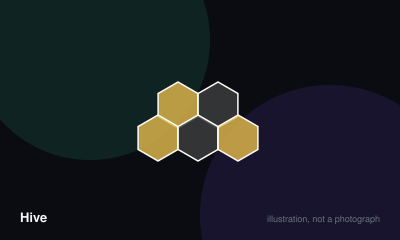

# Hive



> Completely surround your opponent's queen bee with tiles of any colour.

|  |  |
|---|---|
| **Players** | 2–2, best at 2 |
| **Box says** | 20 min |
| **Actually takes** | 25 min |
| **Teach time** | 4 min |
| **Between your turns** | 30 sec |
| **Works at age** | 8+ |
| **Weight** | ●●●○○ 2.5 / 5 |
| **Luck** | 0% chance, 100% skill |
| **Family** | tile-placement-abstract |

## How many players changes what

| Players | Setup | Notes |
|---|---|---|
| **2** | Each player takes eleven tiles — one queen, two spiders, two beetles, three grasshoppers and three ants. The first tile is placed anywhere. | Hive is strictly two-player. There is no sensible extension, and the tension comes from perfect information between exactly two people. |

## Rules

Chess with no board. Twenty-two tiles, and the playing area is whatever shape
the tiles happen to make.

## Setup

Each player takes eleven tiles: one queen bee, two spiders, two beetles, three
grasshoppers and three ants.

The first player places any tile on the table. The second places any tile
touching it. From then on, every new tile you place must touch at least one of
your own tiles and must not touch any of your opponent's.

## The queen rule

Your queen bee must be placed by your fourth turn at the latest. Until your
queen is on the table you may not move any of your tiles — only place new ones.

## Moving

Instead of placing, you may move a tile already in the hive. Three restrictions
govern every move:

**The hive must stay connected.** If removing a tile would split the hive into
two separate groups, that tile cannot move at all. It is pinned.

**Tiles must slide.** A tile must be able to physically slide into its
destination without being lifted over anything. If the gap between two tiles is
too narrow to slide through, the move is illegal.

**The hive must remain one piece after the move too.**

## How each creature moves

- **Queen bee** — one space.
- **Spider** — exactly three spaces, no more, no less, never backtracking.
- **Beetle** — one space, and may climb on top of the hive. A tile underneath a
  beetle cannot move, and the beetle takes the colour of the stack for placement
  purposes.
- **Grasshopper** — jumps in a straight line over one or more tiles, landing on
  the first empty space beyond. It does not slide, so it ignores the narrow-gap
  rule entirely.
- **Soldier ant** — any number of spaces around the outside of the hive. The
  strongest piece in the game by a distance.

## Winning

Surround the opposing queen on all six sides. Any tiles count, including that
player's own and including your own. If both queens become surrounded on the
same move, the game is drawn.

## Settle the argument

### What happens if moving a tile would split the hive?

**Official rule.** Played by almost everyone, almost everywhere.

That tile cannot move at all. The hive must be a single connected group both during and after every move, so any tile whose removal would create two separate groups is pinned until something else changes.

*What it changes:* Pinning is the main defensive tool in the game, and recognising which of your opponent's tiles are immobilised is most of the skill.

```console
$ rulebook ruling hive "one hive rule"
```

### When must the queen bee be placed?

**Official rule.** Played by almost everyone, almost everywhere.

By your fourth turn at the latest, and you may not move any tile until she is on the table. Delaying to the fourth turn is a standard opening choice rather than an oversight, since it maximises your placement flexibility.

```console
$ rulebook ruling hive "queen placement deadline"
```

### Can you open the game by placing your queen?

**Official rule.** Widespread but far from universal.

Under the base rules, yes. The widely used tournament rule forbids it, because opening with the queen was found to be strong enough to narrow the game.

*The house version:* Most experienced players adopt the tournament rule automatically and are surprised to learn it is not in the original rulebook.

```console
$ rulebook ruling hive "queen first tile"
```

### Can a tile move through a narrow gap between two others?

**Official rule.** Widespread but far from universal.

No. A tile must be able to physically slide into its destination without being lifted. If two tiles form a gate too narrow to pass through, the move is illegal. The grasshopper and the beetle are exempt, since one jumps and the other climbs.

```console
$ rulebook ruling hive "sliding rule hive"
```

### Do your own tiles count towards surrounding your queen?

**Official rule.** Widespread but far from universal.

Yes. All six neighbouring spaces count regardless of colour, so you can absolutely lose by boxing in your own queen. Forcing an opponent to complete their own surround is a genuine winning technique.

```console
$ rulebook ruling hive "can I trap my own queen"
```

### What if both queens are surrounded at the same time?

**Official rule.** Occasional, or specific to one group.

The game is a draw. This is the only drawn result in Hive and it is genuinely uncommon, requiring a single move to complete both surrounds.

```console
$ rulebook ruling hive "double surround"
```

## Teaching it

Four minutes, and you can teach it anywhere, on any flat surface, with no setup.

**Open with the goal, because it is unusually clear:** "Surround my queen bee
completely and you win. Six sides, any tiles — mine, yours, doesn't matter."
That last part surprises people and is worth landing early.

**Then the placement rule, which is the game's real constraint:** "When you put
a new tile down, it has to touch your own colour and mustn't touch mine." Show
one legal and one illegal placement. Ten seconds.

**Then the one rule that governs everything:** "The hive can never break apart.
If moving a tile would split it into two groups, that tile can't move." Pick up a
pinned tile and show the gap it leaves. This is the rule that makes Hive a real
game, and demonstrating it beats describing it.

**Teach the ant first, not the queen.** It is the strongest and simplest piece
and it gives a new player something to actually do: "This one goes anywhere
around the outside." Then the grasshopper, which is the most fun. Then the
others.

**Mention the sliding rule when it first blocks somebody,** not before. It is
fiddly in the abstract and obvious in practice — when a tile physically will not
fit through a gap, say "that's the rule, if it can't slide it can't go."

**Say the queen deadline clearly:** "Your queen has to be down by your fourth
turn, and you can't move anything until she's out." Players who miss this spend
three turns building a position they cannot use.

**Warn them about the beetle once it appears:** "That one climbs on top, and
whatever's underneath is stuck." It is the piece that makes new players
reconsider everything, and it lands best as a surprise.

## Variants worth knowing

**Expansion pieces** — The mosquito, ladybug and pillbug each add one tile per player with a new movement rule. The pillbug in particular changes the balance significantly.

**Tournament rule** — Neither player may open with the queen bee, which removes a known strong opening and is standard in competitive play.

## Play it online, free

- **[Board Game Arena](https://boardgamearena.com/gamepanel?game=hive)** — Free with an account, and it will not let you make an illegal move — the fastest way to learn the one-hive rule.

## When it is fair to stop

Resigning a lost position is normal, as in any abstract with no hidden information. Both players can usually see the surround coming three moves out, and playing it through teaches the loser nothing they have not already grasped.

## When a piece goes missing

Nothing to lose but tiles, and a lost tile changes the game rather than stopping it. The tiles are chunky bakelite and famously durable; the pocket edition is smaller and lighter.

## Accessibility

There is no board, which means the play area drifts and can spread further than expected — a large flat surface matters more than it sounds. The tiles are substantial and easy to grip, and the two colours are strongly contrasted. The insect symbols are embossed as well as printed, which helps considerably.

## Sources

- <https://www.gen42.com/games/hive>

---

*Generated from [`games/hive/`](../../games/hive/). Fix it there, not here.*
