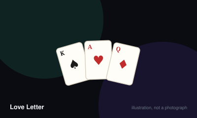

# Love Letter



> Be the last player standing in a round, or hold the highest card when the deck runs out.

|  |  |
|---|---|
| **Players** | 2–4, best at 4 |
| **Box says** | 20 min |
| **Actually takes** | 20 min |
| **Teach time** | 3 min |
| **Between your turns** | 20 sec |
| **Works at age** | 8+ |
| **Weight** | ●○○○○ 1.3 / 5 |
| **Luck** | 60% chance, 40% skill |
| **Family** | deduction-microgame |

## How many players changes what

| Players | Setup | Notes |
|---|---|---|
| **2** | Remove three cards face up at the start of each round in addition to the one set aside face down, so both players share more information. | A genuinely different and sharper game, closer to a duel than a deduction puzzle. |
| **3** | Standard setup with one card set aside face down. | Works well. Elimination is less punishing because rounds are short. |
| **4** | Standard setup, one card removed face down and unseen. | The designed count, and the one where the Guard deduction is at its best. |

## Rules

Sixteen cards. You hold one. On your turn you draw a second and play one of
them. That is the entire ruleset, and it produces a surprisingly deep bluffing
game.

## The deck

Eight kinds of card, numbered by strength:

- **8 Princess** (one copy) — discard this for any reason and you are out.
- **7 Countess** (one) — must be played if you also hold the King or Prince.
- **6 King** (one) — swap hands with another player.
- **5 Prince** (two) — force a player to discard their card and draw a new one.
- **4 Handmaid** (two) — you cannot be targeted until your next turn.
- **3 Baron** (two) — compare hands privately with another player; the lower is out.
- **2 Priest** (two) — look at another player's card.
- **1 Guard** (five) — name a card other than Guard; if that player holds it, they are out.

## A round

Shuffle and remove the top card face down without looking. It stays out of the
round, which means you can never be certain what remains. Deal one card to each
player.

On your turn, draw a card so you hold two, then play one of them face up and do
what it says. Your discarded cards stay visible in front of you, and tracking
what everybody has played is most of the skill.

## Being out

An eliminated player reveals their hand and takes no further part in the round.
They return for the next one.

## Ending a round

The round ends when only one player remains, or when the deck runs out. In the
second case, everyone still in reveals their card and the highest number wins.

The winner takes a token. Play more rounds until somebody has enough tokens to
win the match.

## Two rules that catch everybody

If you ever hold the Countess together with the King or the Prince, you must
play the Countess. You have no choice, and this is the only compulsory play in
the game.

Discarding the Princess eliminates you immediately, however it happened — even
if a Prince forced you to do it. That is not a punishment for a mistake, it is a
weapon somebody used on you.

## Settle the argument

### Do you have to play the Countess?

**Official rule.** Played by almost everyone, almost everywhere.

Yes, and it is the only compulsory play in the game. Holding the Countess alongside either the King or the Prince forces you to discard the Countess that turn. You may still play her voluntarily at any other time, which is what makes the bluff work.

*What it changes:* Because the play is forced, a Countess discard tells the table you almost certainly held a King or a Prince — unless you played her freely to create exactly that impression.

```console
$ rulebook ruling love-letter "countess rule"
```

### What happens if a Prince forces you to discard the Princess?

**Official rule.** Played by almost everyone, almost everywhere.

You are eliminated immediately. The Princess removes you from the round whenever she leaves your hand, regardless of who caused it or whether you had any choice. Targeting a suspected Princess holder with a Prince is a legitimate and devastating play.

```console
$ rulebook ruling love-letter "prince makes me discard princess"
```

### Can a Guard name another Guard?

**Official rule.** Played by almost everyone, almost everywhere.

No. The Guard's text explicitly excludes itself, which matters because five of the sixteen cards are Guards and allowing it would make the guess far too easy.

```console
$ rulebook ruling love-letter "guard on guard"
```

### What if everyone left is protected by a Handmaid?

**Official rule.** Widespread but far from universal.

If no legal target exists, the card is played with no effect. The Prince is the exception — it must target somebody, and if all opponents are protected you must target yourself, discarding your own remaining card.

*What it changes:* This is how a player holding the Princess can be forced to lose the round with nobody having attacked them at all.

```console
$ rulebook ruling love-letter "handmaid everyone protected"
```

### Who wins if two players tie on card value at the end?

**Official rule.** Widespread but far from universal.

Add the values of the cards each tied player has discarded during the round; the higher total wins. Some printings instead award a token to each tied player, so check the edition in front of you rather than assuming.

```console
$ rulebook ruling love-letter "tie love letter"
```

### Can you look back through the discarded cards?

**Official rule.** Played by almost everyone, almost everywhere.

Yes. Discards stay face up in front of each player for exactly this reason, and tracking them is the intended skill rather than a memory test. Anyone insisting you play from memory has invented a rule.

```console
$ rulebook ruling love-letter "can I check discards"
```

## Teaching it

Three minutes, and the entire teach is one sentence plus a card list.

**The sentence:** "You hold one card. On your turn you draw a second and play
one of them."

That genuinely is the whole structure. Say it, let it land, and then go through
the cards.

**Read the cards out in reverse order, from eight down to one.** Starting at the
Princess and working down means the Guard — the card they will hold most often —
is the last thing they hear before their first turn, which is when they need it.

**Put a reference list in the middle of the table.** Every printing includes one.
Use it. Nobody memorises eight effects from a spoken explanation, and a table
that keeps asking "what does five do again?" is slower than one that just looks.

**Explain the Guard properly, because it is five of the sixteen cards:** "Name a
card. Not Guard. If they've got it, they're out." Then add the thing that makes
it a game rather than a coin flip: "At the start you've got nothing to go on. By
the fourth turn you'll have watched what everyone's discarded, and you'll know."

**Mention the Countess rule once and then let it happen.** "If you ever end up
holding the Countess and a King or Prince, you have to play the Countess." It
will come up in about the third round and they will remember it forever after
the first time it costs them.

**Do not warn them about the Princess.** Let somebody get Princed into
discarding it. The reaction is one of the best moments the game offers and no
explanation reproduces it.

**Set expectations about elimination:** "Rounds take two minutes. Getting knocked
out isn't a big deal — you're back in almost immediately." Otherwise the first
player eliminated thinks they have lost the evening.

## Variants worth knowing

**Two-player reveal** — The official two-player rules remove three extra cards face up, which is a real information change rather than a convenience.

**Play to a fixed round count** — Play exactly seven rounds and count tokens, instead of racing to a target. Makes the length predictable.

## When it is fair to stop

A single round takes about two minutes, so there is never a reason to leave mid-round. Stop after any round; the token count carries no partial state.

## When a piece goes missing

The tokens are purely a counter and can be coins, sweets or tally marks. The cards themselves are the game and cannot be improvised without a printout.

## Accessibility

The card text is small and the numbers matter more than the names, so a quick-reference list of the eight cards and their effects placed in the middle of the table removes almost all of the memory burden. Rounds are short, which suits players who find long games tiring.

## Sources

- <https://en.wikipedia.org/wiki/Love_Letter_(card_game)>

---

*Generated from [`games/love-letter/`](../../games/love-letter/). Fix it there, not here.*
