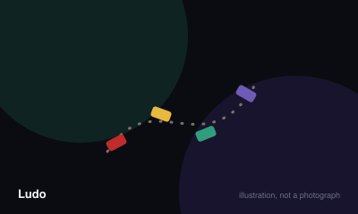

# Ludo



> Get all four of your tokens around the board and into the home column before the other players manage it.

|  |  |
|---|---|
| **Players** | 2–4, best at 4 |
| **Box says** | 30 min |
| **Actually takes** | 45 min |
| **Teach time** | 3 min |
| **Between your turns** | 30 sec |
| **Works at age** | 4+ |
| **Weight** | ●○○○○ 1 / 5 |
| **Luck** | 92% chance, 8% skill |
| **Family** | roll-and-move |

## How many players changes what

| Players | Setup | Notes |
|---|---|---|
| **2** | Play opposite colours rather than adjacent ones, so both players travel the same distance before meeting. | Two-player Ludo is far less chaotic and correspondingly less fun; consider giving each player two colours instead. |
| **3** | One colour sits out. The unused base is simply ignored. | The player between the two others gets captured noticeably more often, which is worth rotating seats over. |
| **4** | One colour each, four tokens each, all starting in base. | The count the board was drawn for. |

## Rules

Four tokens, one die, and a lap of the board. It is almost pure chance, which is
exactly why it works with a four-year-old and a grandparent at the same table.

## Setup

Each player takes the four tokens of one colour and places them in their base.
Nothing starts on the track.

## Getting out

You cannot move onto the board at all until you roll a six. A six places one
token on your coloured starting square and then earns you another roll, so a
lucky opening can put two tokens out and move one of them.

Roll three sixes in a row and your turn ends immediately with no move, which
exists purely to stop one player monopolising the dice.

## Moving

Move any one of your tokens clockwise around the track by the number rolled. You
choose which token each turn, and that choice is the only real decision the game
offers.

## Capturing

Land exactly on a square occupied by an opponent's token and it goes back to
their base, to begin again from nothing. Your own tokens never capture each
other; they simply share the square.

The starting squares are safe in most sets, usually marked with a star or a
different colour, and a token sitting on one cannot be captured.

## Coming home

After a full lap you turn up your own coloured column towards the centre. You
must roll the exact number to reach home — overshooting means you do not move
that token at all. A token three squares from home with a five rolled is stuck,
and you must move something else.

## Winning

The first player to bring all four tokens home wins. Most tables carry on to
settle second and third place, which is worth doing because the game is
frequently more interesting after the winner has left it.

## Settle the argument

### What happens if you roll three sixes in a row?

**Official rule.** Played by almost everyone, almost everywhere.

Your turn ends at once and the third six is forfeited entirely — you do not move for it. The first two sixes and their moves stand.

*The house version:* A harsh and fairly common version sends the token you last moved back to base as well.

*What it changes:* Without any limit, a hot streak could theoretically last forever, which is why some cap exists in nearly every rule set.

```console
$ rulebook ruling ludo "three sixes ludo"
```

### Do you need an exact roll to get home?

**Official rule.** Played by almost everyone, almost everywhere.

Yes. A token must land precisely on the home square. If your roll would take it past, that token cannot move and you must move a different one, or forfeit the move if nothing else is legal.

```console
$ rulebook ruling ludo "exact number to finish"
```

### Can two of your tokens block opponents from passing?

**Not an official rule.** Standard in some places, unheard of in others.

Genuinely disputed, and the sources do not agree. Most British commercial sets describe tokens as simply stacking, with opponents passing freely. General descriptions of the game — including Wikipedia — present the blockade as part of the standard game. Treat it as a rule to agree before you start rather than one to look up mid-argument.

*The house version:* Two of your own tokens on a single square form a blockade that no opponent may pass or land on. This is universal in Indian play and in Parcheesi, and absent from many British sets.

*What it changes:* It introduces the only genuine strategy the game has, and lengthens it substantially. Tables that grew up with it find blockade-free Ludo shapeless.

*Played mostly in:* India, South Asia

```console
$ rulebook ruling ludo "blocking ludo"
```

### Are the starting squares safe from capture?

**Official rule.** Widespread but far from universal.

In most sets yes — the marked squares, usually starred, protect any token standing on them. Boards vary in how many safe squares they print, so agree which markings count before the first capture rather than after it.

```console
$ rulebook ruling ludo "safe squares ludo"
```

### Can you decline to move if every option is bad?

**Official rule.** Widespread but far from universal.

If a legal move exists you must make one, even when it walks a token onto a square where it will obviously be captured. Only when no token can legally move does the turn pass without action.

```console
$ rulebook ruling ludo "do I have to move"
```

## Teaching it

Three minutes, and you can teach it to a four-year-old while playing.

**Say what the goal looks like, using the board.** Point at a base, trace a lap
with your finger, and point at the middle. "Your four go all the way round and
finish in here. First one to get all four home wins." Nobody needs more than
that to start.

**Then the one rule that blocks everything:** "You have to roll a six to get
out." Say it once and let the first turn teach it — a child who rolls a two and
has to pass learns it faster than any explanation.

**Capturing is the fun part, so demonstrate it rather than describing it.** Wait
for the first opportunity and say "look what happens now" before you land on
them. The reaction is the point of the game.

**With young children, mention the exact-roll rule only when it comes up.**
Explaining it at the start is abstract and slightly discouraging. Explaining it
when a token is two from home and they have rolled a four is concrete, and they
will remember it permanently.

**The kindest thing you can do for a mixed-age table** is agree in advance
whether you are playing until first place or until everybody is home. Deciding
that at the start avoids the moment where the adults want to stop and the
six-year-old with one token left does not.

**What to expect:** somebody will spend twenty minutes failing to roll a six.
There is no skill available to fix that, so acknowledge it cheerfully rather
than pretending the game is fairer than it is.

## Editions

| Edition | Year | What changed |
|---|---|---|
| Pachisi | 1896 | Ludo is the simplified commercial descendant of the much older Indian game Pachisi, which uses cowrie shells rather than a die and has a longer, more tactical track. |
| Parcheesi and Sorry | 1934 | Regional descendants with meaningfully different rules — Parcheesi uses two dice and blockades, Sorry replaces the die with cards. Do not mix rule sets. |

## Variants worth knowing

**Doubling up** — Two of your tokens on one square form a block that opponents cannot pass. Standard in Indian and Parcheesi play, absent from most British sets.

**Capture to enter home** — A player must capture at least one opposing token before any of their own may enter the home column. Lengthens the game considerably.

## Play it online, free

- **[PlayOK](https://www.playok.com/en/ludo/)** — Free, and it plays with the blockade rule — worth noticing if your family plays without it.

## When it is fair to stop

A player with every token still in base after twenty minutes is entitled to stop, and it is kinder to let them. Nothing in the game rewards persistence, so nobody is giving up an advantage by leaving.

## When a piece goes missing

Everything here is replaceable. Tokens can be coins, buttons or torn paper, and the board can be drawn. A missing die is the only genuine stopper, and a phone will do.

## Accessibility

The four colours are traditionally red, green, yellow and blue, and the red and green pairing is the worst possible choice for the most common form of colour blindness. Marking tokens with shapes or letters solves it entirely. The tokens themselves are small and fiddly to lift from a crowded square.

## Sources

- <https://en.wikipedia.org/wiki/Ludo>

---

*Generated from [`games/ludo/`](../../games/ludo/). Fix it there, not here.*
