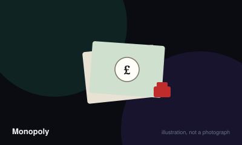

# Monopoly



> Bankrupt everyone else by acquiring property and charging rent.

|  |  |
|---|---|
| **Players** | 2–8, best at 4 |
| **Box says** | 60 min |
| **Actually takes** | 3 hr |
| **Teach time** | 10 min |
| **Between your turns** | 4 min |
| **Works at age** | 10+ |
| **Weight** | ●●○○○ 1.7 / 5 |
| **Luck** | 70% chance, 30% skill |
| **Family** | roll-and-move |

## How many players changes what

| Players | Setup | Notes |
|---|---|---|
| **2** | Standard rules. Each player starts with 1500. | Two-player Monopoly is mostly a trading stalemate; the auction rule matters more than usual because nobody else bids the price up. |
| **3-4** | Standard rules and starting cash. This is the count the board is balanced around. | — |
| **5-8** | Standard, but the property runs out fast and turns get long. | Above five, expect most of the evening to be spent waiting. |

## Rules

The published game is roughly ninety minutes long. The game most people have
played is three hours long, because of two rules — one added and one skipped.
Both are covered in the rulings.

## Setup

Each player takes a token and 1500 in cash. Place tokens on Go. Shuffle the
Chance and Community Chest decks.

## A turn

1. **Roll** two dice and move clockwise that many spaces.
2. **Resolve** the space you land on.
3. **Build, trade or mortgage** — you may do these at almost any time, including
   on other players' turns for trades.
4. Pass the dice, unless you rolled a double, in which case roll again. Three
   doubles in a row sends you to jail.

## Landing on a space

- **Unowned property** — buy it at the printed price, or decline. **If you
  decline, it is auctioned to every player, starting at any price.** The auction
  is not optional.
- **Owned property** — pay the owner rent. Rent doubles on undeveloped
  properties if the owner holds the whole colour group.
- **Chance / Community Chest** — draw and follow the card.
- **Tax** — pay the bank.
- **Go To Jail** — go directly there.
- **Free Parking** — nothing happens.

## Jail

You leave jail by rolling a double, paying 50, or using a card. After three
failed attempts you must pay. While in jail you still collect rent and may
still build and trade.

## Building

You may build once you own every property in a colour group. Houses must be
built **evenly** — no property in a group may have more than one house more than
another. Five houses become a hotel.

There are exactly **32 houses and 12 hotels**. When they run out, nobody can
build until some are sold back.

## Bankruptcy

If you cannot pay, you are bankrupt and out. Your assets go to your creditor, or
to the bank if the debt was to the bank. The last player standing wins.

## Ending early

Almost nobody plays to a single survivor. Agreeing a time limit at the start,
then counting cash plus property value, is a perfectly good way to finish and
produces the same winner most of the time.

## Settle the argument

### Do you collect money from Free Parking?

**Not an official rule.** Played by almost everyone, almost everywhere.

No. Free Parking does nothing at all in the published rules. It is a resting space and pays nothing. This is probably the most widely played rule that has never appeared in any edition of the game.

*The house version:* Fines, taxes and sometimes a fixed stake are placed in the middle of the board and collected by whoever lands on Free Parking.

*What it changes:* It injects money into a game whose entire design depends on money draining out. It is the single biggest reason Monopoly games last three hours instead of ninety minutes.

```console
$ rulebook ruling monopoly "free parking money"
```

### What happens if you land on a property and do not buy it?

**Official rule.** Played by almost everyone, almost everywhere.

It goes to auction immediately, open to every player including the one who declined, starting at any price. Skipping the auction is the other half of why games run long — property stays unsold, monopolies never form, and nobody can win.

*What it changes:* Playing the auction rule alone shortens a typical game dramatically.

```console
$ rulebook ruling monopoly "do you have to auction property"
```

### Do you charge double rent on a full colour group?

**Official rule.** Widespread but far from universal.

Yes — owning every property in a colour group doubles the rent on the undeveloped ones. Many groups miss this and wonder why completing a set before building feels pointless.

```console
$ rulebook ruling monopoly "double rent full set"
```

### Can you run out of houses?

**Official rule.** Occasional, or specific to one group.

Yes, and it is deliberate. There are exactly 32 houses and 12 hotels, and when they run out no more can be built until someone sells. Buying up houses to deny them to opponents is a legitimate and brutal strategy.

```console
$ rulebook ruling monopoly "house shortage monopoly"
```

### Can you collect rent while in jail?

**Official rule.** Widespread but far from universal.

Yes. Being in jail stops you moving, not earning. You still collect rent, may still build, trade and mortgage. In the late game, jail is often the safest place on the board.

```console
$ rulebook ruling monopoly "collect rent in jail"
```

### Do you get double for landing exactly on Go?

**Not an official rule.** Widespread but far from universal.

No. You collect 200 for passing or landing on Go, full stop.

*The house version:* Paying 400 for landing exactly on Go.

*What it changes:* Another small money injection into an economy designed to contract. Mild on its own, compounding alongside Free Parking.

```console
$ rulebook ruling monopoly "double money on go"
```

## Teaching it

Most people think they already know this game. The useful teach is not the rules
— it is the two rules that make it a different, better, shorter game.

## Say this before setting up

"We're playing the actual printed rules, which means two things you may not be
used to."

1. **"If you land on a property and don't buy it, it goes to auction."** Say it
   twice. This is the rule that makes property circulate and monopolies form.
2. **"Free Parking pays nothing."** No jackpot, no pile of money in the middle.

These two changes turn a three-hour slog into a game with an actual arc, and
saying so up front frames it as playing properly rather than as taking away the
fun bit.

## Then the basics, quickly

"Roll, move, buy what you land on or auction it, pay rent when you land on
someone's. Get a full colour set to build. Bankrupt everyone else."

That is enough to start. Everything else can be read off the board and the
deeds.

## Agree an end time before rolling

"Shall we call it at ten, richest player wins?" Setting this at the start rather
than at hour three is the difference between finishing and abandoning.

## Mention when relevant

Even-build rule at the first house purchase. Mortgaging when someone first
cannot pay. The house shortage only if someone is close to exhausting them —
and then mention it with relish, because denying houses is the most interesting
strategy in the game.

## Editions

| Edition | Year | What changed |
|---|---|---|
| The official rules versus the inherited ones | — | The published rules have contained the auction rule and no Free Parking payout since the 1930s. The versions most households play descend from folk rules that were never in any box, and are the direct cause of the game's reputation for lasting forever. |

## When it is fair to stop

Agree a finish time before you start, and when it arrives, count cash plus property value and declare a winner. Almost nobody plays to the bankruptcy of every opponent, and pretending otherwise is how the game got its reputation.

## When a piece goes missing

Money is the component most often lost and the easiest to replace with paper or a phone. Missing houses can be represented by anything of the right size — but note the official rules cap houses at 32, and that cap is a real constraint, not an accident of the box.

## Accessibility

Property groups are identified by colour bands, which is the main barrier for colour vision — the deeds are labelled by name and can be sorted by position. Money handling and repeated arithmetic are the biggest load; a banking app or a dedicated banker helps considerably.

## Sources

- <https://www.hasbro.com/common/instruct/00009.pdf>

---

*Generated from [`games/monopoly/`](../../games/monopoly/). Fix it there, not here.*
