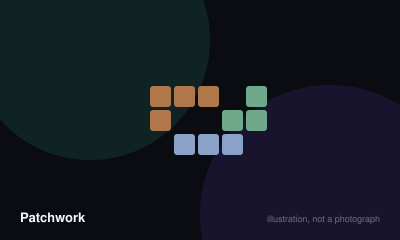

# Patchwork



> Fill your quilt board with patches while keeping ahead on buttons, and avoid leaving empty squares.

|  |  |
|---|---|
| **Players** | 2–2, best at 2 |
| **Box says** | 30 min |
| **Actually takes** | 30 min |
| **Teach time** | 5 min |
| **Between your turns** | 20 sec |
| **Works at age** | 8+ |
| **Weight** | ●●○○○ 1.6 / 5 |
| **Luck** | 20% chance, 80% skill |
| **Family** | spatial-puzzle |

## How many players changes what

| Players | Setup | Notes |
|---|---|---|
| **2** | Lay the patches in a circle with the neutral token before the smallest. Both players start with five buttons and an empty nine-by-nine board. | Strictly two-player. There is an official solo variant against an automated opponent. |

## Rules

Two people building quilts out of awkward shapes, spending buttons and time. The
clever part is that turn order is not fixed.

## Setup

Arrange all thirty-three patches in a circle in any order, with the neutral
token sitting immediately before the smallest patch. Each player takes an empty
nine-by-nine quilt board, five buttons, and a time token placed at the start of
the time board.

## Whose turn it is

Not alternating. **The player whose time token is furthest back takes the next
turn**, which means you can take two, three or four turns in a row while your
opponent sits ahead of you on the track.

If both tokens are on the same space, the one on top goes.

## Your turn — one of two things

**Buy a patch.** You may choose from only the three patches immediately
clockwise of the neutral token. Pay its button cost, move the neutral token to
where that patch was, and sew the patch onto your quilt. Then advance your time
token by the patch's time value.

Patches may be rotated and flipped freely, but must not overlap and must fit
entirely on the board.

**Advance and get paid.** Move your time token to one space beyond your
opponent's, and collect one button for every space you moved.

## Buttons and income

Some patches have buttons printed on them. Whenever your time token passes a
button symbol on the time board, you collect one button for every button printed
across your entire quilt. Patches with button income are worth far more than
their cost suggests, and worth more the earlier you buy them.

## The bonus tile

The first player to completely fill a seven-by-seven square anywhere on their
quilt takes the special tile, worth seven points at the end. Only one player can
ever claim it.

## Ending

The game ends when both time tokens have reached the final space.

Score your buttons, add seven if you hold the bonus tile, and subtract two
points for every empty square left on your quilt. Highest score wins; a tie goes
to whoever passed the final space first.

## The thing that decides games

Empty squares cost two each, and a nine-by-nine board has eighty-one of them.
Players who chase button income without covering their board reliably lose to
players who bought ugly cheap patches and filled the gaps.

## Settle the argument

### Who takes the next turn?

**Official rule.** Played by almost everyone, almost everywhere.

Whichever player's time token is furthest back on the track, which means one player may take several consecutive turns. If both tokens share a space, the token physically on top takes the turn.

*What it changes:* Buying a cheap, low-time patch repeatedly is a legitimate way to take a string of turns and strip the board of good options before your opponent moves at all.

```console
$ rulebook ruling patchwork "whose turn patchwork"
```

### Can you buy any patch from the circle?

**Official rule.** Played by almost everyone, almost everywhere.

Only the three patches immediately clockwise of the neutral token. Everything else in the circle is unavailable until the token has moved past it, and the token only moves when somebody buys.

```console
$ rulebook ruling patchwork "which patches can I buy"
```

### Can patches be rotated or flipped over?

**Official rule.** Widespread but far from universal.

Yes, freely. A patch may be turned to any of its orientations and flipped over before being sewn down, provided it fits entirely on your board without overlapping anything already placed.

```console
$ rulebook ruling patchwork "rotating patches"
```

### How much does an empty square cost?

**Official rule.** Played by almost everyone, almost everywhere.

Two points each, subtracted from your button total at the end. With eighty-one squares on the board, the penalty dominates the scoring and is the main reason button income alone does not win games.

```console
$ rulebook ruling patchwork "empty squares scoring"
```

### Can both players get the seven-by-seven bonus?

**Official rule.** Widespread but far from universal.

No. It goes to the first player to complete a filled seven-by-seven square anywhere on their quilt, and once claimed it is gone. It is worth seven points and is frequently the margin in a close game.

```console
$ rulebook ruling patchwork "special tile patchwork"
```

### How far do you move when you take buttons instead of a patch?

**Official rule.** Widespread but far from universal.

Exactly one space beyond your opponent's token, and you collect one button per space moved. You cannot choose to move further or less, so the payout depends entirely on how far behind you were.

```console
$ rulebook ruling patchwork "advancing on the time track"
```

## Teaching it

Five minutes. The turn order is the only thing that genuinely confuses people,
so lead with it.

**Say it first, before anything else:** "We don't take turns. Whoever's behind on
this track goes next — so I might go three times in a row." Point at the time
board. Expect a puzzled look; it resolves the first time it happens.

**Then the goal, which is deliberately simple:** "Fill your quilt. Every empty
square at the end costs you two points."

**Then the two actions:** "Buy a patch, or skip ahead of me and take buttons for
it." Demonstrate the second one — moving past your opponent and collecting three
buttons is counter-intuitive and looks like doing nothing until they see the
buttons arrive.

**Show the three-patch restriction physically.** Point at the neutral token, then
at the three patches clockwise of it. "Only these three. That's your whole
choice." It looks limiting and is the source of all the tension.

**Explain button income with a concrete example,** because it is the strategic
core: "This patch has a button on it. Every time you cross a button on the track,
you get one button for every button on your whole quilt. So buying this early
pays you four or five times."

**Point out the two-point penalty again at the end of the teach.** Say it twice
in five minutes. New players consistently under-value covering their board and
finish with fourteen empty squares and a shocked expression.

**Mention the seven-by-seven bonus once,** and add: "It's worth seven and only
one of us can get it." That is enough to make it a target without making a first
game about chasing it.

## Play it online, free

- **[Board Game Arena](https://boardgamearena.com/gamepanel?game=patchwork)** — Free with an account, and it handles the turn order that confuses everybody.

## When it is fair to stop

Both players can see the whole board state, so a hopeless quilt is visible to everyone. That said, the game is half an hour and the second half is the interesting part, so finishing is usually worth it.

## When a piece goes missing

The patches are the puzzle and cannot be improvised. Buttons can be any counter. The time board is easily drawn on paper.

## Accessibility

The patches are small cardboard polyominoes and manipulating them into tight spaces is a real dexterity demand. The quilt boards are visually clear and the colour distinctions are not load-bearing, which helps. Spatial reasoning is the entire game, so it is a poor fit for anyone who finds that unenjoyable.

## Sources

- <https://en.wikipedia.org/wiki/Patchwork_(board_game)>

---

*Generated from [`games/patchwork/`](../../games/patchwork/). Fix it there, not here.*
