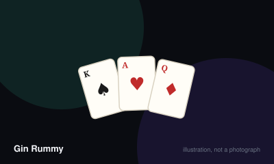

# Gin Rummy



> Arrange your ten cards into sets and runs, then knock before your opponent does.

|  |  |
|---|---|
| **Players** | 2–2, best at 2 |
| **Box says** | 30 min |
| **Actually takes** | 40 min |
| **Teach time** | 5 min |
| **Between your turns** | 35 sec |
| **Works at age** | 8+ |
| **Weight** | ●●○○○ 2 / 5 |
| **Luck** | 55% chance, 45% skill |
| **Family** | draw-and-discard |

## How many players changes what

| Players | Setup | Notes |
|---|---|---|
| **2** | Deal 10 each. Turn one card face up to start the discard pile; the rest is the stock. | Gin Rummy is a two-player game by design. For three or more, play Indian Rummy or Oklahoma Gin instead. |

## Rules

A two-player game of collecting and discarding, where the interesting decision
is not what to keep but when to stop.

## Melds

Your goal is to arrange cards into **melds**:

- **Set** — three or four cards of the same rank (7♠ 7♥ 7♦).
- **Run** — three or more consecutive cards in one suit (4♣ 5♣ 6♣).

A card can only be in one meld at a time. Anything not in a meld is
**deadwood**.

Deadwood values: face cards 10, Aces 1, all others face value.

## Setup

Deal ten cards each. Turn the next card face up to begin the discard pile; the
remainder is the stock.

## Playing a turn

1. **Draw** either the face-up discard or the top of the stock.
2. **Discard** one card face up.

That is the whole turn. The hand builds slowly and the tension is entirely in
the timing.

## Knocking

Instead of a normal discard, you may **knock** when your deadwood totals ten or
less. Lay your hand down, melds separated from deadwood.

Your opponent then lays down their melds, and may **lay off** — adding their
unmatched cards to *your* melds to reduce their own deadwood.

- **Knocker has less deadwood** — they score the difference.
- **Defender has equal or less** — that is an **undercut**. The defender scores
  the difference plus a bonus, and the knocker scores nothing.

## Gin

If you have no deadwood at all, you have **gin**. Announce it, score the
opponent's full deadwood plus a bonus of 25, and note that no laying off is
allowed against gin.

## Ending

Play hands until one player reaches 100 points. If the stock runs down to two
cards without a knock, the hand is dead and nobody scores.

## Settle the argument

### What counts as deadwood?

**Official rule.** Played by almost everyone, almost everywhere.

Any card not part of a completed set (three or more of a rank) or run (three or more in sequence in one suit). Face cards count 10, Aces count 1, everything else counts its face value. A card can only belong to one meld — you cannot use the same seven for both a set and a run.

```console
$ rulebook ruling rummy-gin "what is deadwood"
```

### When are you allowed to knock?

**Official rule.** Played by almost everyone, almost everywhere.

When your deadwood totals ten or less, after drawing and as your discard. You do not have to wait for gin. Knocking early with a small count is the core strategic decision of the game.

```console
$ rulebook ruling rummy-gin "when can you knock"
```

### What happens if the opponent has less deadwood than the knocker?

**Official rule.** Widespread but far from universal.

That is an undercut, and it is why knocking is risky. If the defender's deadwood is equal to or lower than the knocker's, the defender scores the difference plus a bonus of 10 or 25 depending on house convention. The knocker scores nothing.

```console
$ rulebook ruling rummy-gin "undercut gin rummy"
```

### Can you add your cards to the knocker's melds?

**Official rule.** Widespread but far from universal.

Yes, when defending against a knock — but not against gin. You may extend the knocker's sets and runs with your own unmatched cards to reduce your deadwood. Against a gin hand there is no laying off at all.

```console
$ rulebook ruling rummy-gin "laying off gin rummy"
```

### How much is going gin worth?

**Not an official rule.** Widespread but far from universal.

Twenty-five is the most widely used gin bonus, and twenty-five is also the most common undercut bonus, but both vary.

*The house version:* Some groups use a 20-point gin bonus, some 25. "Big gin" — going out with all eleven cards melded — is a house addition worth 31 or more where used.

*What it changes:* Higher bonuses reward holding out for gin; lower ones reward frequent early knocking. Agree before the first deal.

```console
$ rulebook ruling rummy-gin "gin bonus points"
```

## Teaching it

## Start with melds only

Deal ten cards each and say: "Group them into three-of-a-kinds, or runs in the
same suit. Draw a card, throw one away, and try to get everything grouped."

Play two or three turns with hands face up so both players can see what a
forming hand looks like. Nothing else is needed to begin.

## Then explain deadwood

"Anything not in a group is deadwood. Face cards are ten, aces are one." Have
them count their own hand out loud once. That single exercise teaches the whole
scoring system.

## Introduce knocking last

"When your deadwood is ten or less, you can stop the hand instead of
discarding."

Then, immediately: "But if they have less than you, they score instead." The
undercut is what makes the game a game, and it should land at the same moment as
knocking, not later.

## Say before the first hand

"Gin bonus of 25?" The bonus size is not standardised and it changes how the
game should be played — a high bonus rewards patience, a low one rewards
knocking early.

## For three or more players

Do not adapt Gin. Play Indian Rummy instead, which is built for it.

## Scoring

This game has a scorer. `rulebook score rummy-gin "..."` works out the total for you.

## Editions

| Edition | Year | What changed |
|---|---|---|
| Oklahoma Gin | — | The first upcard sets the maximum knock value for the hand rather than it always being ten, which makes early hands far tighter. |

## Play it online, free

- **[cardgames.io](https://cardgames.io/ginrummy/)** — Free against a computer, with the deadwood counted automatically.

## When it is fair to stop

Stop at the end of a hand. Gin is scored across hands to a target, so agreeing a lower target mid-game is more graceful than abandoning it.

## When a piece goes missing

Any deck. If cards are missing, remove whole ranks so runs and sets stay possible, and adjust the target score down.

## Accessibility

Sets and runs depend on rank and suit rather than colour alone, but suit recognition matters for runs — a four-colour deck helps. Holding and rearranging ten cards is the main dexterity load; a card stand solves it.

## Sources

- <https://www.pagat.com/rummy/ginrummy.html>

---

*Generated from [`games/rummy-gin/`](../../games/rummy-gin/). Fix it there, not here.*
