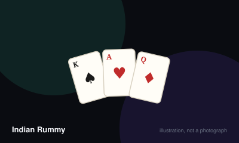

# Indian Rummy



> Arrange all thirteen cards into valid sets and runs, including at least two runs of which one contains no joker.

|  |  |
|---|---|
| **Players** | 2–6, best at 4 |
| **Box says** | 30 min |
| **Actually takes** | 45 min |
| **Teach time** | 6 min |
| **Between your turns** | 50 sec |
| **Works at age** | 9+ |
| **Weight** | ●●○○○ 2.3 / 5 |
| **Luck** | 60% chance, 40% skill |
| **Family** | draw-and-discard |

## How many players changes what

| Players | Setup | Notes |
|---|---|---|
| **2** | Two decks with jokers. Deal 13 each. | — |
| **3-4** | Two decks with jokers. Deal 13 each. Turn one card face up as the wild joker for the hand. | Four-handed with two decks is the standard game. |
| **5-6** | Three decks with jokers. Deal 13 each. | Two decks do not contain enough cards for six players at thirteen apiece plus a workable stock. |

## Rules

Thirteen cards each, two decks, and one rule that shapes the entire game: you
cannot win without a pure sequence.

## Melds

- **Pure sequence** — three or more consecutive cards of the same suit, with no
  joker used as a substitute. 5♥ 6♥ 7♥.
- **Impure sequence** — a run that uses a joker in place of a missing card.
  5♠ 6♠ Joker (standing in for 7♠).
- **Set** — three or four cards of the same rank in different suits.

## Jokers

Two kinds are wild:

- **Printed jokers** from the decks.
- **Wild jokers** — at the start of the hand, one card is turned face up. Every
  card of that rank, in all four suits, is wild for the hand.

## Setup

Use two decks with jokers for up to four players, three decks for five or six.
Deal thirteen cards each. Place the rest face down as the closed pile and turn
one card to start the open pile.

## Playing a turn

1. **Draw** from the closed pile or take the top card of the open pile.
2. **Discard** one card face up.

Arrange your hand into melds as you go.

## Declaring

When all thirteen cards are arranged into valid melds, you may declare. Your
hand must contain:

- at least **two sequences**, and
- at least one of those must be **pure**.

Discard your final card face down and declare. If the arrangement is valid you
win the hand; if it is not, you take the maximum penalty.

## Scoring

Everyone else counts their unmelded cards:

| Card | Points |
| --- | --- |
| Ace, King, Queen, Jack | 10 |
| All others | Face value |
| Jokers | 0 |

The total is capped at 80. **If a player has no pure sequence, they score the
full 80** regardless of what they hold — the single most important number in the
game.

## Dropping

In the points and pool formats you may drop out of a hand rather than play it.
Dropping before your first draw costs 20 points; dropping later costs 40.

## Settle the argument

### Can you declare without a pure sequence?

**Official rule.** Played by almost everyone, almost everywhere.

No. A valid declaration needs at least two sequences, and at least one of them must be pure — three or more consecutive cards of the same suit with no joker standing in for anything. Declaring without one is an invalid declaration and is penalised heavily, usually the full 80 points.

*Played mostly in:* India

```console
$ rulebook ruling rummy-indian "what is a pure sequence"
```

### Can a joker be used inside a run?

**Official rule.** Played by almost everyone, almost everywhere.

Yes, in any sequence except the mandatory pure one. A run using a joker is an impure sequence and is perfectly valid — you simply need one clean run elsewhere in the hand.

*Played mostly in:* India

```console
$ rulebook ruling rummy-indian "joker in a sequence"
```

### How is the wild joker chosen?

**Official rule.** Played by almost everyone, almost everywhere.

One card is turned face up at the start of the hand. Every card of that rank, in all suits, becomes wild for that hand, in addition to the printed jokers. If the turned card is itself a printed joker, then Aces are commonly used instead.

*Played mostly in:* India

```console
$ rulebook ruling rummy-indian "what is the wild joker"
```

### How many points do you lose when someone else declares?

**Official rule.** Played by almost everyone, almost everywhere.

You count the value of your unmelded cards — face cards 10, Ace 10, others face value — capped at 80. If you hold no pure sequence at all, the full 80 applies regardless of what is in your hand, which is why the pure run is the first thing to build.

*Played mostly in:* India

```console
$ rulebook ruling rummy-indian "penalty points indian rummy"
```

### Can you quit a hand early?

**Official rule.** Widespread but far from universal.

In the pool and points formats, yes. Dropping before your first draw costs 20 points; dropping later costs 40. It is a real strategic option with a bad hand, and it does not exist in most Western rummy variants.

*Played mostly in:* India

```console
$ rulebook ruling rummy-indian "can you drop indian rummy"
```

## Teaching it

## Lead with the one rule that matters

Before anything else: **"You cannot win without a pure run — three in a row, same
suit, no joker."**

Say it first, say it again after the first hand, and write it on the score sheet
if you have to. Every other rule can be picked up in play. This one decides
whether a player scores 5 points or 80.

## Then the shape

"Thirteen cards. Make sets of the same number, or runs in the same suit. Draw
one, throw one. Get everything grouped and declare."

## Explain jokers second, not first

Point at the turned-up card: "Every card of this number is wild this hand, plus
the printed jokers." New players immediately try to use jokers everywhere, which
is exactly how they end up declaring without a pure run.

## Let the first invalid declaration happen

Somebody will declare with two impure sequences. Let them, show the 80-point
penalty, and the rule will never need explaining again.

## If they know Gin Rummy

Say what is different, which is faster than teaching from scratch:
thirteen cards not ten, two decks not one, jokers exist, the pure sequence is
mandatory, and you can drop out of a bad hand.

## Editions

| Edition | Year | What changed |
|---|---|---|
| Points, pool and deals rummy | — | The same hand rules are used in three tournament formats — points rummy (single hand for stakes), pool rummy (eliminate at 101 or 201), and deals rummy (fixed number of hands). |

## Play it online, free

- **[cardgames.io](https://cardgames.io/rummy/)** — Free browser rummy. It is not the thirteen-card Indian form, so treat it as practice for the melding rather than the game itself.

## When it is fair to stop

A player who is clearly out of it can drop for a fixed penalty rather than play the hand out, which is a rule rather than a courtesy.

## When a piece goes missing

Two ordinary decks with their jokers are all that is required. If the printed jokers are missing, nominate a rank — commonly twos — as permanent wild cards and say so before dealing.

## Accessibility

Thirteen cards is a wide fan and the main physical barrier; a card holder is genuinely useful. Runs depend on suit, so a four-colour deck helps players with limited colour vision.

## Sources

- <https://www.pagat.com/rummy/indian.html>

---

*Generated from [`games/rummy-indian/`](../../games/rummy-indian/). Fix it there, not here.*
