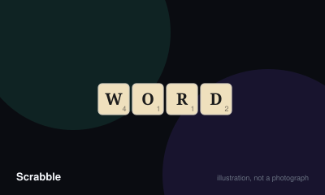

# Scrabble



> Score the most points by forming interlocking words on the board.

|  |  |
|---|---|
| **Players** | 2–4, best at 2 |
| **Box says** | 60 min |
| **Actually takes** | 75 min |
| **Teach time** | 6 min |
| **Between your turns** | 2 min |
| **Works at age** | 9+ |
| **Weight** | ●●○○○ 2.1 / 5 |
| **Luck** | 40% chance, 60% skill |
| **Family** | word-building |

## How many players changes what

| Players | Setup | Notes |
|---|---|---|
| **2** | Seven tiles each. Two-player is the competitive standard — the board stays open and turns come round fast. | — |
| **3-4** | Seven tiles each. The board closes up faster and premium squares are contested harder. | With four players, expect long waits and a tighter, lower-scoring board. |

## Rules

Form interlocking words on a grid, with the board's premium squares doing most
of the scoring work.

## Setup

Each player draws seven tiles. Draw one tile each to decide who starts — closest
to A goes first, blank beats everything.

## A turn

Place tiles to form one word, then score it, then draw back up to seven.

The first word must cross the centre star. Every word after that must connect to
tiles already on the board. All tiles you place in a turn must be in a single
line, and everything formed must be a valid word — including words created
incidentally alongside your main one.

Instead of playing, you may **exchange** any number of tiles (only while at
least seven remain in the bag) or **pass**. Both score zero.

## Scoring

Each tile has a value printed on it. Then apply premium squares:

| Square | Effect |
| --- | --- |
| Double / Triple Letter | Multiplies that tile's value |
| Double / Triple Word | Multiplies the whole word |

Letter multipliers apply before word multipliers. If a word covers two word
multipliers, they compound — a word across two triple-word squares scores nine
times.

**Premium squares only count on the turn a tile is first placed on them.**

If your word creates other words, score each of them, and a shared tile scores
in both.

## The seven-tile bonus

Using all seven tiles in one turn scores an extra **50 points**, added after
multipliers.

## Blanks

Two blank tiles can stand for any letter. They score **zero** regardless of what
they represent or which square they sit on, though they still benefit from word
multipliers. Once placed, the letter is fixed for the game.

## Challenges

Any player may challenge a word before the next turn begins. Look it up in the
agreed dictionary.

- **Invalid** — the tiles come back and the player scores nothing.
- **Valid** — under tournament rules the challenger loses their turn; under
  standard home rules, nothing happens.

Agree which version you are playing before starting.

## Ending

The game ends when the bag is empty and one player has used all their tiles, or
after six consecutive scoreless turns.

Each remaining player subtracts the value of their unplayed tiles. The player
who went out adds the total of everyone else's remaining tiles to their score.

## Settle the argument

### What happens when you challenge a word?

**Official rule.** Played by almost everyone, almost everywhere.

Look it up. If the word is not in the agreed dictionary, the tiles come back and the player scores nothing that turn. If it is valid, the challenger loses their turn under North American tournament rules, while under the standard home rules there is no penalty at all. Agree which before you start — the difference completely changes whether bluffing is viable.

```console
$ rulebook ruling scrabble "how does challenging work"
```

### What is a blank worth, and can you take it back?

**Official rule.** Played by almost everyone, almost everywhere.

Zero, always — even on a triple letter square, and even when the letter it represents is a Z. It still benefits from word multipliers. Once played, the letter it stands for is fixed for the rest of the game, and it cannot be swapped out for the real tile. That last part is a common house rule and is not official.

```console
$ rulebook ruling scrabble "blank tile score"
```

### When do you get the fifty-point bonus?

**Official rule.** Played by almost everyone, almost everywhere.

For using all seven tiles from your rack in a single turn — known as a bingo. The bonus is 50 points, added after all multipliers, and it is the single largest swing available. It applies even if you only had seven tiles left.

```console
$ rulebook ruling scrabble "bingo scrabble"
```

### Do premium squares keep working on later turns?

**Official rule.** Widespread but far from universal.

No. A premium square only counts on the turn a tile is first placed on it. Words crossing it later score the letters at face value.

```console
$ rulebook ruling scrabble "can you use a triple word twice"
```

### Are proper nouns allowed?

**Official rule.** Played by almost everyone, almost everywhere.

No, in the standard game — no names, no abbreviations requiring capitals, no words needing a hyphen or apostrophe. (Hasbro released a separate variant permitting proper nouns, which is a different game rather than a rule change.)

```console
$ rulebook ruling scrabble "can you use names in scrabble"
```

### Are obscure two-letter words really allowed?

**Official rule.** Widespread but far from universal.

If they are in the agreed dictionary, yes. QI and ZA are valid in both major word lists and are the highest-value two-letter plays in the game. Learning the two-letter list is the single largest improvement available to a casual player, and it is also the fastest route to an argument with one.

```console
$ rulebook ruling scrabble "is qi a word"
```

## Teaching it

## Assume they know the idea

Almost everyone knows "make words on a board". Skip that and teach the three
things that actually decide the game.

## The three things

1. **"Premium squares only count once, on the turn you cover them."** New
   players plan around a triple-word they cannot reach any more.
2. **"All seven tiles in one turn is fifty extra points."** This is the biggest
   number in the game and changes how people hold their rack.
3. **"Every word your tiles touch has to be a real word, not just the one you
   meant to make."** This is the rule that gets broken most in a first game.

## Settle the dictionary before the first tile

Ask: "Which word list, and does a failed challenge cost a turn?" There is no
single global Scrabble dictionary — North America and the rest of the world use
different ones, and a word can be legal in one and not the other. Agreeing this
in advance prevents the only real argument this game produces.

## Give a beginner the two-letter list

Print it, put it on the table, let everyone use it. It is the single biggest
skill gap between a new and experienced player, and closing it makes for a much
better game than watching someone fail to find a place for their Q.

## Do not mention

Rack balance, vowel-consonant ratios, or holding tiles for a bingo. All correct,
all useless before somebody has played a full game.

## Scoring

This game has a scorer. `rulebook score scrabble "..."` works out the total for you.

## Editions

| Edition | Year | What changed |
|---|---|---|
| Word lists | — | There is no single global dictionary. North America uses the TWL/NWL list, most other countries use Collins, and Collins is considerably larger. A word can be legal in one and not the other, which is why the list should be agreed before the first tile is placed. |

## Play it online, free

- **[Woogles](https://woogles.io/)** — Free and open source. It is the same game under a different name for trademark reasons, and it is where competitive players actually play.

## When it is fair to stop

Playing on when you are 150 behind with six tiles left is a formality. Conceding is normal, but finish if anyone is chasing a personal best.

## When a piece goes missing

Lost tiles can be written on card, but the tile distribution is carefully balanced and a missing high-value letter changes the game. Note the count on the board or in the rules before replacing.

## Accessibility

Premium squares are colour-coded, which is the main barrier — they are also labelled in text on most sets. Tile letters are small; large-print and braille sets exist. A tile rack stand helps players with limited grip.

## Sources

- <https://scrabble.hasbro.com/en-us/rules>

---

*Generated from [`games/scrabble/`](../../games/scrabble/). Fix it there, not here.*
