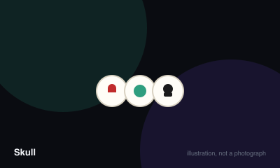

# Skull



> Win two bidding challenges by successfully flipping the number of flowers you promised, without turning over a skull.

|  |  |
|---|---|
| **Players** | 3–6, best at 5 |
| **Box says** | 30 min |
| **Actually takes** | 30 min |
| **Teach time** | 3 min |
| **Between your turns** | 25 sec |
| **Works at age** | 10+ |
| **Weight** | ●○○○○ 1.2 / 5 |
| **Luck** | 25% chance, 75% skill |
| **Family** | bluffing |

## How many players changes what

| Players | Setup | Notes |
|---|---|---|
| **3** | Standard four discs each. Bidding is short and reads are difficult with so few players. | Playable but thin — much of the tension comes from a long bidding chain. |
| **4-5** | Standard. Five is the count most players consider ideal. | Enough players for the bidding to escalate meaningfully without anyone waiting long. |
| **6** | Standard. Expect longer bidding rounds and more dramatic collapses. | Excellent, though the wait between your own decisions lengthens noticeably. |

## Rules

Everyone has three flowers and one skull. You place discs face down. Then
somebody bets they can turn over flowers without finding a skull. That is all of
it, and it is one of the purest bluffing games ever published.

## Placing

Each player secretly places one disc face down on their mat. Continuing
clockwise, players either add another disc on top of their own stack, or open
the bidding.

Stacks build up. Nobody can see anything but the count.

## Bidding

To open, name a number — how many discs you claim you can flip without hitting a
skull. The next player must bid higher or pass. Once you pass you are out of the
bidding for this round entirely.

Bidding stops when everyone but one player has passed. Nobody may bid more than
the total number of discs on the table.

## Flipping

The winning bidder must now turn over that many discs, and here is the rule that
makes the game:

**You must flip your entire own stack first**, from the top down, before touching
anybody else's. Only then may you choose freely from other players' stacks,
always taking from the top.

If you reach your number in flowers, you win the challenge. Win two challenges
and you have won the game.

If you turn over a skull, you stop immediately and lose one disc. If the skull
was somebody else's, they choose which of your discs is removed, at random and
without seeing it. If it was your own, you choose.

A player with no discs left is out.

## Why the own-stack rule matters

Because you must flip your own discs first, placing your skull early and then
bidding is impossible. The bluff has to be built out of what you place, when you
place it, and what you are willing to promise afterwards.

## Settle the argument

### Which discs do you flip first when you win the bid?

**Official rule.** Played by almost everyone, almost everywhere.

Your entire own stack, from the top down, before touching anybody else's. Only when your own discs are all revealed may you choose from other players, and then always from the top of a stack.

*What it changes:* This single rule is what stops the game being trivial. Without it, hiding your skull and bidding aggressively would win every round.

```console
$ rulebook ruling skull "do I flip my own first"
```

### Who chooses which disc you lose?

**Official rule.** Widespread but far from universal.

If you flipped your own skull, you choose which of your discs to remove. If you flipped somebody else's, they take one of yours at random without looking at it. Either way the removed disc is not revealed, so the table never learns whether you still hold your skull.

*What it changes:* The uncertainty about whether an opponent still has a skull is the main source of late-game bluffing.

```console
$ rulebook ruling skull "which disc do I lose"
```

### Can you bid more discs than are on the table?

**Official rule.** Played by almost everyone, almost everywhere.

No. The maximum possible bid is the total number of discs currently placed by all players combined. Bidding the full total is legal and is a common way to end a round decisively.

```console
$ rulebook ruling skull "maximum bid skull"
```

### Can you rejoin the bidding after passing?

**Official rule.** Played by almost everyone, almost everywhere.

No. A pass removes you from the bidding permanently for that round. This is why the decision to pass early carries real weight rather than being a delaying tactic.

```console
$ rulebook ruling skull "can I bid again after passing"
```

### Can a player with one disc still win?

**Official rule.** Widespread but far from universal.

Yes, and they are frequently the most dangerous player at the table. A single disc is either a flower they can safely bid one on, or a skull that nobody can be certain about. Elimination only comes when the last disc is lost.

```console
$ rulebook ruling skull "one disc left"
```

## Teaching it

Three minutes. It is the shortest genuinely deep teach in this registry.

**Show the components and the goal together:** "Three flowers, one skull. You're
trying to flip flowers and avoid skulls. Win two bets and you've won."

**Then the two phases:** "First we all put discs down face down. Then somebody
says 'I can flip four flowers' and we bid on it like an auction."

**Then the one rule everything hinges on, and say it slowly:** "When you win the
bid, you have to flip *all of your own discs first*." Pause there. Let them
work out what that means. The good players at the table will visibly react —
it is the moment the game reveals itself.

**Spell out the consequence if nobody reacts:** "So if you put your skull down
and then win the bidding, you've beaten yourself." That is the sentence that
teaches Skull.

**Explain the loss cleanly:** "Hit a skull and you lose a disc — and you don't
get to choose which one. If it was my skull, I pick one of yours at random."

**Do not explain strategy.** The game is entirely about reading the table, and
any hint from you shapes their first round unhelpfully. Let them place, let them
bid too high, and let the first skull do the teaching.

**Set the expectation about pace:** "Rounds are quick and it takes a few before
you start reading people." Skull is a game that gets dramatically better on the
third round, and telling players that keeps them engaged through the first two.

## When it is fair to stop

A player down to one disc is still genuinely dangerous, so conceding is both unnecessary and premature. If the group wants to stop, finish the current round and count who is closest to two wins.

## When a piece goes missing

Beer mats and coins reproduce this exactly — the game is four tokens per player where one is distinguishable. It is one of the easiest games here to improvise from nothing.

## Accessibility

The discs are chunky and easy to handle, which is unusual and welcome. The game is almost entirely about reading faces and betting behaviour, which makes it a poor fit for players who find that kind of social pressure unpleasant and a superb fit for those who do not.

## Sources

- <https://en.wikipedia.org/wiki/Skull_(card_game)>

---

*Generated from [`games/skull/`](../../games/skull/). Fix it there, not here.*
