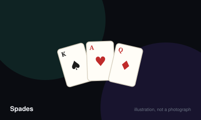

# Spades



> Bid how many tricks your partnership will take, then take exactly that many. Overshooting is punished almost as harshly as falling short.

|  |  |
|---|---|
| **Players** | 2–6, best at 4 |
| **Box says** | 30 min |
| **Actually takes** | 50 min |
| **Teach time** | 6 min |
| **Between your turns** | 20 sec |
| **Works at age** | 9+ |
| **Weight** | ●●○○○ 2.1 / 5 |
| **Luck** | 40% chance, 60% skill |
| **Family** | trick-taking |

## How many players changes what

| Players | Setup | Notes |
|---|---|---|
| **2** | Each player draws from the stock in alternation, choosing to keep or discard each card unseen by the opponent, until both hold thirteen. Then bid and play individually. | A real variant rather than an afterthought, though the bidding loses the partnership tension that defines the game. |
| **3** | Remove the two of clubs so seventeen cards deal each. Everyone plays for themselves. | Cutthroat spades. Perfectly good, but a different game psychologically — nobody is covering for you. |
| **4** | Two partnerships sitting opposite each other, thirteen cards each, whole deck dealt. | The real game. Everything about the bidding maths assumes it. |
| **5-6** | Remove low cards until the deck divides evenly and play individually or in three pairs. | Workable but rarely satisfying; hands get short and bids become coin flips. |

## Rules

A partnership game about promises. You say how many tricks you will take, and
then the hand punishes you for being wrong in either direction.

## Setup

Four players in two partnerships, sitting so that partners face each other.
Deal the entire deck, thirteen cards to each player.

## Bidding

Beginning to the dealer's left, each player states how many of the thirteen
tricks they expect to win. You may not confer with your partner, and you may
not change your mind afterwards. Add the two partners' bids together — that
combined number is what the side must deliver.

A bid of zero is called nil, and is a separate contract: that player promises
to take no tricks at all.

## Playing

The player to the dealer's left leads first, and may not lead a spade until
spades have been broken. Follow the led suit if you hold it. If you cannot,
play anything, including a spade.

Spades are permanently trumps. Any spade beats any card of any other suit. If
more than one spade lands on a trick, the highest spade takes it. Otherwise the
highest card of the suit led wins. Spades become legal to lead once one has
been played on a trick somebody could not follow.

## Scoring

Make your combined bid and score ten points per trick you bid. Fail, and you
lose ten points per trick bid — the whole contract, not the shortfall.

Tricks taken beyond the bid are called bags. Each one is worth a single point
now and a problem later: accumulate ten bags across the game and you lose a
hundred points immediately, with the counter resetting. This is the rule that
makes deliberately losing a trick a real skill.

A successful nil scores a hundred for the partnership. A failed nil loses a
hundred, and the partner's own bid is scored separately either way.

Play continues until a side reaches five hundred.

## Settle the argument

### What happens to tricks you win beyond your bid?

**Official rule.** Played by almost everyone, almost everywhere.

Each one scores a single point immediately and adds a bag to your running count. When that count reaches ten, the partnership loses a hundred points and the counter drops back by ten. The small reward is a trap.

*What it changes:* It is the rule that turns Spades from a race into a game of control, since deliberately dumping a trick is often correct.

```console
$ rulebook ruling spades "what are bags"
```

### Can you signal to your partner?

**Official rule.** Played by almost everyone, almost everywhere.

No. Communicating your hand outside of the bid and the cards you play is cheating, not strategy. Everything your partner learns must come from what they can see on the table.

*The house version:* Some social games permit a single agreed remark after bidding, such as declaring a void suit. It is not part of the game and should be agreed before dealing rather than mid-hand.

```console
$ rulebook ruling spades "table talk spades"
```

### Is blind nil a real bid?

**Not an official rule.** Widespread but far from universal.

Not part of the base game, though it is so widespread in North American play that many players have never met a game without it.

*The house version:* A partnership at least a hundred behind may bid nil before looking at their cards, for double the usual reward and double the penalty. Partners are typically allowed to exchange two cards afterwards.

*What it changes:* It gives a losing side a genuine comeback path, at the cost of some very short, very swingy hands.

*Played mostly in:* North America

```console
$ rulebook ruling spades "blind nil"
```

### When can spades be led?

**Official rule.** Played by almost everyone, almost everywhere.

Once a spade has been played by somebody unable to follow the suit led, spades are broken and may be led freely. Before that they may only be played when you cannot follow, or when your hand holds nothing else.

```console
$ rulebook ruling spades "can I lead spades"
```

### If your partner bids nil, do their tricks count against you?

**Official rule.** Widespread but far from universal.

The nil bidder must take none. Their partner plays their own bid entirely separately and is expected to cover the nil by winning tricks the nil bidder would otherwise be forced to take. The two contracts are scored on their own terms.

```console
$ rulebook ruling spades "partner bid nil"
```

## Teaching it

Six minutes. The hard part is not the play, it is convincing people that
winning too many tricks is bad.

**Start with trumps,** because it is the only mechanic and it is instant:
"Spades beat everything. That is why the game is called Spades." Done.

**Then the promise.** Say: "Before we play, you and your partner each guess how
many tricks you'll win. Add them together. That's what you have to hit —
exactly." Watch for the moment somebody's face changes when they realise
*exactly* means exactly.

**Then bags, and be blunt about it.** New players ignore bags for three hands
and then lose a hundred points in one go and feel cheated. Say it early and
concretely: "Every extra trick you didn't bid gives you a bag. Ten bags costs
you a hundred points. So no, you don't want to win everything."

**Count a hand out loud with them.** Deal, let everyone bid, and before the
first card say the combined numbers: "So you two need six, and you two need
five. That's eleven of thirteen, so two tricks are going spare." That single
observation teaches more about bidding than any explanation of card values.

**Leave nil until somebody asks,** which they will, usually when they are dealt
a hand with no high cards and look upset about it. That is the perfect moment:
"Actually, you can bid zero deliberately. It's worth a hundred."

**The sentence that saves the most confusion:** "You can't lead a spade until
somebody's already been forced to play one." Say it before the opening lead.

## Play it online, free

- **[cardgames.io](https://cardgames.io/spades/)** — Free with a computer partner, which is a gentle way to learn bidding.

## When it is fair to stop

Partnerships play to five hundred, and a side four hundred behind is not coming back. Agreeing to stop at the end of the current hand is normal; both partners should agree, since one of them may still be enjoying it.

## When a piece goes missing

Nothing beyond the deck. If a card is lost, the deal no longer divides evenly at four players, which the game cannot tolerate.

## Accessibility

Bidding requires holding a running total across a whole hand, which is harder than it sounds in a noisy room; a visible bid marker per player helps a great deal. Partnership play involves reading a partner across the table, which is a barrier for anyone with limited vision of the far seat.

## Sources

- <https://www.pagat.com/auctionwhist/spades.html>

---

*Generated from [`games/spades/`](../../games/spades/). Fix it there, not here.*
