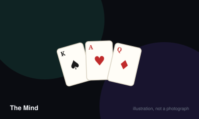

# The Mind



> Play every card in the group's hands in ascending order, without anyone saying a single word.

|  |  |
|---|---|
| **Players** | 2–4, best at 3 |
| **Box says** | 20 min |
| **Actually takes** | 25 min |
| **Teach time** | 90 sec |
| **Between your turns** | 0 sec |
| **Works at age** | 8+ |
| **Weight** | ●○○○○ 1.1 / 5 |
| **Luck** | 45% chance, 55% skill |
| **Family** | cooperative |

## How many players changes what

| Players | Setup | Notes |
|---|---|---|
| **2** | Twelve levels to complete. Start with two lives and one throwing star. | The quietest version and arguably the tensest, since a single misread ends the run. |
| **3** | Ten levels. Three lives, one throwing star. | The sweet spot. Enough hands for genuine uncertainty without the level count dragging. |
| **4** | Eight levels. Four lives, one throwing star. | Chaotic in a good way, though coordinating four silent people is markedly harder. |

## Rules

A hundred cards, numbered one to a hundred. The group must play them in
ascending order. Nobody may say anything.

That is the whole game and it should not work.

## Levels

At level one, each player is dealt one card. At level two, two cards each, and
so on. The number of levels you must complete depends on how many players there
are.

## Playing

Look at your cards. When you believe you hold the lowest card still in anyone's
hand, place it face up in the middle.

You may not speak. You may not gesture deliberately, count, tap, mouth numbers,
or signal in any agreed way. What you may do is wait — and how long you wait is
the entire language of the game.

A group holding a two and a ninety-eight will find the two appears almost
instantly. A group holding a fifty-one and a fifty-four will sit in silence for
a long, agonising while.

## Mistakes

If somebody plays a card while another player still holds a lower one, the group
loses a life. Every player then discards all cards lower than the one just
played, face up, and play continues from there.

Run out of lives and the game is over.

## Throwing stars

At any point, any player may propose using a throwing star by raising a hand.
Everybody must agree. Each player then discards their lowest card face up
simultaneously, which is the only sanctioned way to gain information.

## Rewards

Completing certain levels earns the group an extra life or an extra throwing
star, as printed on the level cards.

## Winning

Finish the last level with at least one life remaining. There is no score and no
individual winner — only how far you got and how close it was.

## The one rule people break

Silence means silence. Sighing meaningfully, staring at somebody, or saying
"okay, wait" all count. Groups that let this slide find the game evaporates,
because the tension is the product.

## Settle the argument

### What exactly counts as communicating?

**Official rule.** Played by almost everyone, almost everywhere.

Anything intended to convey information about your cards is forbidden — speech, numbers, counting, tapping, deliberate gestures, mouthing, and agreed signals of any kind. The only permitted signal is how long you choose to wait before playing, which is deliberately ambiguous.

*What it changes:* Groups that permit small signals find the game becomes trivially easy and loses the tension that is its only mechanism.

```console
$ rulebook ruling the-mind "can I gesture the mind"
```

### What happens to lower cards when someone plays out of order?

**Official rule.** Widespread but far from universal.

Every player discards all cards lower than the one just played, face up so the whole group can see them. The group loses one life and play continues from the card that was played, rather than restarting the level.

*What it changes:* Because the discards are revealed, a mistake gives the group real information, which sometimes makes a level easier to finish afterwards.

```console
$ rulebook ruling the-mind "mistake the mind"
```

### Can one player use a throwing star alone?

**Official rule.** Widespread but far from universal.

No. Any player may propose one by raising a hand, but every player must agree before it is used. Since agreeing is done by raising a hand rather than speaking, the proposal itself carries no forbidden information.

```console
$ rulebook ruling the-mind "throwing star rules"
```

### What if two players play at exactly the same moment?

**Official rule.** Widespread but far from universal.

Resolve them in ascending order as though they had been played correctly. If the higher was placed first, that is a mistake and costs a life; if the group genuinely cannot tell which landed first, the friendly convention is to accept it and continue.

```console
$ rulebook ruling the-mind "two cards at once"
```

### Can you rearrange or hold your cards where others might see?

**Official rule.** Widespread but far from universal.

Your cards are yours alone and must be kept hidden. Deliberately exposing one is communication and is forbidden, though nobody is expected to police an accidental flash — return it to your hand and carry on.

```console
$ rulebook ruling the-mind "can others see my cards"
```

## Teaching it

Ninety seconds, and it is the only game here where the teach is mostly about
what you may *not* do.

**State the goal in one line:** "We have to play all our cards in order, lowest
to highest, into the middle."

**Then the twist, and pause after it:** "Nobody can talk. At all."

**Then answer the question they are about to ask, before they ask it:** "So how
do we know? You wait. If you've got a high card, you wait longer. That's it.
That's the whole communication system."

**Be absolutely explicit about what counts as talking,** because every group
tries to invent a workaround in the first three minutes: "No numbers, no
tapping, no counting on fingers, no meaningful looks, no sighing. If you're
trying to tell someone something, it's not allowed."

**Say that mistakes are expected and fine.** "We'll lose lives. That's normal.
Level four is where it gets interesting." Otherwise the first failure feels like
somebody's fault, and in a cooperative game that sours quickly.

**Explain the throwing star as a group decision:** "If anyone raises a hand and
everyone agrees, we all throw away our lowest card. It's the only time we get
real information."

**Deal level one and start.** Do not explain further. One card each is
self-teaching, and the game explains itself faster than you can.

**One thing worth saying afterwards, not before:** the silence feels absurd for
two levels and then stops feeling absurd entirely. Groups that quit at level two
never find that out.

## Variants worth knowing

**Extreme** — The Mind Extreme adds a second ascending and descending row played simultaneously. Substantially harder and a genuinely different game.

**No stars** — Play without throwing stars for a much harsher run. Common among groups who have finished the standard game.

## When it is fair to stop

There is no opponent to concede to. If the group is losing badly, restart at level one rather than abandoning — the game takes twenty minutes and the attempt is the entire point.

## When a piece goes missing

A deck of a hundred numbered slips reproduces it exactly, and lives can be coins. What cannot be improvised is the silence, which is the actual component.

## Accessibility

The no-talking rule is absolute, which makes this one of the few games here that is fully playable without any shared spoken language. It relies instead on reading hesitation and body language, so it is difficult for players who cannot see the whole table clearly.

## Sources

- <https://en.wikipedia.org/wiki/The_Mind_(card_game)>

---

*Generated from [`games/the-mind/`](../../games/the-mind/). Fix it there, not here.*
