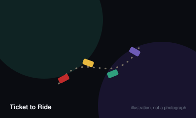

# Ticket to Ride



> Claim railway routes to connect the cities named on your secret destination tickets, scoring for the routes you build and losing points for tickets you fail to finish.

|  |  |
|---|---|
| **Players** | 2–5, best at 4 |
| **Box says** | 60 min |
| **Actually takes** | 70 min |
| **Teach time** | 8 min |
| **Between your turns** | 60 sec |
| **Works at age** | 8+ |
| **Weight** | ●●○○○ 1.9 / 5 |
| **Luck** | 45% chance, 55% skill |
| **Family** | set-collection-and-network |

## How many players changes what

| Players | Setup | Notes |
|---|---|---|
| **2** | Standard rules, but on the original US map only the single track of each double route may be used. | Two-player is much less about blocking and much more about efficiency; the map feels enormous. |
| **3** | Double routes remain restricted to one track on the US map. | The awkward count. Blocking exists but is not yet the dominant concern. |
| **4-5** | Both tracks of every double route are available. | Where the game is designed to live. Routes run out and the blocking becomes genuinely tense. |

## Rules

Collect coloured cards, spend them to claim railway routes, and try to connect
the cities on the secret tickets in your hand.

## Setup

Each player takes forty-five trains in one colour. Deal four train cards to
each player, and lay five face up beside the deck.

Deal three destination tickets to each player. You must keep at least two of
them. These are secret, they are worth points if you complete them, and they
subtract those same points if you do not.

## Your turn — exactly one of three things

**Draw train cards.** Take two, from the five face up or blind from the top of
the deck. Locomotives are wild, and if you take a face-up locomotive it counts
as both of your draws.

**Claim a route.** Choose a stretch of track between two adjacent cities and
discard that many cards of that colour. Grey routes accept any single colour, as
long as all the cards match each other. Place your trains along it.

**Draw destination tickets.** Take three and keep at least one.

## Scoring routes

Longer routes are worth disproportionately more:

- One train scores 1
- Two score 2
- Three score 4
- Four score 7
- Five score 10
- Six score 15

## Ending

When any player has two or fewer trains left, every player including them takes
one final turn. Then the game stops.

Add up your route points. Add the value of every destination ticket you
completed, and subtract the value of every one you did not. Add ten points for
the longest continuous run of track, which is settled by tracing rather than
counting routes.

Highest total wins.

## The rule that decides most games

A ticket you fail to complete costs you its full value, so a twenty-point ticket
drawn late and missed is a forty-point swing. Drawing extra tickets near the end
is the single riskiest thing you can do, and it is also how most close games are
won.

## Settle the argument

### Does taking a face-up locomotive cost your whole turn?

**Official rule.** Played by almost everyone, almost everywhere.

Yes. Taking a locomotive from the five face-up cards uses both of your draws. A locomotive drawn blind from the top of the deck does not — it counts as one ordinary card, and you may still draw a second.

*What it changes:* It is the single most commonly misplayed rule in the game, and playing it wrong makes locomotives far too easy to accumulate.

```console
$ rulebook ruling ticket-to-ride "locomotive draw rules"
```

### Do unfinished tickets cost you points?

**Official rule.** Played by almost everyone, almost everywhere.

Yes, the full face value. A ticket is a two-way bet rather than a bonus, so failing a twenty-point ticket is a forty-point swing against the player who completed a similar one.

```console
$ rulebook ruling ticket-to-ride "failed ticket penalty"
```

### Can one player claim both tracks of a double route?

**Official rule.** Widespread but far from universal.

No player may ever claim both tracks of the same double route. In addition, with two or three players on the original US map, only one track of each double route may be used at all — the second is closed for the whole game.

*What it changes:* Groups that ignore the player-count restriction find two-player games have almost no tension, since nothing can ever be blocked.

```console
$ rulebook ruling ticket-to-ride "double routes rules"
```

### What happens if two players tie for the longest route?

**Official rule.** Widespread but far from universal.

Every tied player receives the full ten points. It is not split and it is not decided by a tiebreaker.

```console
$ rulebook ruling ticket-to-ride "longest route tie"
```

### Does the longest route count branches?

**Official rule.** Widespread but far from universal.

No. It is the longest single continuous path of trains, traced without reusing any segment and without branching. A sprawling network can easily lose to a shorter but straighter one, so trace it carefully rather than counting your total trains.

```console
$ rulebook ruling ticket-to-ride "how is longest route measured"
```

### Can other players see how many tickets you are holding?

**Official rule.** Widespread but far from universal.

The number of tickets you hold is public and may be counted by anyone, since they are held openly in hand. Their contents are secret. The same applies to train cards — the count is visible, the colours are not.

```console
$ rulebook ruling ticket-to-ride "are ticket counts public"
```

## Teaching it

Eight minutes, and the structure of the teach is unusually forgiving because
there are only three possible actions.

**Say the three actions before anything else,** and hold up three fingers: "Every
turn you do one of three things. Draw cards. Build a route. Or take new
tickets." Then explain each. That framing means nobody is ever lost about what
they may do.

**Show a route claim physically.** Point at a three-length blue route, count out
three blue cards, and place the trains. One demonstration removes every question
about colour matching.

**Explain grey routes immediately after,** because they look like an exception
and are not: "Grey means any colour — but they all have to match each other."

**Then tickets, and be honest about the risk:** "These are worth points if you
connect the cities and cost you the same points if you don't." Watch for the
moment they understand it is a two-way bet. That is the game.

**Tell them the thing nobody tells beginners:** longer routes are worth far more
than short ones. Point at the scoring chart. "Six trains is fifteen points. Six
separate one-train routes is six points." New players build short routes all
game and lose without understanding why.

**Warn about blocking, gently.** "If someone builds where you were going, you'll
have to go round." That is enough. Do not encourage it explicitly, or a first
game becomes unpleasant.

**Say when the game ends, clearly:** "It ends when someone is nearly out of
trains — and then everyone gets one last turn." Games have been ruined by
players not realising the end was three turns away.

**Discourage the final ticket draw for beginners.** Say: "Taking more tickets
near the end is how experienced players lose." It sounds like advice and it
prevents the most demoralising possible first game.

## Editions

| Edition | Year | What changed |
|---|---|---|
| Europe | 2005 | Adds stations, tunnels and ferries, and deals longer tickets. Generally considered the better introduction despite being newer. |
| Nordic Countries | 2007 | Built for two and three players specifically, with a tighter map. |

## Variants worth knowing

**Ticket draw at the end** — Allow one final ticket draw for players who finish early. Non-standard and swingy, but popular in casual play.

## When it is fair to stop

Do not leave early. Your trains block routes other players are counting on, and removing them mid-game rewrites everybody's plans. If the group must stop, score it where it stands — completed tickets count, incomplete ones subtract.

## When a piece goes missing

Trains can be replaced with any small markers of a distinct colour, though you need forty-five of each. Losing destination tickets is the real problem — they are the scoring engine and cannot be improvised without the printed distances.

## Accessibility

The route colours include a pink, a red and an orange that are difficult to distinguish under poor lighting, and the board is dense. The trains are small and placing them into narrow route slots is genuinely fiddly for anyone with limited dexterity. The map text is small; a printed city list helps.

## Sources

- <https://www.daysofwonder.com/tickettoride/en/usa/>

---

*Generated from [`games/ticket-to-ride/`](../../games/ticket-to-ride/). Fix it there, not here.*
