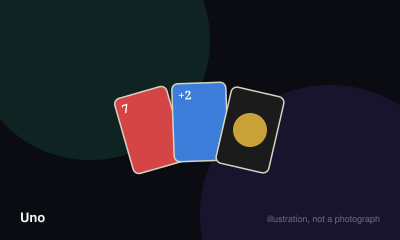

# Uno



> Be the first player to get rid of every card in your hand.

|  |  |
|---|---|
| **Players** | 2–10, best at 4 |
| **Box says** | 30 min |
| **Actually takes** | 45 min |
| **Teach time** | 3 min |
| **Between your turns** | 25 sec |
| **Works at age** | 6+ |
| **Weight** | ●○○○○ 1.2 / 5 |
| **Luck** | 85% chance, 15% skill |
| **Family** | shedding |

## How many players changes what

| Players | Setup | Notes |
|---|---|---|
| **2** | Deal 7 each. Reverse behaves exactly like Skip, so the same player takes another turn. | The two-player game is a short duel and swings hard on a single Draw Four. |
| **3-10** | Deal 7 each. Remaining cards form the draw pile; turn the top card face up to start the discard pile. | Above six players the deck runs thin and reshuffles become frequent. |

## Rules

A shedding game: everyone races to empty their hand, and the special cards exist
to stop whoever is closest.

## Setup

Deal seven cards to each player. Put the rest face down as the draw pile and
turn the top card face up to start the discard pile.

If that starting card is a Wild Draw Four, bury it in the deck and turn over a
new one. If it is any other action card, its effect applies immediately to the
first player.

## Playing a turn

On your turn, play one card that matches the top of the discard pile in **any**
of these ways:

- same colour
- same number
- same symbol (Skip on Skip, Reverse on Reverse, and so on)

A Wild can be played at any time. A Wild Draw Four can only be played when you
hold no card of the current colour — see the rulings below, because this is the
rule most often played incorrectly.

If you cannot play, or choose not to, draw **one** card from the draw pile. If
that card is playable you may play it straight away. Otherwise your turn ends.

## The special cards

| Card | Effect |
| --- | --- |
| **Skip** | The next player loses their turn. |
| **Reverse** | Direction of play flips. With two players it acts as a Skip. |
| **Draw Two** | The next player draws two cards and loses their turn. |
| **Wild** | You name the colour that must be matched next. |
| **Wild Draw Four** | You name the colour; the next player draws four and loses their turn. Only legal if you hold no card of the current colour. |

## Saying "Uno"

As you play your second-to-last card — leaving you holding one — announce
"Uno". If another player catches you before the next player has begun their
turn, you draw two cards as a penalty. Once the next turn starts, you are safe.

## Ending the round

The round ends the instant a player has no cards left. You may go out on any
card, including an action card, and its effect still applies.

## Scoring

The player who went out scores the total value of every card still held by
everyone else:

| Card | Points |
| --- | --- |
| Number cards | Face value (0–9) |
| Skip, Reverse, Draw Two | 20 each |
| Wild, Wild Draw Four | 50 each |

Play until somebody reaches 500 points. Many groups skip scoring entirely and
treat each round as a complete game, which is faster and loses very little.

## Running out of draw cards

If the draw pile empties, take the discard pile except its top card, shuffle it,
and use it as the new draw pile.

## Settle the argument

### Can you stack a Draw Two on a Draw Two, or a Draw Four on a Draw Four?

**Not an official rule.** Played by almost everyone, almost everywhere.

No. Under the published rules there is no stacking. A player hit with a Draw Two draws two cards and loses their turn — they cannot pass the penalty along. Mattel stated this publicly in May 2019 and a large part of the internet refused to believe it. Note that the official UNO mobile game does offer stacking as a setting, which is not the same as it being in the card game's rules.

*The house version:* The near-universal house version lets you answer a Draw Two with your own Draw Two, passing an accumulating penalty around the table until someone cannot respond and draws the entire pile.

*What it changes:* Stacking turns a mild setback into a potential ten-card catastrophe and makes the game swingier and considerably longer.

Source: <https://en.wikipedia.org/wiki/Uno_(card_game)>

```console
$ rulebook ruling uno "can I stack a +2"
```

### Can you play a Wild Draw Four whenever you like?

**Official rule.** Played by almost everyone, almost everywhere.

No — and this is a genuinely official rule that almost nobody plays. You may only play a Wild Draw Four when you hold no card matching the current colour. Numbers and symbols do not count, only colour. The next player may challenge; if the challenge is correct the bluffer draws four instead, and if it is wrong the challenger draws six.

*What it changes:* Played properly, the Draw Four becomes a bluffing card with real risk rather than a free nuke.

```console
$ rulebook ruling uno "when can I play a wild draw four"
```

### What actually happens if you forget to say "Uno"?

**Official rule.** Widespread but far from universal.

You must announce it as you play your second-to-last card. If another player catches you before the next player begins their turn, you draw two cards. Once the next turn has started, you are safe. The penalty is two cards, not four, and it is not automatic — somebody has to catch you.

```console
$ rulebook ruling uno "forgot to say uno"
```

### Do you keep drawing until you get a card you can play?

**Not an official rule.** Played by almost everyone, almost everywhere.

No. Officially you draw exactly one card. If it can be played you may play it immediately; if not, your turn ends.

*The house version:* Drawing repeatedly until a playable card appears. This is probably the single most common deviation from the printed rules, and it inflates hand sizes dramatically.

*What it changes:* Hands balloon, rounds run long, and the player with bad luck early is buried for the rest of the round.

```console
$ rulebook ruling uno "do you draw until you can play"
```

### Can you win by playing an action card as your last card?

**Official rule.** Widespread but far from universal.

Yes. The published rules allow you to go out on any card, including a Draw Two, Draw Four, Skip or Reverse — and the next player still suffers the effect, drawing the cards that then count against them in scoring.

```console
$ rulebook ruling uno "can you end on a draw two"
```

### Can you play out of turn if you hold the identical card?

**Not an official rule.** Widespread but far from universal.

Not official. Turn order is strict in the published rules.

*The house version:* "Jump-in": if you hold a card identical in both colour and value to the top discard, you may slap it down out of turn, and play resumes from you.

*What it changes:* Rewards attention and speeds the game up considerably, at the cost of arguments about who put their card down first.

```console
$ rulebook ruling uno "jump in uno"
```

### Do Sevens and Zeros swap hands?

**Not an official rule.** Widespread but far from universal.

Not official. Sevens and Zeros are ordinary number cards in the printed rules.

*The house version:* Playing a Seven lets you swap hands with a player of your choice; playing a Zero rotates every hand one seat in the direction of play.

*What it changes:* Adds a large swing and a lot of table talk. It punishes hoarding and is the main reason someone with one card left can suddenly have nine.

*Played mostly in:* North America, United Kingdom

```console
$ rulebook ruling uno "seven zero rule"
```

## Teaching it

## Say this first

"Match the top card by colour or by number. First person with no cards wins."

That single sentence is ninety per cent of the game. Deal seven each, flip one
card, and start playing. Do not explain anything else yet.

## Introduce as they appear

Let the special cards come up naturally and explain each in one line when it
lands:

- **Skip** — next player misses their turn.
- **Reverse** — direction flips. (With two players, it just means you go again.)
- **Draw Two** — next player draws two and misses their turn.
- **Wild** — you choose the colour.
- **Wild Draw Four** — you choose the colour, next player draws four.

## Mention on their second turn, not their first

"When you get down to one card, say Uno out loud. If someone catches you before
the next player goes, you draw two."

New players forget this once, get caught, and then never forget again. Letting
it happen is a better teacher than warning them.

## Say out loud before the first hand

Whichever house rules you play — stacking, draw-until-playable, sevens and
zeros — **name them before dealing**. Every one of them is a deviation from the
printed rules, and every group assumes theirs is the real one. Thirty seconds
here prevents the argument later.

## Do not mention

Wild Draw Four legality and challenges. It is officially the most interesting
rule in the game and completely overwhelming in the first round. Introduce it
in game two, if at all.

## Scoring

This game has a scorer. `rulebook score uno "..."` works out the total for you.

## Editions

| Edition | Year | What changed |
|---|---|---|
| Mattel rule clarification | 2019 | Mattel publicly confirmed that Draw Two and Draw Four cards cannot be stacked, which surprised most of the internet. |

## When it is fair to stop

Rounds are short and scores carry, so lower the target rather than stopping. Ending mid-round wastes the one hand somebody had actually engineered.

## When a piece goes missing

A standard 52-card deck plays a near-identical game as Crazy Eights: Jack is Skip, Queen is Reverse, Ace is Draw Two, and Eight is Wild. If a single Uno card is lost, remove its three colour-siblings so the deck stays balanced.

## Accessibility

Colour is the primary signal and the four colours are red, yellow, green and blue — the worst possible set for red-green colour blindness. Mark card corners with symbols, or use a deck with colour-blind markings. The number cards are high-contrast and large; the Wild cards are the hardest to read at a glance.

## Sources

- <https://www.mattelgames.com/en-us/cards/uno>
- <https://en.wikipedia.org/wiki/Uno_(card_game)>

---

*Generated from [`games/uno/`](../../games/uno/). Fix it there, not here.*
