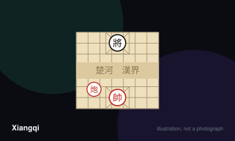

# Xiangqi



> Checkmate the enemy general, who never leaves the nine points of his own palace.

|  |  |
|---|---|
| **Players** | 2–2, best at 2 |
| **Box says** | 30 min |
| **Actually takes** | 35 min |
| **Teach time** | 10 min |
| **Between your turns** | 45 sec |
| **Works at age** | 8+ |
| **Weight** | ●●●○○ 2.7 / 5 |
| **Luck** | 0% chance, 100% skill |
| **Family** | chess-variant |

## How many players changes what

| Players | Setup | Notes |
|---|---|---|
| **2** | Pieces sit on the intersections, not the squares. Each side has one general, two advisors, two elephants, two horses, two chariots, two cannons and five soldiers. | Strictly two-player. The asymmetry between the red and black sides is only that red moves first. |

## Rules

Chinese chess. Two armies face each other across a river, each general confined
to a small palace he may never leave. It is played by more people than any other
board game on earth, and almost none of them are in the West.

## The board

Nine vertical lines and ten horizontal ones. Pieces sit **on the intersections**,
not inside the squares — the single thing that most confuses anyone arriving
from international chess.

Across the middle runs the river. At each end sits a palace: a three-by-three
area marked with diagonals, which two pieces may never leave.

## The pieces

**General** — one step, orthogonally, and never outside the palace.

**Advisor** — one step diagonally, also confined to the palace. Two of them,
and they exist only to shield the general.

**Elephant** — exactly two points diagonally, and **may never cross the river**.
It is blocked if the intervening point is occupied. Purely defensive.

**Horse** — one point orthogonally then one diagonally outward. Unlike the
western knight it does **not** jump: if the orthogonal step is blocked, the horse
cannot move that way at all. This restriction shapes the whole game.

**Chariot** — any distance along a line, exactly like a rook. The strongest
piece.

**Cannon** — moves like a chariot, but captures only by jumping over **exactly
one** piece, of either colour, and landing on an enemy. An empty file makes a
cannon harmless; a crowded one makes it deadly.

**Soldier** — one step forward. After crossing the river it may also move
sideways, but never backwards, ever.

## Two rules with no western equivalent

**The generals may never face each other** down an open file with nothing
between them. This is called the flying general, and it means an empty central
file can win a game outright.

**Perpetual check is forbidden.** A player who repeats a check indefinitely must
vary the move or forfeit. Endless repetition is not a way to save a lost game.

## Winning

Checkmate the general. A player with no legal move has also lost — **stalemate
is a loss, not a draw**. Draws exist but are far rarer than in international
chess, which makes the endgame sharper and considerably less forgiving.

## Settle the argument

### Can the two generals face each other down an open file?

**Official rule.** Played by almost everyone, almost everywhere.

No. If the two generals stand on the same file with no piece between them, the position is illegal. In practice this means the general may capture the opposing general along an empty file, so no player may ever create that alignment. Clearing the central file at the wrong moment loses on the spot.

```console
$ rulebook ruling xiangqi "flying general rule"
```

### Is stalemate a draw?

**Official rule.** Played by almost everyone, almost everywhere.

No — a player with no legal move has lost. This is the opposite of international chess, and it makes the endgame far sharper because there is no half point to scramble towards.

*What it changes:* Beginners arriving from chess routinely play for stalemate in lost positions and are surprised to find they have simply resigned slowly.

```console
$ rulebook ruling xiangqi "stalemate xiangqi"
```

### Does the horse jump like a knight?

**Official rule.** Played by almost everyone, almost everywhere.

No. The horse moves one point orthogonally and then one diagonally outward, and if the orthogonal point is occupied by any piece, the move is blocked entirely. Blocking an enemy horse with a single soldier is a standard defensive idea and has no equivalent in the western game.

```console
$ rulebook ruling xiangqi "horse blocked xiangqi"
```

### How exactly does the cannon capture?

**Official rule.** Played by almost everyone, almost everywhere.

It captures only by jumping exactly one piece — of either colour — along a straight line, landing on an enemy piece immediately beyond. It cannot capture without a screen, and it cannot jump two. Moving without capturing works exactly like a chariot, with nothing in the way.

```console
$ rulebook ruling xiangqi "cannon rules xiangqi"
```

### Can you draw by repeating check forever?

**Official rule.** Widespread but far from universal.

No. Endless checking is forbidden and the checking player must vary or forfeit the game. Rules for other kinds of repetition are detailed and vary slightly between Chinese and Asian federation codes, but perpetual check losing is common to all of them.

*What it changes:* It removes the standard western escape from a lost position, which is one reason draws are far less common here.

```console
$ rulebook ruling xiangqi "perpetual check xiangqi"
```

### Can the elephant cross the river?

**Official rule.** Played by almost everyone, almost everywhere.

Never. Elephants are confined to their own half for the whole game, which makes them purely defensive pieces. They also move exactly two points diagonally and are blocked if the point in between is occupied.

```console
$ rulebook ruling xiangqi "elephant river xiangqi"
```

### When can a soldier move sideways?

**Official rule.** Widespread but far from universal.

Only after it has crossed the river, and even then only one point at a time. A soldier may never move backwards under any circumstances, so pushing one is a permanent commitment.

```console
$ rulebook ruling xiangqi "pawn sideways xiangqi"
```

## Teaching it

Ten minutes. If they play international chess, most of that time goes on
unlearning rather than learning.

**Start with the board, physically.** Point at an intersection and say: "Pieces
go on the crossings, not in the squares." Everything else lands more easily once
that has been absorbed, and nothing else will land at all until it has.

**Then the two features the western game has no version of.** Trace the river
with a finger, then outline a palace. "The general never leaves this box. The
elephants never cross this river." Two sentences, and half the geography of the
game is done.

**Teach the chariot first.** It behaves exactly like a rook, it is the strongest
piece, and it gives a beginner something they can already use.

**Then the cannon, and take your time.** "It moves like the chariot — but to
capture, it has to jump over exactly one piece, any piece, and land on an
enemy." Set one up on the board and show a capture. Then show the same cannon
with an empty file in front of it and say: "and like this, it can take nothing
at all." That contrast is the whole piece.

**Then the horse, and be explicit that it does not jump.** Anyone who knows
chess will assume it does for at least three games. Show a blocked horse
physically.

**Leave the soldiers until they matter.** One step forward, sideways after the
river, never back. It takes ten seconds and means nothing until the midgame.

**The two rules to state before the first move,** because both decide games and
neither is guessable: the generals may never see each other down an open file,
and stalemate is a loss rather than a draw.

**What to expect:** a chess player will lose their first few games to the cannon
and be delighted about it. That piece is the reason to learn this game.

## Variants worth knowing

**Janggi** — The Korean cousin, with a differently shaped palace, a general that may move within it diagonally, and the option to pass a turn.

**Blind and handicap play** — Removing a piece or playing without sight of the board are both long-standing traditions rather than novelties.

## Play it online, free

- **[PlayOK](https://www.playok.com/en/xiangqi/)** — Free browser play against people or a computer, no account required. The interface is plain and the servers are busy.

## When it is fair to stop

Resigning a lost endgame is normal and expected. Because stalemate loses rather than draws, a hopeless position is genuinely hopeless — there is no saving half point to play towards.

## When a piece goes missing

Pieces are flat discs marked with characters, so a lost piece can be replaced by a coin with the character written on it. The board is a grid of lines and can simply be drawn. Note that a set marked in traditional characters and one in simplified characters mix perfectly well.

## Accessibility

The pieces are distinguished by the character written on them rather than by shape, which is a genuine barrier for anyone who cannot read them and for low-vision players — Western-style sets with figurine pieces exist and are worth seeking out. The two sides are conventionally red and black, a pairing that is legible to almost everyone. Playing on the intersections rather than in the squares confuses newcomers from international chess more than any rule does.

## Sources

- <https://en.wikipedia.org/wiki/Xiangqi>
- <https://www.pagat.com/>

---

*Generated from [`games/xiangqi/`](../../games/xiangqi/). Fix it there, not here.*
