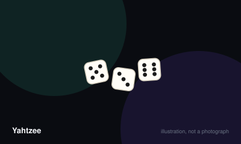

# Yahtzee



> Fill thirteen scoring categories with dice combinations, choosing which category to spend each roll on.

|  |  |
|---|---|
| **Players** | 1–10, best at 4 |
| **Box says** | 30 min |
| **Actually takes** | 30 min |
| **Teach time** | 4 min |
| **Between your turns** | 40 sec |
| **Works at age** | 6+ |
| **Weight** | ●○○○○ 1.4 / 5 |
| **Luck** | 75% chance, 25% skill |
| **Family** | dice-and-categories |

## How many players changes what

| Players | Setup | Notes |
|---|---|---|
| **1** | Play the full thirteen rounds and chase a personal best. Around 250 is a strong solo score. | Genuinely fine alone, which almost nothing else here manages. |
| **2-4** | One score column each, taking turns in order. | The comfortable range. Turns are quick enough that nobody drifts off. |
| **5-10** | Extra score sheets. Consider two dice sets passed in opposite directions to halve the waiting. | Playable but the gap between your turns stretches badly past six players. |

## Rules

Roll five dice up to three times, then decide which box to spend the result on.
Thirteen rounds, thirteen boxes, and the entire game is the tension between
what you rolled and what you still need.

## A turn

Roll all five dice. You may then set any number of them aside and reroll the
rest. You may do this once more. Three rolls in total, and dice set aside can
be picked up and rerolled again if you change your mind.

When you stop, you must write a score into exactly one category that you have
not used yet. If nothing fits, you must still choose one and score it zero.
That forced sacrifice is a real decision, not a punishment.

## The upper section

Aces through sixes. Each scores the sum of the dice showing that number, so
four fives scores twenty. If your upper section totals sixty-three or more —
the equivalent of three of each number — you gain a thirty-five point bonus.
Chasing that bonus drives most early decisions.

## The lower section

- **Three of a kind** — total of all five dice.
- **Four of a kind** — total of all five dice.
- **Full house** — three of one number and two of another, scoring twenty-five.
- **Small straight** — four consecutive numbers, scoring thirty.
- **Large straight** — five consecutive numbers, scoring forty.
- **Yahtzee** — all five dice matching, scoring fifty.
- **Chance** — total of all five dice, whatever they are. The safety net.

## Extra Yahtzees

Roll a second Yahtzee after already scoring fifty in the box and you earn a
hundred point bonus, then place the dice in another category under the joker
rules: the matching upper box if it is free, otherwise any lower box, which may
be filled as a full house or a straight regardless of what the dice actually
show.

If your Yahtzee box was scored zero, no bonus is available, but the joker
placement still applies.

## Finishing

Thirteen rounds fill every box. Add both sections and the bonus. Highest wins.

## Settle the argument

### What happens if you roll a second Yahtzee?

**Official rule.** Widespread but far from universal.

If the Yahtzee box already holds fifty, you score a hundred point bonus and then place the dice elsewhere under the joker rules — the matching upper box if free, otherwise any open lower box, which may be claimed as a full house or straight even though the dice do not form one.

*What it changes:* A player who scored their Yahtzee box zero gets no bonus for later ones, which is why writing a zero there is far more costly than it looks.

```console
$ rulebook ruling yahtzee "two yahtzees"
```

### Can you pick up dice you already set aside?

**Official rule.** Widespread but far from universal.

Yes. Setting dice aside is not binding. On your second and third rolls you may reroll any dice you like, including ones you kept earlier. Many players assume kept dice are locked, which quietly costs them points all game.

```console
$ rulebook ruling yahtzee "can I reroll kept dice"
```

### Does a large straight also count as a small straight?

**Official rule.** Played by almost everyone, almost everywhere.

Yes. A small straight needs four consecutive numbers among the five dice, so any large straight contains one. Scoring a forty-point straight in the thirty-point box is legal and occasionally correct.

```console
$ rulebook ruling yahtzee "large straight small straight"
```

### Can you skip a turn if nothing fits?

**Official rule.** Played by almost everyone, almost everywhere.

No. Every turn ends with a number written into an unused box, and if nothing qualifies that number is zero. Choosing where to take the damage is part of the game.

```console
$ rulebook ruling yahtzee "do I have to score"
```

### Does three of a kind score just the three matching dice?

**Official rule.** Widespread but far from universal.

You add all five dice, not only the matching ones. Three sixes with a five and a four scores twenty-seven. This is misplayed constantly, almost always in the player's own disfavour.

```console
$ rulebook ruling yahtzee "three of a kind scoring"
```

## Teaching it

Four minutes, and most of that is pointing at the sheet.

**Hand them the score sheet first and let them read it.** Unlike almost every
other game here, the rules are printed on the component. Say: "Everything you
can score is on that page. Your job each turn is to fill in exactly one box."

**Three rolls, and demonstrate rather than describe.** Roll five dice in front
of them, say what you are keeping and why, and reroll. One demonstration beats
any explanation of the mechanic.

**Point at the top half and explain the bonus immediately.** "If you can get
sixty-three up here, you get thirty-five free points. That's three of each
number. It's worth chasing." Beginners who do not hear this early ignore the
upper section entirely and lose by exactly thirty-five.

**Be explicit that a zero is a legal move,** because it feels wrong the first
time and new players will look for a way out. Say: "Sometimes you'll roll
rubbish and have to put a nought somewhere. Put it in the box you were least
likely to fill anyway. That's a real choice, not a failure."

**Point out Chance as the escape hatch.** Knowing it is there stops the panic.

**Leave the joker rules alone entirely.** They only matter on a second Yahtzee,
which most games never see. If one arrives, look it up then — the table will be
too delighted to mind the pause.

**With children, do the addition with them rather than for them.** The rolling
is not the hard part; the two-section total at the end is, and it is also the
part that is quietly teaching them something.

## Play it online, free

- **[cardgames.io](https://cardgames.io/yahtzee/)** — Free, and it does the two-section arithmetic for you.

## When it is fair to stop

There is nothing to concede. Every player fills the same thirteen boxes regardless of what anyone else rolls, so a losing position costs nothing to finish and the last few rounds are often the funniest part.

## When a piece goes missing

Any five dice work, and score sheets are trivially reproduced on plain paper — the categories are the game, not the pad. A missing die genuinely stops play, so a spare is worth keeping in the box.

## Accessibility

Reading five scattered dice quickly is the main visual demand; larger dice and a shallow tray help considerably. The score sheet involves repeated addition across two sections, which is the part young children need help with rather than the rolling.

## Sources

- <https://www.hasbro.com/common/instruct/Yahtzee.pdf>

---

*Generated from [`games/yahtzee/`](../../games/yahtzee/). Fix it there, not here.*
